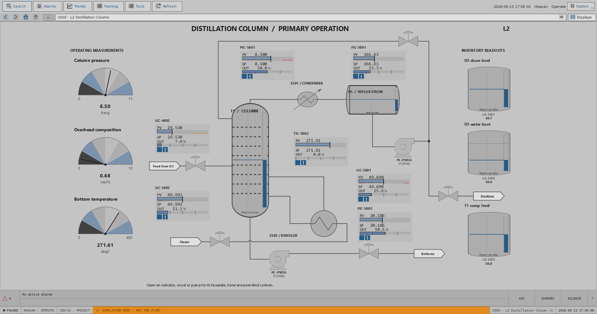

# Azeo Control Trainer

Azeo Control Trainer is a desktop environment for learning process-control
engineering and operation. Build function-block control modules, connect them
to a simulated plant, author operator graphics and guided procedures, then
operate the result through alarms, faceplates and trends.



> **Development preview.** This software is for training and simulation. It is
> not qualified to control a real plant or perform a safety function. A public
> installer has not yet been released.

## Applications

| Application | Purpose |
| --- | --- |
| Explorer | Open projects and inspect controllers, units, modules and Virtual I/O. |
| Control Designer | Build, compile, download and monitor control modules. |
| Graphics Designer | Author displays, reusable PVMs and faceplates. |
| Operator Station | Use published displays, alarms, trends and procedures. |
| Simulation Workbench | Run and investigate the simulated process. |
| PA Designer | Author, map and validate guided procedures. |

The control runtime and plant exchange values through `SharedDataStore` and a
configured I/O provider. The plant is not imported into the control logic.

## Run from source

Windows x64 is the current development target. Use Python 3.13 and a C++ build
toolchain for the native plant extension. From the repository root in
PowerShell:

```powershell
python -m venv .venv
.\.venv\Scripts\python.exe -m pip install -e ".[native,windows]"
.\.venv\Scripts\python.exe tools\build_plant_core.py
.\.venv\Scripts\python.exe run.py
```

Explorer opens the included `AzeoPlantVirtualController` training project.
Start its plant from **Tools > Virtual I/O > Start Simulator**; open Operator
Station after the provider reports Running. `run.py --list` shows the available
projects. See the [installation guide](docs/INSTALLATION_GUIDE.md) for
component, workspace and troubleshooting details.

## Guides

The [suite user manual](docs/USER_MANUAL.md) connects the engineering and
operator workflows. Product-specific illustrated guides are available for
[Explorer](docs/EXPLORER_HELP.md),
[Control Designer](docs/CONTROL_DESIGNER_HELP.md),
[Graphics Designer](docs/GRAPHICS_DESIGNER_HELP.md),
[Operator Station](docs/OPERATOR_STATION_HELP.md),
[Simulation Workbench](docs/SIMULATION_WORKBENCH_HELP.md) and
[PA Designer](docs/PA_DESIGNER_HELP.md). The application Help Center uses these
same maintained sources offline.

Further illustrated workflows: [control-module classes](docs/CONTROL_MODULE_CLASS_TUTORIAL.md)
and [PVMs and faceplates](docs/PVM_FACEPLATE_TUTORIAL.md).

## Development

Install the development tools with `python -m pip install -e ".[dev]"`, then
run focused tests for the area changed. The smoke scripts in `tests/` cover the
application boundaries and included training project. The native plant and
Virtual I/O integration require a built native extension.

Please keep changes to `projects/` and `src/strategies/` deliberate: they are
shipped training data, not disposable runtime output. Include a regression
test and update the relevant guide when changing user-visible behavior.

## License and notices

Original Azeo source is under the [MIT License](LICENSE). Bundled assets and
dependencies with separate terms are identified in [NOTICE](NOTICE) and the
[open-source compliance guide](legal/OPEN_SOURCE_COMPLIANCE.md). Do not assume
that an example or third-party asset is covered by the root MIT grant.
