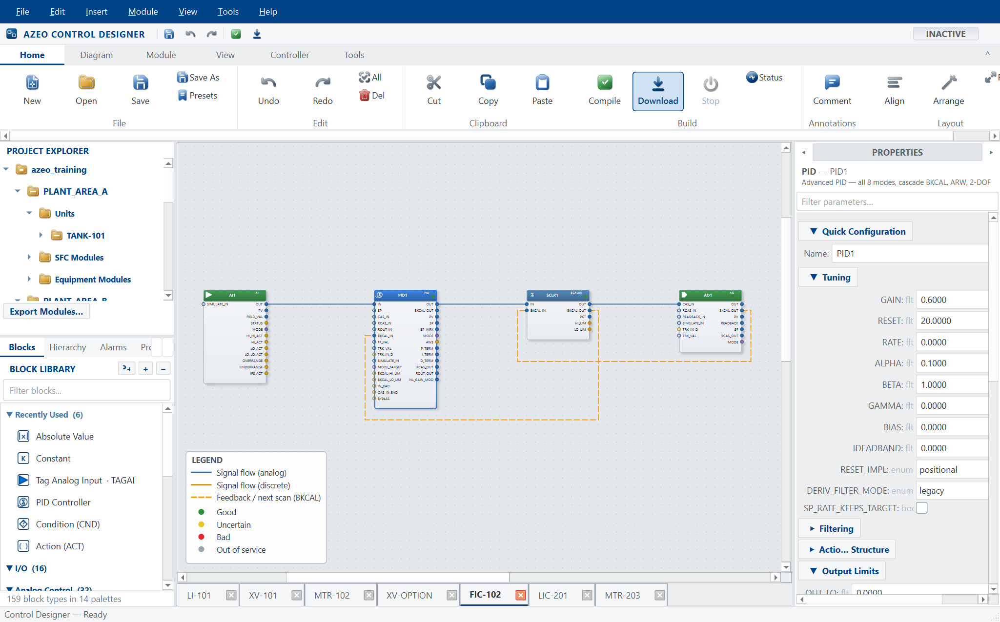
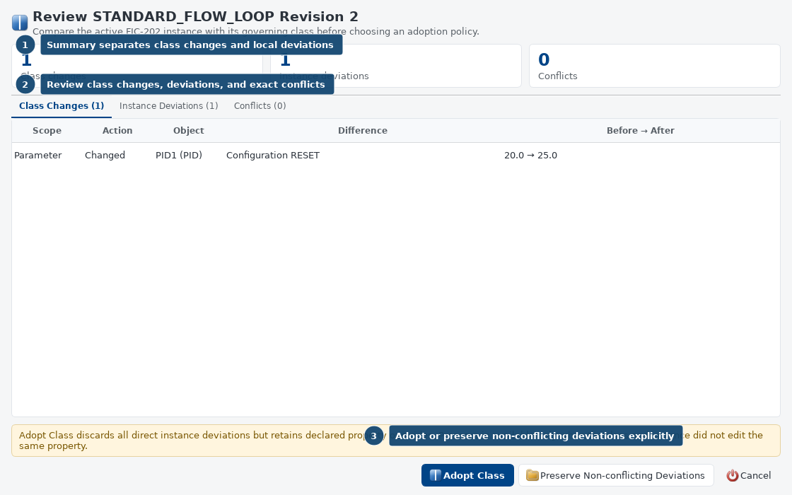

# Azeo Control Designer User Manual

Edition 1.0 - 23 September 2026
Application baseline: `0.4.0`
Document ID: AZEO-UM-CONTROL

Function-block module engineering, class reuse, download and live diagnosis. This guide uses the current Azeo application names and real
widget captures. Examples use the training system; values and demonstrated
conditions are not operating targets for a real plant.

Section numbers inherited from the [suite user manual](USER_MANUAL.md) are kept
intact so cross-application references remain accurate. Application-specific
commands depend on the active project, selected object and granted authority.

## Start with a task

| Goal | Where to go |
| --- | --- |
| Create, wire, compile and save a module | Relevant numbered section below |
| Review a Control Module Class and adopt an update | Relevant numbered section below |
| Download, monitor and safely return a module offline | Relevant numbered section below |

**Before changing live state:** use an instructor-approved training copy,
check the selected project and current source quality, and keep Save, Download,
Publish, Refresh and operator commands distinct. The [installation guide](INSTALLATION_GUIDE.md)
covers setup and repair. **Help > System information** gives the actual build,
licence and support paths on the workstation.

## 2. Your first session

### 2.1 Prepare the workstation

For a source checkout, create the environment described in the repository
README, open PowerShell at the repository root, and use:

```powershell
& .\.venv\Scripts\python.exe run.py
```

The command opens Azeo Explorer on the registered default project. On a
managed training workstation, use the installed launcher instead of the
source-checkout command.

For a list of available projects and areas, run:

```powershell
& .\.venv\Scripts\python.exe run.py --list
```

**Expected result:** The project list includes the intended training project, and the startup project is marked as the default. `--list` exits without starting the graphical application.

### 2.2 Open a specific application

Run these options from the repository root using the same interpreter. Replace the project path only when selecting a different prepared project.

| Option after `run.py` | Result |
| --- | --- |
| No option | Open Explorer on the registered default project |
| `projects/AzeoPlantVirtualController` | Open the explicitly named project |
| `--classic` | Open Control Designer as the primary window |
| `--graphics` | Open Graphics Designer as the primary window |
| `--station` | Open the dedicated Operator Station; Control Designer stays hidden until requested from a faceplate |
| `--simulation` | Open Simulation Workbench as the primary window |
| `--blank` | Open an empty scratch area |
| `--online` | Request an area download at startup; use only for a prepared configuration |
| `--no-plant` | Open an engineering session without a driven process source |
| `--help` | Show the launcher's command reference |

For the first commissioning session, use Explorer so you can explicitly inspect the project, provider, and module state. Application windows can also be opened from Explorer's **Applications** menu without launching another independent controller session.

### 2.3 Start the APVC training system

**Before you begin:** Confirm the selected project and use a training copy if you intend to make changes. The default APVC workflow uses the embedded Local Virtual I/O provider. Its manual startup state is deliberate.

1. Launch Explorer and read the project identity in the window.
2. Inspect the controller and Local Virtual I/O nodes under the physical network.
3. Open **Tools > Virtual I/O > Provider Status** if available, or the corresponding Local Virtual I/O node's status command.
4. Choose **Start Simulator** from **Tools > Virtual I/O**.
5. Confirm that the provider reports Running. Refresh the status and check that exchange activity advances.
6. Open the intended module in **Applications > Control Designer**. Compile and download the selected module as described in Chapter 4, or use the reviewed **Total Download** workflow for the prepared project.
7. Confirm that the required modules are online and their scan counters advance.
8. Choose **Applications > Operator Station**.
9. Verify the intended home display, current data quality, and station status.

**Expected result:** The provider is running, required modules are scanning, and bound values appear with credible quality. A source that has just started may need an observation interval before the station can establish freshness.

**Recovery:** If values are Bad, check provider state, online module state, and the tag path before changing a control mode. An open window and a moving clock do not prove that process data is healthy.

### 2.4 Make a read-only orientation pass

1. In Operator Live, select **Displays** and open one assigned unit display.
2. Select a live instrument or loop PVM to open its faceplate.
3. Read the module/block identity, PV, quality, and actual mode.
4. Select **Pin** on the faceplate title bar.
5. Select a second loop and compare the two independent windows.
6. Open **Trends** or the faceplate's history action.
7. Open **Alarms** and inspect the list without acknowledging anything solely to clear the screen.
8. Return to the home display with **Alt+Home**.

**Expected result:** You can locate equipment, retain a comparison faceplate, and reach process history without editing a graphic or changing a process value.

### 2.5 Finish a session

1. Finish an active training session so its report and input-fault cleanup are completed.
2. Review and release exercise-specific input simulations or engineering forces.
3. Save intended engineering changes. Publish only displays that have completed the release checks.
4. Save a project backup or simulation snapshot when the lesson requires one; these serve different purposes.
5. Close tools and application windows through their normal close controls.
6. Wait for application shutdown before restoring files or modifying provider configuration.

Closing a faceplate closes that window. Closing Operator Live is not the same command as pausing the coordinated simulation. Use the explicit Workbench or training-session pause command when you need the process and controller clocks to stop together.

## 4. Azeo Control Designer

### 4.1 Understand the workspace

Control Designer presents one tab per open module, a function-block canvas, commands on the ribbon and menus, configuration panels, and monitoring/debugging tools. The canvas shows the control strategy; live monitoring can overlay wire values and execution information.



| Control Designer object | Purpose |
| --- | --- |
| Module | Named control configuration containing blocks and connections |
| Function block | An algorithm or I/O/device function with typed terminals and configuration |
| Terminal/pin | Connection point for an input, output, mode or status signal |
| Wire | Connection carrying a value and associated quality/status |
| CONFIG parameter | A configured setting rather than an ordinary terminal |
| Compiled module | Verified execution representation of the module |
| Downloaded module | Configuration installed in the controller runtime |

The Project Explorer separates logical process ownership from physical runtime
placement. Control modules appear under **Project > Area > Units > Unit >
Control Modules**. Create or import from a unit's context menu to assign the
module there, or right-click a module and choose **Move to Unit**. Modules with
no valid process-unit assignment remain accessible under **Unassigned**. The
separate **Control Network** branch continues to show which controller node
runs each module; moving a module between units does not change that node.

### 4.2 Create and save a module

**Before you begin:** Work in a training project and decide the module's purpose, tag names, signal units, and I/O source.

1. Choose **File > New Strategy** or press **Ctrl+N**.
2. Give the module a unique, meaningful name when prompted.
3. Insert blocks using **Insert > Function Block**, or drag them from the block palette.
4. Select a block and configure its name and parameters using the available block editor.
5. Connect compatible output and input terminals on the canvas.
6. Add comments that explain control intent, assumptions, and required interlocks.
7. Open **Module > Module Properties** and review the module settings, including its execution interval where configured.
8. Choose **File > Save** or press **Ctrl+S**.

**Expected result:** The named module is saved in the intended project/area. Unsaved changes and changes not downloaded remain separate concerns.

### 4.3 Build a basic measured loop

Use the installed block reference to select the exact terminals for each block. A typical analog loop includes an AI, a PID, optional scaling, and an AO/final-element demand. It also includes the required downstream status and back-calculation path.

1. Configure the AI's field reference and engineering range.
2. Configure the PID's PV range, action, initial mode, output limits, and tuning for the exercise.
3. Connect the measured value to the PID's PV input using compatible units.
4. Connect the PID output through any necessary scaler to the final-element command input.
5. Complete the downstream acceptance/tracking and BKCAL connections required by the block contracts.
6. Verify that both sides of every scaler use the same numerical interpretation.
7. Keep commissioning modes under deliberate control and compile the module.

> **Range check:** A PID output of 0-100 connected to a scaler expecting 0-1 is a configuration error even if the wire type is numeric. Confirm ranges and units at each boundary. Do not correct a saturated final element by hiding or clamping the displayed value.

### 4.4 Compile and resolve errors

1. Select the module tab.
2. Choose **Module > Compile** or press **F7**.
3. Read the complete result. Identify the referenced block, pin, connection, or expression.
4. Correct the first underlying error and compile again.
5. Review warnings before download; a successful compile does not prove that the I/O mapping or control intent is correct.
6. Use **View > Show Execution Order** to inspect the compiler-derived execution order when investigating dependencies.

**Expected result:** The module compiles with understood diagnostics. Confirm that every critical input is intentionally driven and every output has the correct owner.

### 4.5 Save, download, go online and go offline

| Command | Use it when | Result to inspect |
| --- | --- | --- |
| Save | Preserve engineering edits | Saved project file and module identity |
| Compile, F7 | Check module structure and execution | Diagnostics and execution order |
| Download, F5 | Choose the set of open modules that should be online | Entire checkbox selection, download result and controller state |
| Go On Line | Attach the editor's live view to the running configuration | Live values and online indication |
| Go Off Line, Shift+F5 | Take all online modules open in this Control Designer offline | Resulting module inventory and scan state |
| Upload (Controller -> Project) | Bring supported running values/configuration back into the project | Reviewed differences before saving |
| Compare Parameters, Ctrl+K | Inspect parameter differences | Intended versus actual values |

**Download procedure**

1. Save and compile the module.
2. Verify the target controller/module identity and required I/O readiness.
3. Choose **Module > Download** to open the module-selection dialog.
4. Review the complete checkbox selection. Keep every already-running module selected if it must stay online; deselecting an online module takes it offline. Select the additional modules required by the exercise and confirm the reviewed selection.
5. Open **Module > Controller Status** and confirm the module is active/online as intended.
6. Observe more than one scan and verify PV quality and output acceptance.
7. If an online module has changed since download, use its **Re-Download** action in **Controller Status** before expecting the runtime to use the edit. Selecting an already-online module in the ordinary download selection does not replace its running configuration.

**Expected result:** The intended module is scanning. A source edit, an open tab, or an attached live view is not proof that the new configuration was downloaded.

> **Offline scope:** The menu/ribbon **Go Off Line** command affects all online modules open in that Control Designer. For one-module work, use that module's row in **Controller Status**: **Go Offline**, **Go Online**, or **Re-Download** as appropriate. The row's Go Online action compiles and brings that inactive module online; it is different from the menu's view-attachment command.

### 4.6 Monitor a running module

1. Open the module and attach its online view.
2. Enable **View > Show Wire Values** if needed.
3. Select the relevant block and inspect its values, modes, quality, and status.
4. Open **View > Watch Window** or press **Ctrl+Shift+W** for a focused set of observations.
5. Open **Module > Controller Diagnostics** for scan and module health.
6. Use **Module > Cross Reference** to inspect related references when a signal appears to have an unexpected consumer or source.
7. Use the **Monitoring Tab** with **Ctrl+M** for the available monitoring view.

Record a symptom together with the actual mode, target mode, PV/SP/OUT, quality, and downstream status. A single numeric value rarely explains a loop that will not transfer or a demand that will not move an output.

### 4.7 Use controller debugging tools

Breakpoints, stepping, forcing, and watch facilities are engineering tools for an isolated exercise. A breakpoint can suspend progress expected by other modules or displays. A forced value can conceal the real signal path. Record the scope and remove temporary interventions before returning to normal operation.

1. Reproduce the problem in a copied project or a prepared offline controller simulation.
2. Add only the observations needed to isolate the block/connection.
3. Use the available breakpoint/step controls to examine execution at the intended boundary.
4. Record the input, output, quality, and internal state that establish the problem.
5. Remove breakpoints and forces, restore the agreed state, and repeat under normal scanning.

Use **Module > Controller Simulator** for the separate offline module-testing surface. Use the suite's **Simulation Workbench** for coordinated process/controller time and complete process snapshots. The two tools serve different scopes.

### 4.8 Review and document a module

Use **File > Module Report** for the available module report and **Print Preview** before printing. **Tools > Compare Strategies** and **Version History** support engineering review. Record the control purpose, input/output mapping, units, normal/setup modes, limits, and expected abnormal behavior with the module.

Before a lesson release, confirm that the saved project, running module, graphic bindings, and instructor's starting snapshot describe the same intended configuration.

### 4.9 Reuse a master Control Module Class

Use a Control Module Class when complete modules should share governed block
structure, wiring, configuration, drawing layout, and documentation while a
small typed set of instance values may differ.

1. Open, compile, save, and take the finished source module offline.
2. Choose **Tools > Control Module Classes...** and
   **Create Class from Active**.
3. Expose only approved instance properties such as field tags or selected
   tuning values. The source becomes the first linked revision-1 instance.
4. Choose **Create Linked Instance**. In the guided window, enter a unique
   module name, select the owning project area and process unit, and apply only
   the typed property overrides that should not inherit the class default.
5. Publish later master changes with **Publish Active as New Revision**. Other
   instances remain unchanged and report **STALE**.
6. Open each stale instance and use **Review / Adopt Update** to compare class
   changes, direct deviations, and exact three-way merge conflicts.
7. Compile and perform deployment-impact review on every effective instance
   before download.



See [Creating a master Control Module Class](CONTROL_MODULE_CLASS_TUTORIAL.md)
for the complete illustrated workflow, status reference, and release checklist.

The installed `AzeoPlantVirtualController` project provides a concrete
cooling-water example. Four revision-1 classes create nine linked instances:
four AI/PID/AO loops, two cooling-tower fan cells, two circulation-pump and
discharge-valve assemblies, and one tower-performance module. The fan cells
stage from supply temperature with availability, VFD, fault, run-feedback and
basin-low-low protection. Each pump opens and proves its discharge MOV before
start; the standby instance adds a delayed low-header-pressure demand. All 16
CT1 outputs download in Manual and require the normal commissioning transfer.
The simulator remains open-loop and owns only process physics and its
independent SIS.

## 5. Virtual I/O and signal checkout

### 5.1 Understand the signal boundary

The APVC provider exchanges plant measurements and controller demands through Local Virtual I/O. AI and DI are acquired inputs. AO and DO are controller-owned outputs. The provider's output-holder rules prevent competing sources from writing the same outputs.

| Signal kind | Meaning | Plant-side input simulation |
| --- | --- | --- |
| AI | Analog measurement from the process | Static or patterned value with acquisition quality |
| DI | Discrete measurement/status from the process | Supported discrete/static or patterned input |
| AO | Analog command from the controller | Read-only in the plant-side input simulator |
| DO | Discrete command from the controller | Read-only in the plant-side input simulator |

Controller block simulation and Virtual I/O input simulation are separate layers. The first substitutes a block's configured simulation input. The second substitutes a provider input before it reaches the controller. Graphics TEST is a third layer used only to review display behavior.

### 5.2 Inspect provider health

1. In Explorer, select the Local Virtual I/O node.
2. Open **Provider Status**.
3. Confirm Running state, the intended source identity, and the output holder.
4. Record current exchange counters.
5. Close/reopen or refresh the status after a short interval and confirm progress.
6. Inspect a routed field point in Tag Database and then its consuming control block.

**Expected result:** Provider activity advances and valid acquired data reaches the intended block. A total Tag Database count can exceed the field-route count because it includes module parameters.

### 5.3 Apply an input profile

**Before you begin:** Select an AI or DI in a copied training project. Identify the live source to which the input should return after the exercise.

1. Open **Applications > Virtual I/O Simulator**, or the Local Virtual I/O node's **Open Signal Simulator** action.
2. Find the tag by unit and signal kind.
3. Select the input row and choose **Configure Input**.
4. Select the required Static, Sawtooth, Square, or Sine profile offered for that input.
5. Enter the static value or the pattern's low, high, and period settings.
6. Choose Good, Uncertain, or Bad acquisition quality for the test.
7. Apply and inspect the input's simulation indication.
8. Verify the resulting value and quality in Control Designer and Operator Live.

**Expected result:** The selected input changes through the intended provider path. AO/DO rows remain protected from this input-simulation operation.

### 5.4 Release, save and load input simulations

Choose **Release** on the simulated input to expose current process physics again. The process can continue evolving while its measurement is substituted, so the restored live value may differ from the pre-test value.

Use **Save Scenario** to preserve the active input-profile set. **Load Scenario** validates the complete saved set before replacing active profiles. Pattern phase restarts when loaded. Keep these input scenarios separate from complete Workbench snapshots and from recorded training sessions.

### 5.5 Commission a loop's direction and authority

1. Confirm Good input quality and the intended manual/setup modes.
2. Compare the displayed output with the actual final-element readback.
3. Make only the small output movement specified in the instructor's exercise.
4. Observe the process response and confirm its direction and plausible rate.
5. Return to the agreed operating condition and verify tracking/BKCAL acceptance.
6. Transfer the downstream device and controller through their engineered modes in the prescribed order.
7. Verify actual mode and response after every transfer.

Do not assume a generated project's initial modes or special-case output values remain unchanged after project editing or snapshot restoration. Read the actual configuration and use the lesson's approved values.

### 5.6 Change a provider configuration

Changes to provider factory, paths, source/holder identity, routes, catalog, snapshots, exchange timing, or startup settings require a reviewed configuration update and an application restart. Explorer **F5** refreshes its view; it does not reconstruct the provider.

The APVC Local Virtual I/O configuration is an embedded-provider workflow. Connecting to a separately running process requires a commissioned network transport/profile; a changed endpoint string alone does not convert Local Virtual I/O into an external OPC UA client.

## 17. Keyboard and gesture reference

### 17.1 Shortcuts depend on the active application

**F5 has four different meanings:** refresh Explorer, download a module in Control Designer, enter TEST in Graphics Designer, and retrieve configuration in Operator Live. Confirm window focus before using it. A text editor or modal dialog can also consume a shortcut.

### 17.2 Explorer and Control Designer

| Application | Shortcut | Action |
| --- | --- | --- |
| Explorer | F5 | Refresh the project view |
| Explorer | Ctrl+F | Search the system |
| Explorer | F1 | Explorer Help |
| Control Designer | Ctrl+N / Ctrl+O | New/open strategy |
| Control Designer | Ctrl+S / Ctrl+Shift+S | Save/Save As |
| Control Designer | Ctrl+F4 | Close module |
| Control Designer | Ctrl+Z / Ctrl+Y | Undo/Redo |
| Control Designer | Ctrl+F | Find block |
| Control Designer | F7 | Compile |
| Control Designer | F5 | Download |
| Control Designer | Shift+F5 | Take all online modules open in Control Designer offline |
| Control Designer | Ctrl+K | Compare Parameters |
| Control Designer | Ctrl+0 | Zoom to Fit |
| Control Designer | Ctrl+Shift+G | Graphics Designer |
| Control Designer | Ctrl+Shift+O | Operator Station |
| Control Designer | Ctrl+T | Tag Database |
| Control Designer | Ctrl+M | Monitoring Tab |
| Control Designer | Ctrl+Shift+W | Watch Window |
| Control Designer | Ctrl+Shift+M | Controller Simulator |
| Control Designer | F1 | Control Designer Help |

### 17.3 Graphics Designer and PVM Configuration Designer

| Shortcut/gesture | Action |
| --- | --- |
| Ctrl+N | New display |
| Ctrl+K | Search Graphics Designer commands and recent components |
| Ctrl+S | Save display/class |
| Ctrl+Shift+P | Publish an eligible display |
| Ctrl+E | Toggle/request Edit mode |
| F5 | TEST mode |
| F8 | Verify |
| F11 | Focus-view toggle |
| Ctrl+2 | Library Explorer |
| Ctrl+3 | Control Data |
| Ctrl+Tab | Next open tab |
| V / H | Select / Pan |
| R / E / L | Rectangle / Ellipse / Line |
| C / P / A | Connector / Pencil / Arc |
| S / X / T | Polygon/shape tool / Eraser / Text |
| Esc | Cancel the active gesture/tool |
| Space+drag | Temporary pan |
| Ctrl+drag | Copy the selection |
| Shift+drag | Axis-constrained movement |
| Alt+drag | Bypass snapping |
| Arrow keys | Nudge selection in Edit mode |
| Shift+Right / Shift+Left | Grow/shrink width about the center |
| Shift+Up / Shift+Down | Grow/shrink height about the center |
| Shift+F | Zoom to selection |
| F1 | Contextual Help Center |
| Designer: Ctrl+Z / Ctrl+Y | Undo/Redo the current class configuration |

Single-letter drawing shortcuts are intended for the authoring canvas. When editing a text/property field, use the field's normal text-entry behavior and then return focus to the canvas.

### 17.4 Operator Live

| Shortcut/gesture | Action |
| --- | --- |
| Alt+Left / Alt+Right | Previous/next navigation history |
| Alt+Home / Alt+Up | Home / parent display |
| Ctrl+L | Display chooser |
| Ctrl+K | Search |
| Ctrl+Shift+A | Alarm list |
| Ctrl+Shift+H | Process History View |
| F5 | Retrieve published configuration updates |
| F11 | Full screen/window |
| Ctrl+0 | Fit process display |
| Ctrl+= / Ctrl+- | Zoom in/out |
| Ctrl+mouse wheel | Zoom the process graphic |
| Middle-button drag | Pan the process graphic |
| Faceplate title drag | Move the detached faceplate |
| Faceplate Pin | Retain that window when another object is opened |
| Ctrl+click PVM/numeric Data Link | Select tags together for Add to Historian |
| Shift+F10 in historian chart | Open the historian context menu |

### Related Azeo help

- [Complete suite user manual](USER_MANUAL.md) - connected workflow and glossary.
- [Installation and administration](INSTALLATION_GUIDE.md) - setup, update and repair.
- [PA Designer authoring guide](PA_DESIGNER.md) - block and procedure details.
- [Control Module Class tutorial](CONTROL_MODULE_CLASS_TUTORIAL.md) - reusable control engineering.
- [PVM and faceplate tutorial](PVM_FACEPLATE_TUTORIAL.md) - reusable graphics engineering.

Use the application's F1 help for the installed block or selected tool. A screenshot
documents the interface, not live readiness or permission to perform a command.
