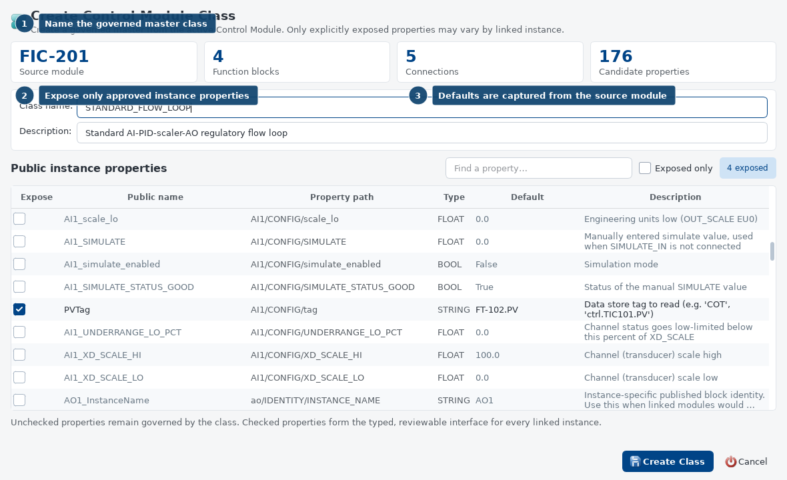
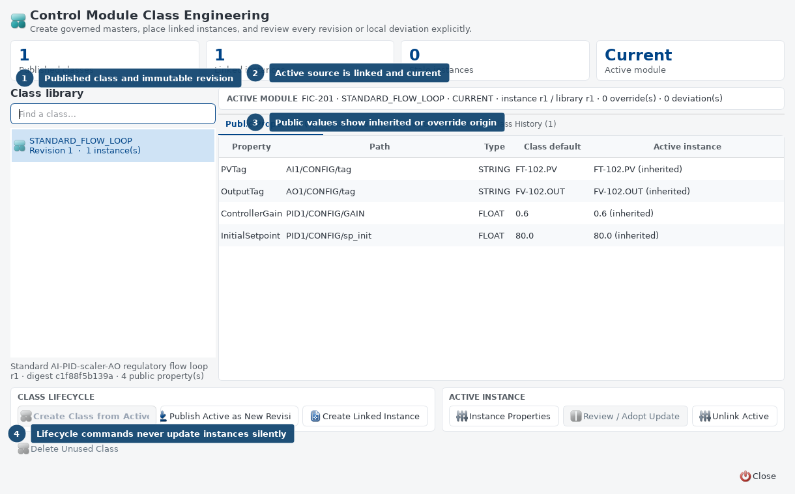
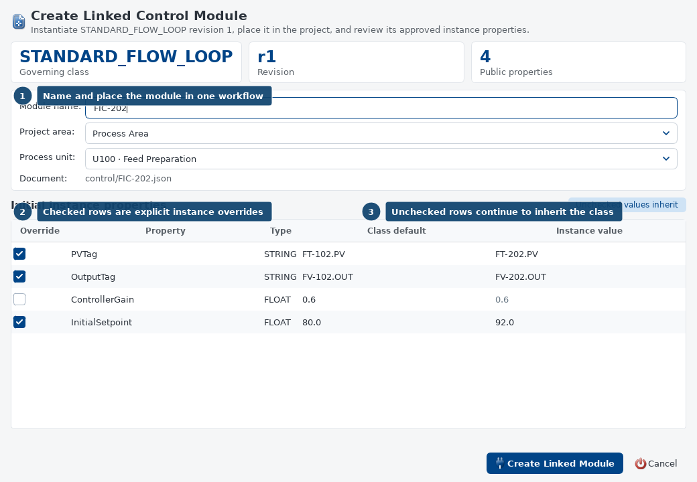
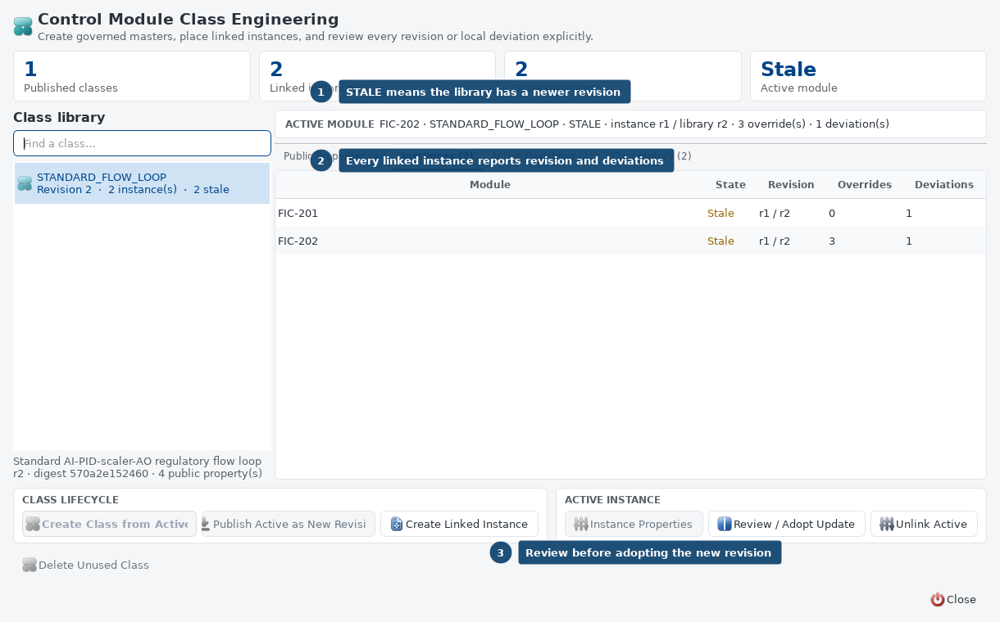
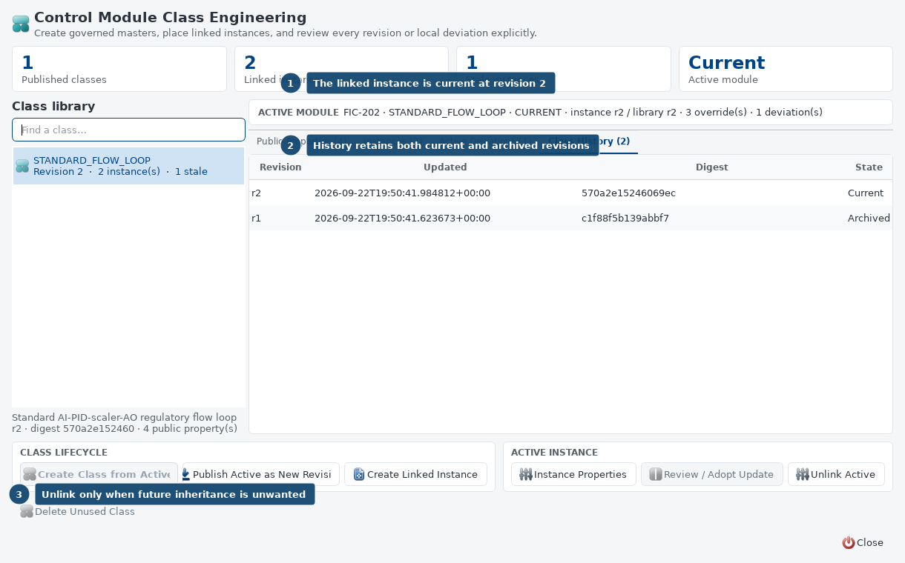
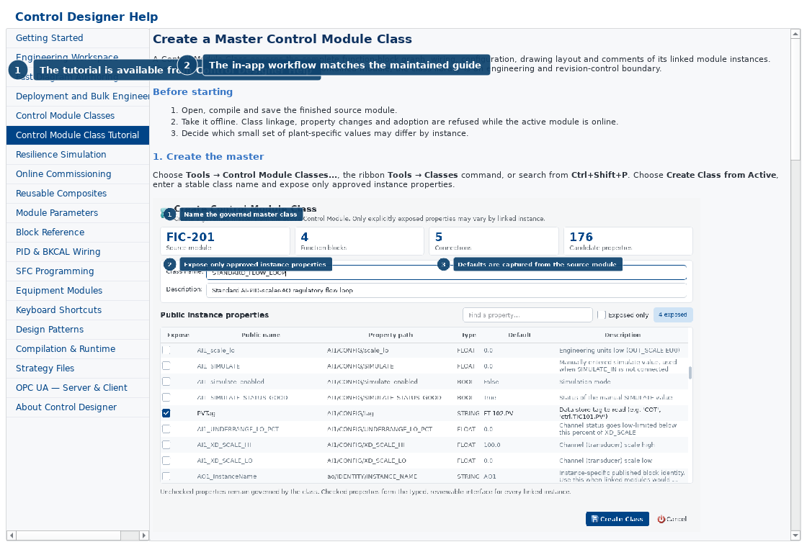

# Creating a master Control Module Class

A **Control Module Class** is a revisioned master definition for a complete
function-block module. Its linked instances remain normal executable Control
Modules, but they retain their relationship to the master so an engineer can
review and adopt later class revisions.

Use a class when several modules should share the same block structure,
wiring, tuning basis, documentation, and drawing layout while allowing a small,
deliberate set of instance values to differ.

This tutorial builds `STANDARD_FLOW_LOOP` from an existing AI-PID-scaler-AO
flow loop and creates `FIC-202` as a linked instance.

## What is governed

The class owns the complete module document:

- function blocks and stable block identities;
- signal and BKCAL wiring;
- block configuration and module parameters;
- drawing positions and engineering comments;
- the declared public-property interface; and
- immutable revision history and content digests.

A linked instance may contain two kinds of intentional difference:

| Difference | Meaning | Update behavior |
| --- | --- | --- |
| Public-property override | An approved plant-specific value such as a tag, initial setpoint, or gain | Retained automatically when a new class revision is adopted |
| Direct instance deviation | A structural, configuration, drawing, or documentation edit made outside the public interface | Reported separately and retained only through an explicit reviewed choice |

The controller runs the effective graph embedded in each instance. It does not
need the engineering class library at runtime.

## Before starting

1. Open the source Control Module in Control Designer.
2. Compile it and correct every validation error.
3. Save the module.
4. Take the module **offline**. Creating, unlinking, updating, or changing the
   public properties of a class instance is refused while that module is online.
5. Decide which values genuinely vary per instance. Keep the interface small.

Good public properties include field tags, an approved initial setpoint, or a
site-specific tuning value. Block identities, signal topology, BKCAL wiring,
interlocks, execution structure, and ordinary documentation should normally
remain governed by the master.

## 1. Open the class manager

Use any of these equivalent routes:

- **Tools > Control Module Classes...**
- **Tools** ribbon tab, then **Classes**
- **Ctrl+Shift+P**, then search for **Control Module Classes**

The class manager always describes the active module separately from the
selected library class. An independent active module says `INDEPENDENT`; a
linked module says `CURRENT`, `STALE`, or `MISSING`.

## 2. Create the master from the active module

Choose **Create Class from Active**.



1. Enter a stable class name such as `STANDARD_FLOW_LOOP`.
2. Add a purpose-oriented description.
3. Check only properties that instances are permitted to override.
4. Give each checked property a clear public name. The property path remains
   tied to the real module or block schema.
5. Confirm its declared type and default.
6. Choose **Create Class** (or **Publish Revision** for an existing class).

For the tutorial loop, expose:

| Public name | Governed property path | Type | Purpose |
| --- | --- | --- | --- |
| `PVTag` | `AI1/CONFIG/tag` | STRING | Field measurement read by the AI block |
| `InitialSetpoint` | `PID1/CONFIG/sp_init` | FLOAT | Initial working setpoint |
| `ControllerGain` | `PID1/CONFIG/GAIN` | FLOAT | Approved per-instance tuning value |
| `OutputTag` | `AO1/CONFIG/tag` | STRING | Field demand written by the AO block |

The active source becomes the first linked instance of revision 1. This avoids
leaving an ungoverned copy beside the newly created master.



Review the **Public Properties** tab. The Active instance column identifies
each value as `inherited` or `override`. The other tabs show all linked
instances, direct deviations, and immutable class history.

## 3. Create a linked instance

Select `STANDARD_FLOW_LOOP`, then choose **Create Linked Instance**.

1. Enter a unique Control Module name, for example `FIC-202`.
2. Select the owning project area and process unit. Choose **Unassigned** only
   when placement has not yet been approved.
3. In the same window, check only the values that differ from the class.
4. Enter the plant-specific values, review the document destination, and choose
   **Create Linked Module**.



Unchecked rows continue to inherit the class default and cannot be edited until
Override is checked. Checked rows are stored as typed overrides. The new
document is compiled before it is written, an existing module file is never
overwritten, and the new module appears under the selected unit in Project
Explorer.

Open `FIC-202`, verify the generated tags and parameters, compile it, then use
the normal reviewed download workflow.

## 4. Change an instance value later

Open the linked module, take it offline, select its class, and choose
**Instance Properties**.

- Check a row and enter a value to create or replace an override.
- Clear a row to remove the override and resume inheritance.
- Properties that were not declared public cannot be changed through this
  dialog. Edit the master when the change belongs to every instance.

An override is not a deviation. It is part of the reviewed class interface and
survives later class adoption.

## 5. Publish a new master revision

To change the master:

1. Open a **current** linked instance that represents the intended master.
2. Take it offline.
3. Make and validate the structural, configuration, drawing, or documentation
   changes.
4. Open Control Module Classes and choose
   **Publish Active as New Revision**.
5. Review the public interface again and publish the successor.

Publishing a revision never rewrites other modules. Their embedded revision
continues to execute and their status becomes `STALE`.



This deliberate separation makes a class edit reviewable: an engineer decides
when each instance is ready to adopt the new master.

## 6. Review and adopt the update

Open a stale linked module, take it offline, select its class, and choose
**Review / Adopt Update**.


The review has three independent views:

- **Class Changes** — differences between the instance's adopted class revision
  and the selected current class revision.
- **Instance Deviations** — direct differences between the active instance and
  its adopted class snapshot.
- **Conflicts** — exact property paths changed differently by both the class and
  the instance.

Choose one result:

- **Adopt Class** applies the current master and discards direct deviations.
  Declared public-property overrides are retained.
- **Preserve Non-conflicting Deviations** performs a three-way merge. It keeps
  local differences only where the class did not change the same property.

Preserve is disabled when a conflict exists. Resolve the conflicting intent in
the active module or master, publish or revert as appropriate, and review again.
The product never silently chooses between two different edits to the same
property.

After adoption, compile and inspect the effective module before download.



The history tab retains archived revisions for traceability. A current linked
module reports the same instance and library revision.

## 7. Understand direct deviations

A direct edit to a linked instance is allowed so the engineer is never trapped,
but it is visible. Examples include:

- adding, deleting, or replacing a block;
- changing a wire or BKCAL path;
- editing a non-public configuration value;
- moving a block or changing a comment; or
- changing module runtime settings.

Use **Active Deviations** before release. If a difference should be common,
publish it as a new master revision. If it is legitimately plant-specific,
consider making the property public in the next reviewed revision. Do not make
structure public merely to hide an exception.

## 8. Unlink only by design

**Unlink Active** keeps the instance's effective executable logic and removes
its class identity. The module becomes independent and receives no future class
status or updates.

Unlink when the module has intentionally diverged into a different engineering
design. Do not unlink merely to avoid resolving a revision conflict.

A class cannot be deleted while linked instances exist.

## Status reference

| Status | Meaning | Required action |
| --- | --- | --- |
| `INDEPENDENT` | The module has no governing class | Create a class or leave it intentionally independent |
| `CURRENT` | Embedded revision and digest match the library | Normal engineering and download workflow |
| `STALE` | The library has a newer revision | Review and adopt when the instance is ready |
| `MISSING` | The instance is linked but its library definition is unavailable | Restore/import the class definition before attempting an update |
| Invalid metadata | The embedded identity, revision, snapshot, or digest is inconsistent | Restore the module from a trusted revision; do not bypass validation |

## Release checklist

- The class and every target instance compile cleanly.
- Public properties are minimal, typed, and named by purpose.
- Field tags and ranges are correct for each instance.
- No unexpected direct deviations remain.
- Every stale instance has an explicit adoption decision.
- Conflicts have been resolved rather than bypassed.
- Updated modules have passed the normal deployment-impact review.
- The class revision and module revision are recorded in the release review.
- Modules are downloaded only after their individual effective logic is
  verified.

## Tutorial in Help

The same workflow is available inside Control Designer under
**Help > Control Designer Help > Control Module Class Tutorial**.



## Regenerating the screenshots

The images are deterministic captures of the real class dialogs over an
isolated temporary copy of the training flow loop. They do not edit a project
or run a controller:

```powershell
.\.venv\Scripts\python.exe tools\render_control_module_class_tutorial.py
```
