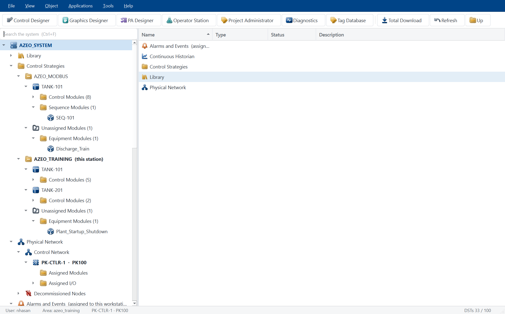
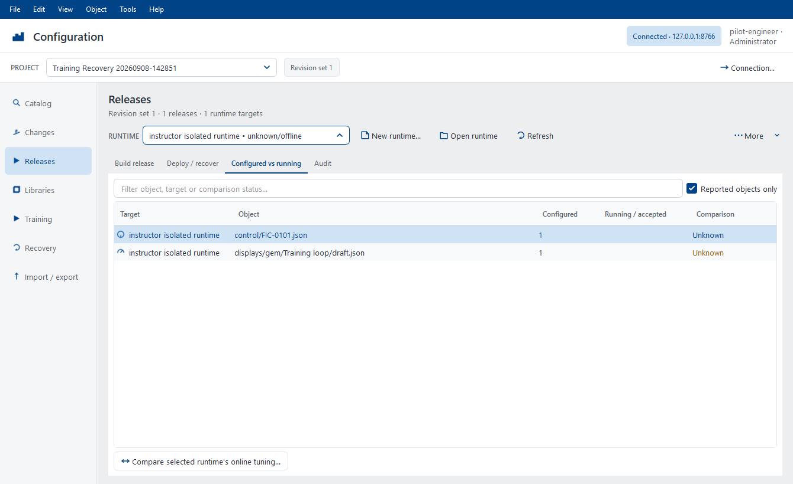
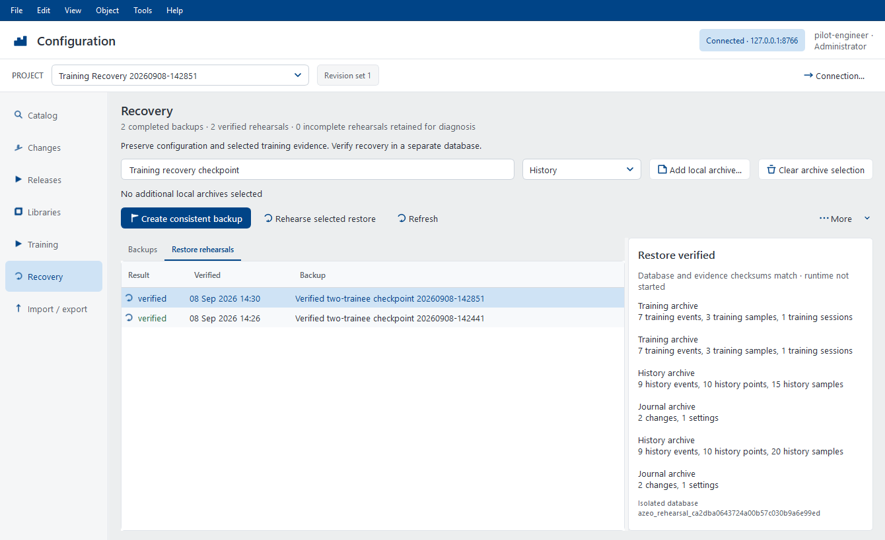

# Azeo Explorer User Manual

Edition 1.0 - 23 September 2026
Application baseline: `0.4.0`
Document ID: AZEO-UM-EXPLORER

Project navigation, administration, shared configuration and recovery. This guide uses the current Azeo application names and real
widget captures. Examples use the training system; values and demonstrated
conditions are not operating targets for a real plant.

Section numbers inherited from the [suite user manual](USER_MANUAL.md) are kept
intact so cross-application references remain accurate. Application-specific
commands depend on the active project, selected object and granted authority.

## Start with a task

| Goal | Where to go |
| --- | --- |
| Open a project and identify its controller, units and modules | Relevant numbered section below |
| Inspect configured and running state before deployment | Relevant numbered section below |
| Back up, restore and investigate project or startup problems | Relevant numbered section below |

**Before changing live state:** use an instructor-approved training copy,
check the selected project and current source quality, and keep Save, Download,
Publish, Refresh and operator commands distinct. The [installation guide](INSTALLATION_GUIDE.md)
covers setup and repair. **Help > System information** gives the actual build,
licence and support paths on the workstation.

## 2. Your first session

### 2.1 Prepare the workstation

For a source checkout, create the environment described in the repository
README, open PowerShell at the repository root, and use:

```powershell
& .\.venv\Scripts\python.exe run.py
```

The command opens Azeo Explorer on the registered default project. On a
managed training workstation, use the installed launcher instead of the
source-checkout command.

For a list of available projects and areas, run:

```powershell
& .\.venv\Scripts\python.exe run.py --list
```

**Expected result:** The project list includes the intended training project, and the startup project is marked as the default. `--list` exits without starting the graphical application.

### 2.2 Open a specific application

Run these options from the repository root using the same interpreter. Replace the project path only when selecting a different prepared project.

| Option after `run.py` | Result |
| --- | --- |
| No option | Open Explorer on the registered default project |
| `projects/AzeoPlantVirtualController` | Open the explicitly named project |
| `--classic` | Open Control Designer as the primary window |
| `--graphics` | Open Graphics Designer as the primary window |
| `--station` | Open the dedicated Operator Station; Control Designer stays hidden until requested from a faceplate |
| `--simulation` | Open Simulation Workbench as the primary window |
| `--blank` | Open an empty scratch area |
| `--online` | Request an area download at startup; use only for a prepared configuration |
| `--no-plant` | Open an engineering session without a driven process source |
| `--help` | Show the launcher's command reference |

For the first commissioning session, use Explorer so you can explicitly inspect the project, provider, and module state. Application windows can also be opened from Explorer's **Applications** menu without launching another independent controller session.

### 2.3 Start the APVC training system

**Before you begin:** Confirm the selected project and use a training copy if you intend to make changes. The default APVC workflow uses the embedded Local Virtual I/O provider. Its manual startup state is deliberate.

1. Launch Explorer and read the project identity in the window.
2. Inspect the controller and Local Virtual I/O nodes under the physical network.
3. Open **Tools > Virtual I/O > Provider Status** if available, or the corresponding Local Virtual I/O node's status command.
4. Choose **Start Simulator** from **Tools > Virtual I/O**.
5. Confirm that the provider reports Running. Refresh the status and check that exchange activity advances.
6. Open the intended module in **Applications > Control Designer**. Compile and download the selected module as described in Chapter 4, or use the reviewed **Total Download** workflow for the prepared project.
7. Confirm that the required modules are online and their scan counters advance.
8. Choose **Applications > Operator Station**.
9. Verify the intended home display, current data quality, and station status.

**Expected result:** The provider is running, required modules are scanning, and bound values appear with credible quality. A source that has just started may need an observation interval before the station can establish freshness.

**Recovery:** If values are Bad, check provider state, online module state, and the tag path before changing a control mode. An open window and a moving clock do not prove that process data is healthy.

### 2.4 Make a read-only orientation pass

1. In Operator Live, select **Displays** and open one assigned unit display.
2. Select a live instrument or loop PVM to open its faceplate.
3. Read the module/block identity, PV, quality, and actual mode.
4. Select **Pin** on the faceplate title bar.
5. Select a second loop and compare the two independent windows.
6. Open **Trends** or the faceplate's history action.
7. Open **Alarms** and inspect the list without acknowledging anything solely to clear the screen.
8. Return to the home display with **Alt+Home**.

**Expected result:** You can locate equipment, retain a comparison faceplate, and reach process history without editing a graphic or changing a process value.

### 2.5 Finish a session

1. Finish an active training session so its report and input-fault cleanup are completed.
2. Review and release exercise-specific input simulations or engineering forces.
3. Save intended engineering changes. Publish only displays that have completed the release checks.
4. Save a project backup or simulation snapshot when the lesson requires one; these serve different purposes.
5. Close tools and application windows through their normal close controls.
6. Wait for application shutdown before restoring files or modifying provider configuration.

Closing a faceplate closes that window. Closing Operator Live is not the same command as pausing the coordinated simulation. Use the explicit Workbench or training-session pause command when you need the process and controller clocks to stop together.

## 3. Azeo Explorer and project administration

### 3.1 Find your way around Explorer

Explorer provides the project tree, object details, and entry points to the other applications. Expand a tree node to narrow the scope; select the object before using its context menu. A command on a controller applies to a different scope from a command on one module.



Use **View > Refresh** or **F5** to refresh the Explorer view. Use the application toolbar or **Applications** menu to open Control Designer, Graphics Designer, Operator Station, Tag Database, and available simulation tools. **F1** opens Explorer help.

| Object or tool | What to inspect |
| --- | --- |
| Project/system node | Current project identity and project administration |
| Area and module nodes | Module organization, names and available opening/download actions |
| Controller node | Controller identity, assigned modules and diagnostic state |
| Local Virtual I/O node | Provider state, source/holder identity and input simulation entry point |
| Tag Database | Canonical tag paths, types, units and consumers |
| Graphics/display nodes | Engineering graphics and publication context |

### 3.2 Open and verify a module

1. Expand the appropriate area or controller assignment.
2. Select the required control module.
3. Double-click it or choose **Open in Control Designer** where that action is offered.
4. Check the Control Designer tab name before editing.
5. Use **Module > Compile** to check the module and review any reported errors.

**Expected result:** Control Designer focuses the selected module. Opening a module does not, by itself, replace a running controller configuration.

### 3.3 Inspect a tag

1. Open **Tag Database** from Explorer.
2. Search for a known tag, such as `FT-0102` in the APVC example.
3. Select the appropriate field or parameter row. Similar text can appear in several rows with different meanings.
4. Read its canonical path, I/O kind, direction, data type, engineering units, description, and consumers.
5. Compare that path with the binding or block configuration you are investigating.

A physical field tag, a function-block path, a terminal, and a CONFIG parameter are different addresses. For example, `FIC-0101/FT-0102` identifies a block path in the example project; adding a terminal name selects one value on that block.

### 3.4 Create a training copy

**Before you begin:** Know which project is the source. A project copy is appropriate for experiments that should not alter the commissioned teaching baseline.

1. Choose **File > Project Administrator**.
2. Select the source project.
3. Choose **Copy** and enter a unique name, such as `Training_Student01`.
4. Complete the copy operation and select the new row.
5. Choose **Verify Selected**.
6. Inspect the copied provider paths, controller assignments, and workstation configuration before starting it.
7. Choose **Set Active** if this copy should be opened by the next application session.
8. Close the current suite normally and launch again.

**Expected result:** The copy has its own project identity and contains the source modules, graphics, library, and configuration. **Set Active** changes the next startup selection; it does not switch open editors to a different project.

### 3.5 Create an empty project

Choose **New** in Project Administrator. Enter a canonical project name and description. For an empty engineering database, leave network preservation off. To reuse an established topology, enable network preservation and select the source project.

The topology-preserving option copies controller/network and provider declarations, not the control modules and process displays. Inspect external or relative provider paths before using the new project. A copied network declaration is not evidence that a provider is running.

### 3.6 Back up and restore a project

**Backup procedure**

1. Save the intended module and graphic drafts.
2. Open Project Administrator and select the project.
3. Choose **Backup**.
4. Choose a descriptive `.azeoproject` filename and destination.
5. Confirm successful completion and retain the file with the lesson or project release record.

The archive includes project configuration, control/sequence modules, HMI drafts and revisions, PVM classes, deployment configuration, Virtual I/O files, and project-local documents. File checksums allow restore to reject damaged or incomplete archives.

**Restore procedure**

1. Choose **Restore** and select the archive.
2. Supply a new project name if that name already exists.
3. Complete validation and restoration.
4. Run **Verify Selected** on the restored project.
5. Review assignments and provider configuration before selecting it as Active.
6. Restart into the restored project, compile the required modules, and perform a staged checkout.

**Expected result:** Restoration creates a separate verified project. It does not overwrite an existing project. A backup protects engineering files; use a Workbench snapshot when you need process and controller operating state.

### 3.7 Register, rename, migrate or deregister

| Command | Behavior | Important condition |
| --- | --- | --- |
| Register | Copies an existing project into the managed projects directory | Source directory must contain `_project.json` |
| Rename | Changes the canonical name and project directory | The currently open project cannot be renamed |
| Verify Selected | Checks project structure and referenced module files | It does not compile or download modules |
| Migrate | Previews supported metadata/schema changes | Review the preview before applying |
| Deregister | Moves the project to a recoverable deregistered directory | Active and currently open projects are protected |

Recover a deregistered project with **Register** using its archived directory. Project Administrator has no permanent-delete operation.

### 3.8 Use Total Download deliberately

1. Select the intended project/controller scope in Explorer.
2. Choose **Total Download**.
3. Read the planned scope and validation results.
4. Resolve missing modules, invalid assignments, or compile failures before proceeding.
5. Review the download plan and any initialization implications.
6. Execute the intended stage and inspect its result.
7. Confirm the resulting online module inventory and live tag quality.

A total download is a controller operation. It does not substitute for publishing display revisions. For an individual loop under development, prefer the selected-module workflow in Chapter 4.

### 3.9 Capture a project in the Configuration Database

**Before you begin:** Have an administrator prepare the local service using the
[Configuration Database setup guide](CONFIGURATION_DATABASE.md#local-pilot-setup).
Select the intended source project in Project Administrator.

1. Choose **Configuration Database** to open **Configuration > Import / export**.
   Confirm the service and identity in the header; the local pilot connects
   automatically. Use **Connection** to change this workspace's service or token.
2. Enter a name beside **Capture as** and choose **Preview local project**.
3. Review additions, changes, removals, exclusions and unresolved references.
   Pause engineering changes while capturing a baseline that must be coherent.
4. Choose **Import reviewed snapshot**. If the source or shared generation changed,
   repeat the preview before importing.
5. Inspect **Objects**, **Tags** and **Audit** for the captured revision and author.
6. Use **Export snapshot** to reconstruct the captured files in a new directory
   and verify their hashes.

**Expected result:** The repository contains a traceable capture. Original files
remain the engineering source for this project; capturing does not redirect Save,
download a controller or publish a display. Exported project files are distinct
from the database backup in Section 16.10.

### 3.10 Search shared configuration and inspect a loop

Open **Tag Database > Shared configuration** in Explorer or Control Designer, or
**View > Tag Catalog** in Graphics Designer. Select the repository project explicitly
if the local project's association is ambiguous.

The **Configuration** workspace uses the same blue controls as Control Designer.
Its header shows the service, signed-in identity, selected project and revision
set. The left navigation opens **Catalog**, **Changes**, **Releases**,
**Libraries**, **Training**, **Recovery** and **Import / export**. Project pages
retain their filters and selections while you move between them. Review dialogs
stay separate so you can inspect the proposed action before committing it.
Finish an active request or review before changing the project or connection.

The **File**, **Edit**, **View**, **Object**, **Tools** and **Help** menus follow
the engineering apps' shared menu style. **Object** exposes commands for the
current page. Right-click a row (or press **Shift+F10**) for actions on that
object: inspect references, include release/library items in a review, open a
draft, create a named trainee copy, or rehearse/export a selected backup.
Commands use the same selection and review requirements as their page buttons.

Use **F5** to refresh the current page, **Ctrl+F** to focus its search, **Ctrl+C**
to copy selected text or table rows, and **Ctrl+Shift+C** to copy the catalog
object path. **Ctrl+Alt+1** through **Ctrl+Alt+7** switch pages; **Ctrl+B** toggles
the navigation pane. These shortcuts apply while the Configuration workspace
is active. **F1** opens Configuration help, and **Help > User guide** opens this guide.

1. Search by module, point path or several words; choose a category filter.
2. Select a result and choose **Inspect loop**. Follow **References** to its I/O,
   controller publications, graphics, classes and faceplate connections.
3. Use **Where used only** to focus on consumers. Double-click a source or target
   to follow it; **Back** returns to the previous object.
4. Inspect **Properties**, **History** and **Revisions** for identity, author,
   reason and captured configuration. Double-click a revision to inspect it.
5. Review **Coverage** findings before renaming or changing a shared object.
   Dynamic/script references can require manual review.

Binding and I/O pickers offer **Shared configuration** to select the exact point
or store tag. Confirm parameter case, units and expected type after insertion.
The catalog shows captured configuration, not live PVs. **Live / open modules**
retains the local live-data view; a graphic preview cannot issue operator writes.

### 3.11 Work in a private draft and check in changes

**Before you begin:** Select a repository editing project in the Engineering
catalog. An administrator can use **Create isolated editing pilot** on a captured
project to create one without changing the source project.

1. Open **Changes** and choose **Start new editing session**. Use
   **Resume selected draft** to continue saved work after closing the session.
2. In the session's **Changes** page, select a module or display and choose
   **Open in Studio**. It reserves the document and opens it in the
   corresponding Studio. Confirm the project and session before editing.
3. Use normal **Save**, or **Save drafts** in Changes. This saves private
   work and does not update the shared revision.
4. Choose **Review and check in**, inspect **Changed fields** and reference
   findings, and enter a change description.
5. Choose **Check in change set** and verify the resulting shared revision.

**Conflict recovery:** Use **Compare / resolve** to compare the draft base, your
draft and the current shared revision. Review before reloading the shared version
or retaining your draft against it. Both choices preserve a dated recovery copy;
retaining a draft still requires check-in. After a lost response, choose **Retry
interrupted check-in** from **More** to recover the original receipt.

Reservations renew while connected. **Release reservations** frees them promptly;
expiry after a crash does not permit an old draft to overwrite newer work. Reopen
drafts through **Configuration > Changes**. Draft modules cannot run on scan, and draft
displays cannot publish directly.

For a module rename, first check in or resolve local changes, then use **More >
Rename module**. Review known consumers and unclassified references, supply a reason and
choose **Check in reviewed rename**. The module retains its repository identity;
its block names and controller-store publications are separate identifiers.

### 3.12 Validate and deploy a repository release

1. Open **Configuration > Releases**, or **More > Release Manager** in engineering
   changes after checking in the intended work.
2. In **Build release**, select the modules and graphics, then choose **Validate
   and review**. The footer shows how many objects are selected.
3. Review included dependencies, validation findings and display links. Resolve
   errors; enter a reason and choose **Create immutable release**.
4. Choose **Create isolated runtime**, or **Start / resume selected runtime** for
   an existing target.
5. In **Deploy / recover**, select the release, runtime and intended control and/or
   graphics operation, then choose **Deploy selected release**.
6. Open **Operator Live** from the runtime. For an already opened graphic, use
   operator **Refresh** to accept the new display and matching classes/assets.
7. Inspect **Configured vs running** and **Audit** before declaring completion.

| Reported comparison | What to check |
| --- | --- |
| Current | Source matches and control has scanned, or the station accepted the graphic |
| Online changes | The loaded version matches, but observed engineering tuning differs |
| Different | Target is using another source revision |
| Available / inactive | Graphic is unaccepted or the loaded module is inactive |
| Not loaded | Connected target has not reported the object |
| Unknown | Fresh target evidence is unavailable; investigate connectivity and runtime state |

**Delivered** confirms target processing. It does not prove a controller scan or
operator acceptance. Clear **Reported objects only** to include objects never
loaded. The isolated target has its own tag store; external field-I/O deployment
is not enabled. Section 14.11 describes explicitly attaching its training process.

After a lost response, use **More > Retry pending command**. Correct a transient
failure before **Deploy / recover > More > Retry selected failed deployment**.
If replacing a failed release, use **Cancel selected failed deployment** in that
same menu, then deploy the corrected release.
Cancellation preserves evidence of partial target changes; inspect that evidence
before deciding the next action.



### 3.13 Preserve selected online tuning

1. In Release Manager, select the runtime and choose **Compare selected runtime's
   online tuning**.
2. Check the observation time, configured values and online values. Select only
   parameters that should become engineering configuration and enter a reason.
3. Choose **Check in selected tuning** and verify the new engineering revision.
4. Validate, release and deploy through Section 3.12 when ready.

A tuning upload does not automatically download its result. Changed selected
values, stale target evidence, conflicting ownership or a newer engineering
revision require another review. Normal SP/mode movement is not an engineering
tuning change.

## 16. Troubleshooting, maintenance and recovery

### 16.1 Follow the signal and release path

When something looks wrong, first identify which layer owns it. Follow the path in order: project selection, provider/field input, online controller module, parameter path, graphic binding, published revision, station assignment and operating action.

Do not fix an uncertain measurement by recoloring it Good. Do not fix a missing faceplate by changing a controller mode. A disciplined layer-by-layer check reduces unnecessary edits and makes a reproducible issue report possible.

### 16.2 Startup and live-data problems

| Symptom | Check | Action |
| --- | --- | --- |
| Wrong project opens | Registered Active project and explicit launch path | Select the intended project and restart normally |
| Python import/startup error | Interpreter path and installed environment | Use the configured venv/launcher; collect the full error |
| Provider is stopped | Explorer's Virtual I/O lifecycle state | Start the configured provider when the exercise requires it |
| Provider cannot load | Factory/search paths and matching project assets | Correct the project configuration and restart the provider/application as required |
| All inputs are Bad | Provider, routing and module online state | Diagnose the first missing source; preserve honest Bad quality |
| One value is Bad | Exact block/terminal/CONFIG path and source quality | Correct the path or diagnose that specific input |
| LIVE status but one bad measurement | Individual value quality and binding | Investigate that signal independently of overall scan progress |
| NO DATA after opening | Whether completed scans have been observed | Allow an observation interval, then check counters and online inventory |
| STALE or PARTLY PAUSED | Module scan counters and debugger/pause state | Identify the stalled/paused module and restore intended execution |
| Controller output not accepted | Holder identity, mode, range and actual readback | Correct ownership/acceptance; verify a permitted small MAN change |

### 16.3 Operator display and faceplate problems

| Symptom | Check | Action |
| --- | --- | --- |
| Display absent from chooser | Publication and workstation/display-set assignment | Publish/assign the intended display and retrieve configuration |
| Station shows old artwork | Held revision and whether the draft was published | Publish the reviewed display, then Refresh in Operator Live |
| Faceplate does not open | Bound PVM/action, published revision and display errors | Verify the interaction in Studio and again at the station |
| First faceplate disappears on next click | Pin state | Pin it before opening another comparison |
| Faceplate is behind another window | Existing open instance | Select the same object to bring its faceplate forward |
| Faceplate body is clipped on high DPI | Logical desktop size and body scrolling | Scroll the body; keep the title controls reachable |
| Drag starts on a button | Pointer target within the title | Drag the title/caption area, not Pin or Close |
| Process view is zoomed or panned | Retained manual viewport state | Press Ctrl+0 to restore Fit |
| Alarm seems missing | Filter, shelf/suppression and scope | Inspect the intended list and condition state |
| Trend is blank | Collection start, pen path, time range and quality | Confirm valid observations exist in the chosen window |
| Repeated command refusal | Feedback reason, authority, ownership, quality and limits | Correct the actual cause before submitting again |

### 16.4 Graphics and class-authoring problems

| Symptom | Check | Action |
| --- | --- | --- |
| Cannot move an object | Edit mode, selection/layer/group context | Enter Edit and select the intended editable object |
| Placement feels constrained | Snap/Guides and intended gesture | Adjust aids or temporarily use Alt+drag |
| Tool keeps placing objects | Repeat is enabled | Press Esc/right-click or turn Repeat off |
| Pipe endpoint is wrong | Authored port/perimeter choice and symbol transform | Reconnect to the intended endpoint and verify after movement |
| Reusable instance uses the wrong loop | Public paths and literal master references | Correct Configure instance or replace literal paths with `Pvm.*` |
| Class cannot be published | Class-master tab | Save the class; publish affected display revisions |
| Commissioning review becomes stale | Display changed after the recorded review | Repeat the affected checks and visual review |
| Display locked | Another editing session or interrupted owner | Resolve ownership using the lock procedure in section 9.8 |
| Narrow ribbon/browser hides commands | Available width, scroll and sidebar arrangement | Scroll or resize the pane; use the corresponding menu/shortcut |

### 16.5 Training and simulation problems

| Symptom | Check | Action |
| --- | --- | --- |
| Training command unavailable | Station's attached training/simulation service | Open the prepared project through its supported application workflow |
| Cannot capture a starting condition | Provider running state and snapshot capability | Start a supported provider and confirm capability |
| Snapshot restore rejected | Compatibility and validation error | Use the correct snapshot/project pair; do not partially hand-edit state to bypass validation |
| Fault has no visible effect | Selected AI/DI, simulation layer and graphic binding | Follow the input through provider/block/binding to the display |
| Input does not return to the old number | Process evolved during substitution | Verify the current live value and prior simulation settings |
| Baseline/trial metric invalid | Quality gaps, setpoint changes, tolerance and window | Repeat a valid controlled measurement or record why it is invalid |
| Saved-session review changes nothing | Reviewing is read-only | Use Workbench playback only when deliberately applying supported recorded actions |
| Restart creates another attempt | Training restart semantics | Review the saved earlier attempt separately |

### 16.6 When a window disappears or stops responding

1. Record the exact time, application, project/display/module, and last action.
2. Distinguish a deliberately closed window from an unexpected disappearance.
3. Check whether other suite windows remain open and responsive.
4. Preserve unsaved engineering work where the application remains usable.
5. Collect the application and error/crash logs before repeated restart attempts obscure the sequence.
6. Restart through the supported launcher and attempt a minimal reproduction in a training copy.
7. Include the reproduction and logs in the issue report.

A warning such as `QFont::setPointSize` is a diagnostic clue, not proof of the cause of a native crash. The time, process ID, traceback/native exit information, and surrounding records are needed to establish what happened.

For a Graphics Designer exit without a traceback, a source-workstation maintainer can use:

```powershell
& .\.venv\Scripts\python.exe tools/diagnose_graphics_startup.py
```

The diagnostic launcher records supervisor information under `logs/diagnostics`. Open Graphics Designer normally during that controlled reproduction and retain the resulting diagnostic record.

### 16.7 Locate logs and support evidence

Source builds normally write under `<repository>/logs`. Frozen Windows builds use the configured per-user Azeo log directory, normally `%LOCALAPPDATA%\Azeo\ControlTrainer\Logs`. `AZEO_LOG_DIR` can redirect the location in a managed setup.

| Log area | Useful evidence |
| --- | --- |
| `applications/explorer.log` | Project navigation and Explorer actions |
| `applications/control_designer.log` | Engineering/module activity |
| `applications/graphics_designer.log` | Display/class authoring |
| `applications/pvm_configurator.log` | PVM Configuration Designer |
| `applications/operator_station.log` | Operator Station activity |
| `applications/simulation_workbench.log` | Coordinated simulation actions |
| `system/system.log` | Combined application/subsystem timeline |
| `system/errors.log` | Error/critical records and tracebacks |
| `system/audit.log` | Structured engineering/operator actions |
| `system/crash.log` | Native fault and all-thread traceback output |

Include application baseline, local timestamp/timezone, process ID where available, project and object identity, exact steps, expected result, actual result, and relevant logs. For a documentation issue, include the manual edition and section number. Remove credentials from any configuration excerpts before sharing them.

### 16.8 Choose the correct preservation artifact

| Need | Preserve | Restore/review path |
| --- | --- | --- |
| Engineering project recovery | `.azeoproject` backup | Project Administrator > Restore |
| Repeatable operating/process state | Workbench snapshot | Workbench > Snapshots |
| Reusable input profiles | Virtual I/O scenario | Signal Simulator > Load Scenario |
| Training assessment evidence | Saved session and exported HTML/JSON | Training > Saved sessions and report |
| Operator action playback | Operator change journal | Workbench > Operator Playback |
| Application failure investigation | Application, system, audit and crash logs | Maintainer review with reproduction details |
| Shared repository revisions, audits and selected seat evidence | Configuration database backup and portable ZIP | Database recovery > Rehearse selected restore |
| A released lesson with independent trainee projects | Immutable training baseline and attached exercise | Configuration > Training > Create isolated trainee copy |

These artifacts are complementary. A project archive does not automatically contain all per-user runtime journals and training records. Retain those separately when the course requires them.

### 16.9 Known boundaries in this edition

| Capability | Boundary |
| --- | --- |
| Instructor/trainee selector | Presentation choice, not a new authenticated role system |
| Objective completion | Instructor evidence review, not automatic competency grading |
| Training input faults | Input substitutions, not a mechanical-failure simulator |
| Recorded event timeline | Station-observed events, not high-resolution controller SOE |
| Snapshot repeatability | Depends on compatible modules, model and provider capabilities |
| Operator printing | No attached print service in the current station implementation |
| Optional tools/layout commands | Depend on workstation assignment and available services |
| Class Save | Engineering-library update; affected displays still need publication |
| Repository class changes | Selected instance adoption, release and station acceptance are separate steps |
| Configuration database | Isolated engineering/training pilots; original-project cutover remains deferred |
| Database recovery | Verified isolated restore rehearsal; no automatic service cutover or process reset |
| Historian identity | Repository module points carry release context; legacy/field-address history remains separate |
| Local Virtual I/O | Embedded provider; external processes need a commissioned transport/profile |
| Advanced/installed PVM indication | Some modeled or displayed features depend on a runtime producer; check the capability reference |

Consult the repository's HMI capability status when planning lessons around less common features. A visible symbol, property model, or validation rule is not by itself evidence of a complete operating workflow.

### 16.10 Back up shared configuration and rehearse recovery

**Before you begin:** Use a service administrator identity and a service host with
the configured PostgreSQL backup utilities. Decide which seats' history, training
and operator journals are part of the record to preserve.

1. Open **Project Administrator > Database recovery**, or choose **Recovery**
   in the Configuration workspace. Backup import/export and interrupted-command
   recovery are available in **More**.
2. Name the backup. Use **Add local archive** to select each required **History**,
   **Training** or **Journal** archive and its correct type.
3. Choose **Create consistent backup** and inspect the completed record. The
   service verifies that releases and baselines referenced by evidence are present.
4. Select the backup and choose **Rehearse selected restore**. Wait for a verified
   receipt naming a new isolated rehearsal database.
5. Choose **Export selected backup** to preserve the portable ZIP. On the recovery
   service, use **Import exported backup**, then rehearse that imported backup.
6. Retain the verified receipt with the backup and the service's recovery instructions.

After a lost response, use **Retry pending command** and refresh the receipts.
An interrupted rehearsal resumes its original isolated destination. A failed
verification requires investigation; a downloaded ZIP alone is not proof of recovery.

Selected seat archives are frozen before the configuration database snapshot.
They form evidence linked to immutable releases, not a simultaneous snapshot of
every workstation. The backup contains all configuration projects and access
records; keep it in administrator-controlled storage. Service credentials/settings,
PostgreSQL server roles and installed application/provider binaries require
separate preservation. The pilot accepts up to 20 evidence archives and bounds
archive uploads/imported contents at 2 GB.

**Expected result:** A new database is restored and verified while the original
service remains in place. Rehearsal does not start a controller, replay a journal,
restore process physics or switch the service to the restored database. Use a
Workbench snapshot or an explicitly started baseline exercise for process state.



### 16.11 Shared configuration troubleshooting

| Symptom | Check | Recovery |
| --- | --- | --- |
| Catalog is unavailable | Service address, connection status and project access | Reconnect with the assigned profile; ask the administrator to resolve access |
| Saved work is absent in another Studio | Private Save versus shared check-in | Review and check in, then refresh the other catalog |
| Draft cannot launch, scan or publish | Repository draft ownership | Resume through Configuration > Changes; deploy through Releases |
| Check-in or rename conflicts | Base revision, ownership and intervening changes | Compare/resolve and repeat the review; preserve the local draft |
| Request timed out | Pending command/receipt | Retry the original pending command before creating new work |
| Delivered graphic still looks old | Operator-held revision and matching class version | Inspect target evidence and use operator Refresh |
| Runtime reports Unknown | Runtime process and freshness of target observations | Restore communication and wait for new evidence |
| Class change refuses check-in | Affected instances without initial pins | Review initial pins before checking in the class change |
| Baseline refuses Start | Release, exercise, snapshot and provider compatibility | Reconcile the intended configuration or create a new reviewed baseline |
| Backup or rehearsal fails | Utility setup, archive type and receipt findings | Correct the reported cause; retry/rehearse and require verified completion |

## 17. Keyboard and gesture reference

### 17.1 Shortcuts depend on the active application

**F5 has four different meanings:** refresh Explorer, download a module in Control Designer, enter TEST in Graphics Designer, and retrieve configuration in Operator Live. Confirm window focus before using it. A text editor or modal dialog can also consume a shortcut.

### 17.2 Explorer and Control Designer

| Application | Shortcut | Action |
| --- | --- | --- |
| Explorer | F5 | Refresh the project view |
| Explorer | Ctrl+F | Search the system |
| Explorer | F1 | Explorer Help |
| Control Designer | Ctrl+N / Ctrl+O | New/open strategy |
| Control Designer | Ctrl+S / Ctrl+Shift+S | Save/Save As |
| Control Designer | Ctrl+F4 | Close module |
| Control Designer | Ctrl+Z / Ctrl+Y | Undo/Redo |
| Control Designer | Ctrl+F | Find block |
| Control Designer | F7 | Compile |
| Control Designer | F5 | Download |
| Control Designer | Shift+F5 | Take all online modules open in Control Designer offline |
| Control Designer | Ctrl+K | Compare Parameters |
| Control Designer | Ctrl+0 | Zoom to Fit |
| Control Designer | Ctrl+Shift+G | Graphics Designer |
| Control Designer | Ctrl+Shift+O | Operator Station |
| Control Designer | Ctrl+T | Tag Database |
| Control Designer | Ctrl+M | Monitoring Tab |
| Control Designer | Ctrl+Shift+W | Watch Window |
| Control Designer | Ctrl+Shift+M | Controller Simulator |
| Control Designer | F1 | Control Designer Help |

### 17.3 Graphics Designer and PVM Configuration Designer

| Shortcut/gesture | Action |
| --- | --- |
| Ctrl+N | New display |
| Ctrl+K | Search Graphics Designer commands and recent components |
| Ctrl+S | Save display/class |
| Ctrl+Shift+P | Publish an eligible display |
| Ctrl+E | Toggle/request Edit mode |
| F5 | TEST mode |
| F8 | Verify |
| F11 | Focus-view toggle |
| Ctrl+2 | Library Explorer |
| Ctrl+3 | Control Data |
| Ctrl+Tab | Next open tab |
| V / H | Select / Pan |
| R / E / L | Rectangle / Ellipse / Line |
| C / P / A | Connector / Pencil / Arc |
| S / X / T | Polygon/shape tool / Eraser / Text |
| Esc | Cancel the active gesture/tool |
| Space+drag | Temporary pan |
| Ctrl+drag | Copy the selection |
| Shift+drag | Axis-constrained movement |
| Alt+drag | Bypass snapping |
| Arrow keys | Nudge selection in Edit mode |
| Shift+Right / Shift+Left | Grow/shrink width about the center |
| Shift+Up / Shift+Down | Grow/shrink height about the center |
| Shift+F | Zoom to selection |
| F1 | Contextual Help Center |
| Designer: Ctrl+Z / Ctrl+Y | Undo/Redo the current class configuration |

Single-letter drawing shortcuts are intended for the authoring canvas. When editing a text/property field, use the field's normal text-entry behavior and then return focus to the canvas.

### 17.4 Operator Live

| Shortcut/gesture | Action |
| --- | --- |
| Alt+Left / Alt+Right | Previous/next navigation history |
| Alt+Home / Alt+Up | Home / parent display |
| Ctrl+L | Display chooser |
| Ctrl+K | Search |
| Ctrl+Shift+A | Alarm list |
| Ctrl+Shift+H | Process History View |
| F5 | Retrieve published configuration updates |
| F11 | Full screen/window |
| Ctrl+0 | Fit process display |
| Ctrl+= / Ctrl+- | Zoom in/out |
| Ctrl+mouse wheel | Zoom the process graphic |
| Middle-button drag | Pan the process graphic |
| Faceplate title drag | Move the detached faceplate |
| Faceplate Pin | Retain that window when another object is opened |
| Ctrl+click PVM/numeric Data Link | Select tags together for Add to Historian |
| Shift+F10 in historian chart | Open the historian context menu |

### Related Azeo help

- [Complete suite user manual](USER_MANUAL.md) - connected workflow and glossary.
- [Installation and administration](INSTALLATION_GUIDE.md) - setup, update and repair.
- [PA Designer authoring guide](PA_DESIGNER.md) - block and procedure details.
- [Control Module Class tutorial](CONTROL_MODULE_CLASS_TUTORIAL.md) - reusable control engineering.
- [PVM and faceplate tutorial](PVM_FACEPLATE_TUTORIAL.md) - reusable graphics engineering.

Use the application's F1 help for the installed block or selected tool. A screenshot
documents the interface, not live readiness or permission to perform a command.
