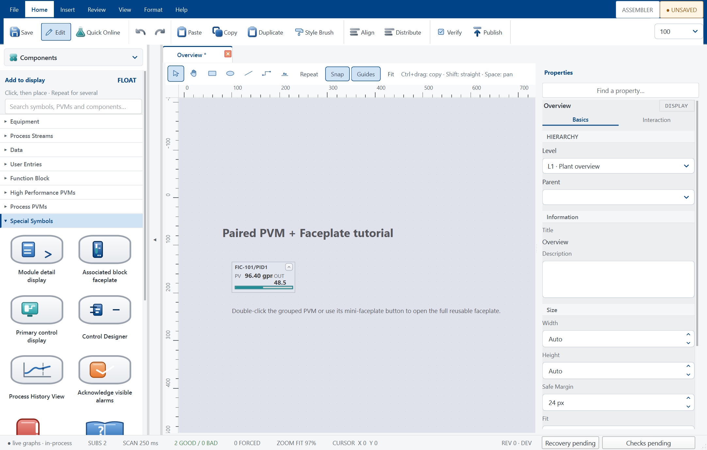
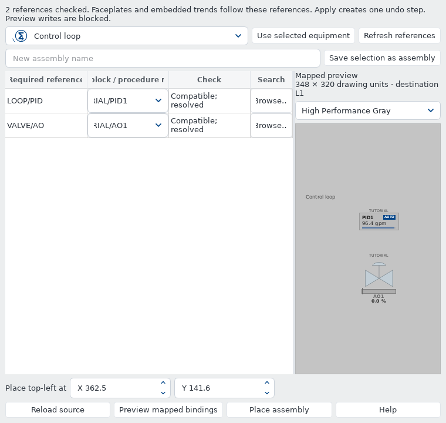
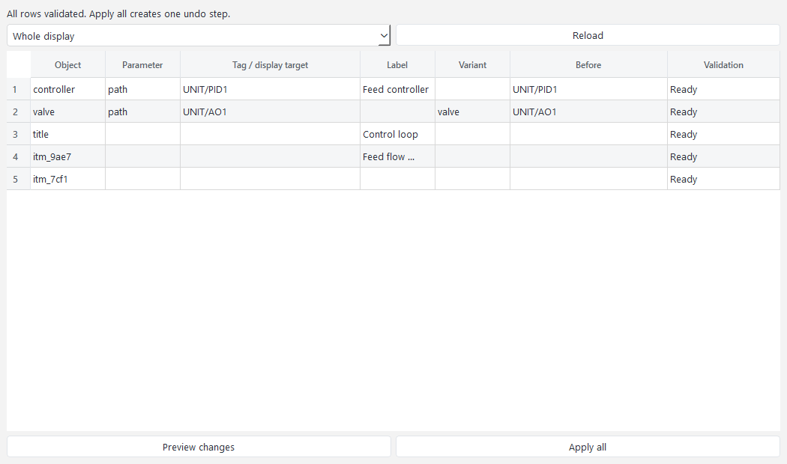
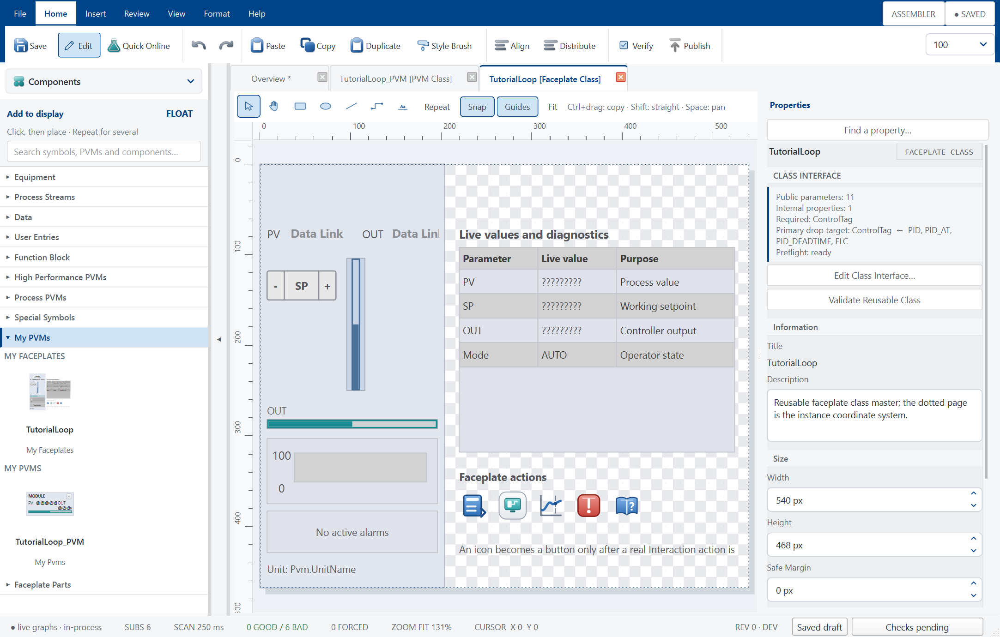
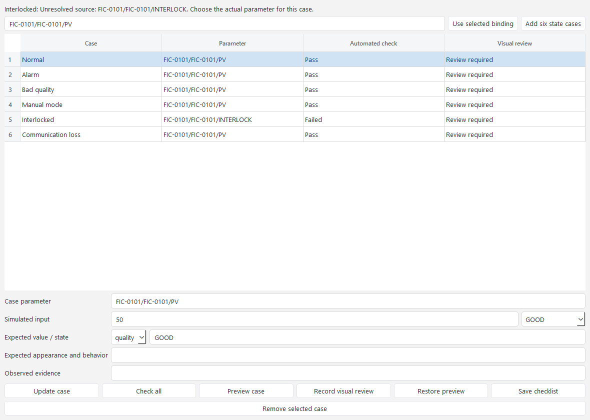

# Azeo Graphics Designer User Manual

Edition 1.0 - 23 September 2026
Application baseline: `0.4.0`
Document ID: AZEO-UM-GRAPHICS

Display drawing, PVM and faceplate authoring, verification and publication. This guide uses the current Azeo application names and real
widget captures. Examples use the training system; values and demonstrated
conditions are not operating targets for a real plant.

Section numbers inherited from the [suite user manual](USER_MANUAL.md) are kept
intact so cross-application references remain accurate. Application-specific
commands depend on the active project, selected object and granted authority.

## Start with a task

| Goal | Where to go |
| --- | --- |
| Create a blank or template-based display | Relevant numbered section below |
| Build and bind a reusable PVM and faceplate | Relevant numbered section below |
| Verify, commission, review and publish a revision | Relevant numbered section below |

**Before changing live state:** use an instructor-approved training copy,
check the selected project and current source quality, and keep Save, Download,
Publish, Refresh and operator commands distinct. The [installation guide](INSTALLATION_GUIDE.md)
covers setup and repair. **Help > System information** gives the actual build,
licence and support paths on the workstation.

## 2. Your first session

### 2.1 Prepare the workstation

For a source checkout, create the environment described in the repository
README, open PowerShell at the repository root, and use:

```powershell
& .\.venv\Scripts\python.exe run.py
```

The command opens Azeo Explorer on the registered default project. On a
managed training workstation, use the installed launcher instead of the
source-checkout command.

For a list of available projects and areas, run:

```powershell
& .\.venv\Scripts\python.exe run.py --list
```

**Expected result:** The project list includes the intended training project, and the startup project is marked as the default. `--list` exits without starting the graphical application.

### 2.2 Open a specific application

Run these options from the repository root using the same interpreter. Replace the project path only when selecting a different prepared project.

| Option after `run.py` | Result |
| --- | --- |
| No option | Open Explorer on the registered default project |
| `projects/AzeoPlantVirtualController` | Open the explicitly named project |
| `--classic` | Open Control Designer as the primary window |
| `--graphics` | Open Graphics Designer as the primary window |
| `--station` | Open the dedicated Operator Station; Control Designer stays hidden until requested from a faceplate |
| `--simulation` | Open Simulation Workbench as the primary window |
| `--blank` | Open an empty scratch area |
| `--online` | Request an area download at startup; use only for a prepared configuration |
| `--no-plant` | Open an engineering session without a driven process source |
| `--help` | Show the launcher's command reference |

For the first commissioning session, use Explorer so you can explicitly inspect the project, provider, and module state. Application windows can also be opened from Explorer's **Applications** menu without launching another independent controller session.

### 2.3 Start the APVC training system

**Before you begin:** Confirm the selected project and use a training copy if you intend to make changes. The default APVC workflow uses the embedded Local Virtual I/O provider. Its manual startup state is deliberate.

1. Launch Explorer and read the project identity in the window.
2. Inspect the controller and Local Virtual I/O nodes under the physical network.
3. Open **Tools > Virtual I/O > Provider Status** if available, or the corresponding Local Virtual I/O node's status command.
4. Choose **Start Simulator** from **Tools > Virtual I/O**.
5. Confirm that the provider reports Running. Refresh the status and check that exchange activity advances.
6. Open the intended module in **Applications > Control Designer**. Compile and download the selected module as described in Chapter 4, or use the reviewed **Total Download** workflow for the prepared project.
7. Confirm that the required modules are online and their scan counters advance.
8. Choose **Applications > Operator Station**.
9. Verify the intended home display, current data quality, and station status.

**Expected result:** The provider is running, required modules are scanning, and bound values appear with credible quality. A source that has just started may need an observation interval before the station can establish freshness.

**Recovery:** If values are Bad, check provider state, online module state, and the tag path before changing a control mode. An open window and a moving clock do not prove that process data is healthy.

### 2.4 Make a read-only orientation pass

1. In Operator Live, select **Displays** and open one assigned unit display.
2. Select a live instrument or loop PVM to open its faceplate.
3. Read the module/block identity, PV, quality, and actual mode.
4. Select **Pin** on the faceplate title bar.
5. Select a second loop and compare the two independent windows.
6. Open **Trends** or the faceplate's history action.
7. Open **Alarms** and inspect the list without acknowledging anything solely to clear the screen.
8. Return to the home display with **Alt+Home**.

**Expected result:** You can locate equipment, retain a comparison faceplate, and reach process history without editing a graphic or changing a process value.

### 2.5 Finish a session

1. Finish an active training session so its report and input-fault cleanup are completed.
2. Review and release exercise-specific input simulations or engineering forces.
3. Save intended engineering changes. Publish only displays that have completed the release checks.
4. Save a project backup or simulation snapshot when the lesson requires one; these serve different purposes.
5. Close tools and application windows through their normal close controls.
6. Wait for application shutdown before restoring files or modifying provider configuration.

Closing a faceplate closes that window. Closing Operator Live is not the same command as pausing the coordinated simulation. Use the explicit Workbench or training-session pause command when you need the process and controller clocks to stop together.

## 6. Graphics Designer: build a process display

### 6.1 Understand the authoring workspace

Open **Explorer > Applications > Graphics Designer**, or **Control Designer > View > Graphics Designer**. Check the project and display name before entering Edit mode.



| Workspace area | Use |
| --- | --- |
| Ribbon | Create, edit, arrange, verify, test and publish |
| Display tabs | Switch between display drafts and open class masters |
| Sidebar selector | Switch among Components, Displays, Library, Control Data, Objects and Layers |
| Component Palette | Search and place equipment, function-block PVMs, data elements and User Entries |
| Canvas toolbar | Select, pan, repeat placement, snap, guides and fit |
| Drawing page | The display's authored coordinate area |
| Property inspector | Edit the selected object, display or class interface |
| Alert/status strips | Inspect current conditions, mode, selection and view state |

**Split view** keeps a browser above Components. The sidebar chevron collapses and restores the arrangement. Resize panes to suit the current task. Ribbon content can scroll horizontally on a narrow desktop.

### 6.2 Choose the display's purpose and level

Plan what an operator must decide on this display before drawing equipment. Use L1-L4 hierarchy metadata and consistent parent/child navigation.

| Level | Intended information | Typical content |
| --- | --- | --- |
| L1 | Overall plant or process-area awareness | Unit health, major constraints and routes to unit displays |
| L2 | Unit control and process relationships | Main equipment, flows and primary operating loops |
| L3 | Focused equipment or task operation | Supporting measurements and detailed process context |
| L4 | Detailed diagnosis/reference | Conditions, limits, maintenance or specialist detail |

The level field describes the display hierarchy; it does not enforce an operator's permission level. New displays start at L1. Older displays that predate explicit level metadata can be treated as L2 for compatibility, so review the metadata when adapting an older drawing.

### 6.3 Create a display and establish its page

1. In the Displays/Graphics browser, choose **New Display**, or use the ribbon's **New** command.
2. Enter a meaningful, unique display name.
3. Enter **Edit** mode.
4. Select the display/page rather than an individual object and review page dimensions, display level, title, and navigation metadata in the available configuration controls.
5. Choose a suitable built-in template when appropriate, or begin with a clear empty page.
6. Establish a consistent margin and reserve space for headings and critical operating information.
7. Save the initial draft.

**Expected result:** The correct display tab is open in Edit mode, with a page appropriate to the target workstation. Page geometry and viewport zoom are different settings; use Fit to inspect the whole page without changing its authored size.

### 6.4 Place equipment and data rapidly

1. Select **Components** in the sidebar.
2. Enter a functional search term, such as a pump, vessel, valve, data link, or block family.
3. Select the component card and click the desired canvas position.
4. Enable **Repeat** to place several instances without reselecting the card.
5. Press **Esc** or right-click to return to Select after placement.
6. Select each instance and complete its process reference and properties.
7. Use **Control Data** when a graphic should be created from an existing module/block rather than configured from a blank visual.

A process symbol communicates equipment geometry. A function-block PVM also has a data and action contract. An attractive symbol is not automatically connected to a process value or faceplate. Verify the binding and interaction, not just the artwork.

### 6.5 Move, resize, align and duplicate

| Gesture or command | Result |
| --- | --- |
| Select and drag | Move the selected object or selection |
| Drag a resize handle | Resize according to the object's supported geometry |
| Shift+drag | Constrain movement to an axis |
| Alt+drag | Temporarily bypass snapping |
| Ctrl+drag | Copy the selection, including selected equipment and internal pipe relationships |
| Ctrl+Alt-click | Cycle through overlapping visible, unlocked objects |
| Hold Space and drag | Pan temporarily while keeping the current drawing tool |
| Snap | Align placement/movement to the configured snapping aids |
| Guides | Show/use alignment assistance |
| Fit | Fit the drawing into the available viewport |
| Undo/Redo | Reverse or repeat an authoring transaction |

Use exact position and size fields for repeatable geometry. Use alignment/distribution commands for rows of values and equipment. Multiple selected objects retain their relative arrangement during a move. A completed placement, move, or copy-drag is an undoable action.

### 6.6 Connect equipment with pipes

**Before you begin:** Place the equipment and choose the intended inlet/outlet geometry. Keep equipment identity separate from the pipe's visual route.

1. Select the connection tool.
2. Start on the intended visible perimeter or a named port of the source equipment.
3. Route toward the destination and finish on its intended perimeter or port.
4. Inspect both endpoints after committing the connection.
5. Move one connected object and confirm that the connection remains attached.
6. Adjust route bends where the automatic path does not communicate the intended process route clearly.
7. Use endpoint coordinates and persistent ruler guides to align manual bends.
8. Test rotated or mirrored symbols to confirm the chosen ports remain correct.

Named cardinal ports are convenient magnetic targets; connection geometry is not limited to the bounding box's four side centers. The chosen endpoint and its orientation remain part of the authored connection. Avoid routes that obscure tags, values, operator targets, or other equipment boundaries.

While dragging, the route is provisional. Release the pointer to evaluate the
final obstacle route. For a decorative background panel, clear **Graphics
Configuration > Visibility > Block automatic pipe routes** so connections can
cross its background. Keep equipment and labels clear of the chosen port exits.

### 6.7 Group an equipment arrangement

1. Select the relevant PVMs, static drawing objects, and connecting pipes.
2. Use the grouping command.
3. Click a member and confirm the arrangement selects as a group.
4. Move the group and verify internal connections.
5. Save, reopen, and confirm grouping is retained.
6. Ungroup only when you need to edit the independent membership.

Use a **PVM class** for a linked reusable visual with a formal public interface. Use an **assembly** for a reusable arrangement that is inserted/copied through the existing template and clipboard workflow. A group alone does not create a reusable class contract.

### 6.8 Set appearance and behavior

Select a drawing object to open its inspector. **Design** contains geometry, fill, stroke and text styling. **Data** contains bindings and equipment-port configuration. **Behavior** contains the supported actions, scripts and animation controls. Display and installed-PVM properties use their corresponding typed controls.

Use color swatches to choose colors consistently. **Home > Style Brush** copies the appearance from a styled drawing object to another shape or pipe. With Repeat enabled, apply the style to several targets. Each target keeps its own geometry and bindings.

Use the shared blue for application/authoring actions. Keep process quality, alarm priority, mode, and state colors semantic. Do not turn every process indication blue merely to match the ribbon.

### 6.9 Add live values, navigation and actions

1. Place a **Data Link** for a live value or drag a terminal/CONFIG parameter from Control Data.
2. Review its exact path, displayed precision, units and quality behavior.
3. Place a **Display Link** or configure a supported navigation action for a real destination.
4. Add a chart or Alarm List only where the operating task needs it.
5. Use supported User Entries for operator input. Bind them to valid, writable targets.
6. For a decorative icon, omit an interaction unless a real action is configured.
7. Test every target using the actual runtime-style interaction.

**Expected result:** Values come from the intended source, display links reach an assigned destination, and input actions either receive an accepted result or a meaningful refusal. No unlabeled inert control should be part of the released operating workflow.

### 6.10 Reuse an assembly and map its tags

1. Choose **Insert > Assemblies**.
2. Select an available starter or saved arrangement.
3. Map every source block to an existing destination block.
4. Choose **Preview mapped bindings**.
5. Resolve missing blocks, incompatible families, terminals, and CONFIG paths.
6. Choose **Apply to canvas** after the preview succeeds.
7. Position the inserted arrangement and verify its internal pipes and PVM bindings.

To reuse your own arrangement, select its members and pipes, provide an assembly name, and choose **Save selection as assembly**. To remap a complete drawing, select the current-display source in the mapping tool. The full insertion/replacement is one undoable operation. Use **Reload source** if the source display has changed while the mapping dialog is open.



### 6.11 Review before leaving Edit

Check the display at its intended operating size, not only while zoomed in. Tags and units should be legible; important values should align; action targets should remain clear; abnormal states should attract attention without making the normal display visually noisy.

Run **Verify**, inspect unresolved references, and save the draft. Continue with the class workflow in Chapter 7 if you are creating reusable graphics, or the commissioning and publication workflow in Chapter 9 if this is an ordinary display.

### 6.12 Edit many objects with the engineering worksheet

1. Open **Insert > Worksheet** and choose **Selected objects** or **Whole display**.
2. Edit the supported tags, PVM labels, registered variants, text or display-link
   destinations. Each PVM parameter has its own row; locked objects are excluded.
3. Choose **Preview changes**. Resolve missing targets and binding incompatibilities.
4. Choose **Apply all**, then inspect the affected objects and their bindings.
5. Save the display after review. Use Undo to reverse the complete application.

**Expected result:** One reviewed batch becomes one undo step. Reload the worksheet
if the canvas changed since it opened. Controller ranges, units, tuning and alarm
limits remain controller configuration and are not edited by this worksheet.



### 6.13 Find commands and frequently used properties

Press **Ctrl+K**, or open **View > Commands**, and type a command name. Press Enter
or double-click to run the selected result. Recent components armed from the
palette also appear here for quick placement.

Select an object and choose **View > Properties** or **Find a property** in its
inspector. Search, choose **Go to property**, and edit the existing field. Use
**Favorite / Unfavorite** to keep frequent fields at the top on this workstation.

For a PVM, **Inherited** identifies a class default and **Instance** identifies an
individual choice. **Reset** restores the applicable class default in one undo
step. For retained repository class versions, inspect the effective contract in
Library Manager before adopting another version (Section 7.9).

## 7. Reusable PVMs and faceplates

### 7.1 Choose the correct reusable artifact

| Artifact | Intended use | Editing/release behavior |
| --- | --- | --- |
| Installed function-block PVM | Standard visual for an installed block family | Use its supported properties and runtime contract |
| Authored PVM class | Compact reusable graphic with a typed public interface | Save the class, review its linked uses, then publish affected displays |
| Authored faceplate class | Reusable contextual operating surface | Pair with a compatible compact PVM and verify actions |
| Assembly | Repeated arrangement of objects and pipes | Map and insert through the assembly/template workflow |
| Display | Operator's process page | Save draft, verify, publish and retrieve at the station |

A linked class instance is a use of the master with instance-specific public values. An unlinked copy is a local fork and no longer serves the same linked-maintenance purpose.

### 7.2 Create a paired PVM and faceplate

**Before you begin:** Decide the supported block family and identify which values vary by instance. Use a training library, not an installed read-only class, for the first exercise.

1. Open **Library Explorer** using the sidebar or **Ctrl+2**.
2. Expand **Faceplate Classes**.
3. Right-click and choose **New Paired PVM + Faceplate Blueprint**.
4. Enter a functional name without spaces, such as `FeedFlowLoop`.
5. Inspect the created faceplate class and compact `FeedFlowLoop_PVM` class.
6. Open each class with **Edit Layout**.
7. Review the reciprocal pairing and initial interface before changing either master.

The PID-family blueprint supplies conventional fields such as `ControlTag`, `ModuleName`, `Title`, `Description`, `PVPath`, `SPPath`, `OUTPath`, `ModulePath`, `EU0`, `EU100`, and `UnitName`. Its typed target supports the declared PID-family block types. Check the saved interface instead of assuming an arbitrary class name gives it the same behavior.

For a graphic with no contextual operating surface, use **PVM Classes > New PVM Class**. To start from tested objects on a display, select them and choose **Convert to PVM class** or **Convert to Faceplate class**. Conversion still requires an explicit reusable interface.

### 7.3 Edit the class master



1. Choose **Edit Layout** on the authored class.
2. Confirm the tab identifies a **PVM Class** or **Faceplate Class**.
3. Review the master page's Width and Height.
4. Draw and arrange members using the normal Graphics Designer tools.
5. Name members according to their purpose, such as a title, PV value, mode indicator or trend.
6. Keep visible content and interaction targets within the intended class page.
7. Save the class master.

The class page preserves its origin and internal whitespace. Saving does not resize it to a selected child. **Publish** is disabled on a class master because library Save and display Publish are different operations.

### 7.4 Define a compact PVM

Use a compact PVM to answer a small number of operational questions: what equipment is this, what is its important value/state, is that value trustworthy, and how does the operator reach its controls?

A useful starting arrangement includes the tag, one or two live values, mode/status/quality, an equipment silhouette or analog bar, and a working faceplate action. Avoid reproducing the complete faceplate inside every unit display.

For a reusable class, bind members through public or internal `Pvm.*` properties. A hard-coded plant path in the master makes the second instance difficult to commission and easy to bind to the wrong loop.

### 7.5 Define the faceplate

Organize a faceplate around the equipment's operating contract. A measured-loop faceplate commonly includes identity, PV/SP/OUT, scale, actual/target mode, checked inputs, trend, module alarms, units, and supported detail/history/engineering actions. Device and condition faceplates present different data where appropriate.

Keep labels readable at the authored size. Test a small logical desktop or a high-DPI display: the body may need to scroll while the title, pin, and close controls remain reachable. Operator Live opens faceplates as independent windows; do not design the class on the assumption that it becomes a full-height sidebar.

### 7.6 Bind members through the interface

| Member purpose | Typical class reference | Check |
| --- | --- | --- |
| Title text | `Pvm.Title` | Resolves to the intended instance title |
| PV data link | `Pvm.PVPath` | Read-only measurement and quality |
| SP data link/input | `Pvm.SPPath` | Read display and permitted checked-write target |
| OUT data link | `Pvm.OUTPath` | Correct algorithm/output value and units |
| Alarm List scope | `Pvm.ModulePath` | Shows the intended module's alarms |
| Range limits | `Pvm.EU0`, `Pvm.EU100` | Correct low/high scale values |
| Unit label | `Pvm.UnitName` | Operator-facing engineering units |

For a shape or text member, use **Shape binding** and select the bindable property, such as text, visibility, fill percentage, fill, opacity, or supported geometry. Use `Pvm.*` for class data and `Standard.*` for the supported project appearance references.

Charts should use the same PV/SP/OUT references as the numeric values. A table's live cell should resolve a typed value; a static label should remain a static label. An Alarm List should read the runtime alarm registry, not a row of painted text that merely resembles an alarm.

### 7.7 Place from Control Data

1. Validate and save the class interface.
2. Open an ordinary display in Edit mode.
3. Open **Control Data** with **Ctrl+3**.
4. Expand a module and drag the function-block row to the canvas.
5. If a chooser appears, select the intended compatible native or authored visual.
6. Review **Remember this choice** before accepting it for later blocks of the same type on this display.
7. Right-click the placed instance and choose **Configure instance**.
8. Review auto-filled conventional references and complete all remaining required values.
9. Verify the instance and test its paired faceplate.

Dragging a terminal or CONFIG parameter creates a Data Link instead of a PVM. If a class is missing from the chooser, inspect its typed primary drop target and accepted block types. A property merely named `Tag` is insufficient.

### 7.8 Prove that the class is reusable

Place two instances for two compatible blocks. Change each instance's public title, paths, range and units without editing the class master. Confirm that each faceplate and chart follows its own block.

Then edit a harmless master-level appearance feature and save the class. Review both linked engineering instances. Use **Find Usages** to identify affected displays and follow Chapter 9 to release them. Do not expect an operator's held revision to change as a side effect of class Save.

### 7.9 Adopt a shared class version for selected instances

**Before you begin:** Use a repository editing project and open **Configuration >
Libraries**. This workflow also lists paired faceplates, installed
PVM configuration and control composites.

1. Before changing an existing shared graphics class, select its unpinned instances
   and choose **Review initial pins**. Review, enter a reason and check in to retain
   their current class contracts.
2. Edit the class in a private Studio draft and check in. Affected unpinned
   instances must be resolved before the shared class change can be checked in.
3. Refresh Library Manager and find **Update available**. Select only instances
   intended to adopt the change, then choose **Review selected adoption**.
4. Inspect **Selected instances** and **Class changes**, including defaults and
   explicit overrides. Resolve incompatible choices or removed pipe attachments.
5. Enter a reason and check in the review. Validate and deploy the affected
   displays through Release Manager; verify operator acceptance.

Unselected instances keep their retained versions. A paired faceplate uses its
source PVM's retained contract, including when several versions are open. Class
Save in a repository draft does not update every linked instance automatically.
**Source revision set** permits review of an earlier class contract; adopting it
creates a new engineering revision and preserves historical evidence.

## 8. PVM Configuration Designer

### 8.1 Open the Designer

Open it from the class master's **Edit Class Interface** command, from **Library Explorer > right-click class > Configure Properties**, or from Explorer's **Tools > PVM Configuration Designer** entry point. Choose the intended authored class before editing.


The property tree organizes groups and fields. The editor defines the selected item's contract. The preview shows the resulting appearance or configuration behavior. Search finds a property/group; pane dividers let you allocate room to the tree, form and preview. **Fit** and **Actual size** change the preview view, not the class contract.

### 8.2 Plan the public interface

Create public properties only for information that legitimately varies between instances. Keep derived helper values internal. This makes instance configuration faster and prevents ordinary graphics engineers from having to understand the master's implementation.

| Public property example | Reason it is public |
| --- | --- |
| Control tag/block reference | Determines which equipment this instance represents |
| PV/SP/OUT parameter references | Resolves the required operating values |
| Title and description | Identifies this equipment to the operator |
| Range and units | Establishes a truthful scale and annotation |
| Equipment/style Selection | Chooses among commissioned class variants |
| Optional-feature Boolean | Enables an intended instance option |

Internal properties are suitable for derived text, normalized helper values, internal visibility decisions, and intermediate selection results. Internal properties remain available to class-member bindings but are absent from **Configure instance**.

### 8.3 Add a group and property

1. Choose **Add group** and give the group a meaningful name.
2. Keep the new group selected.
3. Choose **Add property** and select the appropriate supported type.
4. Enter a stable property name and operator/engineer-facing description.
5. Set the default value or supported reference.
6. In **Instance Interface**, select Public or Internal scope.
7. Set direction and Required only where they are valid.
8. Inspect the preview and choose **Validate**.
9. Save the class after resolving errors.

Use the Designer's typed controls rather than encoding numbers, references and choices into one free-text field. Match the property's meaning to its selected type, particularly for Control Tag, Function Block Reference, and Parameter Reference properties.

### 8.4 Scope, required values and direction

| Setting | Meaning | Practical rule |
| --- | --- | --- |
| Public instance parameter | Shown in instance configuration | Use for plant-specific values and supported options |
| Internal class property | Used by the master only | Do not require it from the instance engineer |
| Required | Instance must provide an acceptable value | Mark only values that the class cannot operate without |
| Read only | Presentation/configuration input | Default choice for measurements and class selection |
| Operator write (checked service) | Permitted input through a supported User Entry | Use only for a public property resolving to a valid writable target |

Internal properties cannot be Required, Operator write, or the primary drop target. Declaring a property writable does not grant authority to a read-only algorithm output or bypass runtime ownership and quality checks.

### 8.5 Set the typed primary drop target

1. Select a public Control Tag or Function Block Reference property, usually `ControlTag`.
2. Enable **Primary target for a dragged control block or tag**.
3. Enter the accepted block types as a comma-separated list appropriate to the class, for example `PID, PID_AT, PID_DEADTIME, FLC` for the supplied PID-family blueprint.
4. Confirm the property is Required and Read only.
5. Validate and Save.

**Expected result:** The saved class has exactly one valid primary target and appears for compatible block drops. Use a wildcard only when the class has been designed and tested for that broad contract.

**Recovery:** Check for multiple targets, an Internal target, an unsuitable value type, an empty accepted-type list, or unsaved validation errors. Fix the interface before trying placement again.

### 8.6 Configure a Selection

A Selection defines named options and their subproperty values. Use it for a finite set of supported visual/equipment variants rather than free-form naming conventions.

1. Add or select a Selection property.
2. Define the option names and the default selection.
3. Add the required subproperty columns.
4. Fill every option's values with the correct types.
5. If using capture mode, review the values copied from the default before treating them as a completed alternative.
6. Test each option in the configuration preview.
7. Verify the resolved values and affected member appearance.

Changing a choice should select a commissioned variant, not silently introduce an unreviewed plant reference. Check every option, including the default and any optional components it enables.

### 8.7 Configure Presence and Present Online

**Presence** controls whether a property participates under the selected Boolean condition. **Present Online** applies to a property group and controls whether that group is included online. These settings affect resolved properties and subscriptions; they are not simply a way to hide a label.

1. Define the Boolean option that should control the optional feature.
2. Apply the corresponding Presence condition to the relevant properties.
3. Set the group's Present Online rule only when the whole group should be omitted online.
4. Choose **Test configuration**.
5. Toggle the controlling option.
6. Inspect resolved properties, omitted properties, and the online subscription list.
7. Verify that required displayed values do not depend on a property that has been gated out.

**Expected result:** An absent feature is consistently absent from appearance, resolution and subscriptions. It should not leave an apparently healthy constant value where no live source is being read.

### 8.8 Test, validate and save

1. Choose **Test configuration** to try the options as an instance engineer would.
2. Exercise all required values, Selections, and Boolean feature combinations.
3. Inspect the resolved references and subscription list.
4. Return to the Designer and choose **Validate**.
5. Correct invalid types, names, scope/direction rules, drop targets and references.
6. Save the engineering class.
7. Reopen an affected display, configure its instance, and perform runtime-style testing.

**Ctrl+Z** and **Ctrl+Y** undo/redo edits to the current class. A successful interface validation does not prove that every operator action has been tested. Finish with a two-instance test and affected-display publication.

### 8.9 Diagnose class configuration problems

| Symptom | Likely check | Corrective action |
| --- | --- | --- |
| Class absent from drop chooser | Primary target, accepted types, saved validity | Repair and save the typed interface |
| Required instance field is empty | No valid default or block-drop mapping | Complete the Public value in Configure instance |
| Helper field appears to users | Property is Public | Make it Internal if it is an implementation detail |
| Value disappears with an option | Presence/Present Online dependency | Test the option and correct its dependency chain |
| Entry remains read-only | Direction, target ownership, quality or authority | Inspect the actual refusal; do not bypass it |
| Second instance shows first loop | Literal plant path in master | Replace it with the appropriate `Pvm.*` reference |
| Published display still shows old master | Station holds an older revision | Review usages, publish affected displays and retrieve |

### 8.10 Review class changes before saving

Choose **Change impact** in PVM Configuration Designer. Select an affected
instance to compare its saved and proposed appearance and resolved properties.
Open displays use their current unsaved document in this review.

1. Check the affected display and instance inventory.
2. Inspect incompatible values, removed properties/options and type changes.
3. Repair invalid choices before saving the class. Nested-consumer rows identify
   when their preview represents class defaults rather than all nested choices.
4. Save, verify affected displays and test two differently configured instances.
5. For file projects, publish the reviewed displays. For repository projects,
   follow selected class adoption and Release Manager in Sections 7.9 and 3.12.

The impact preview supports engineering review; it does not replace runtime
testing of bindings, operator actions or station acceptance.

## 9. Verify, test and publish graphics

### 9.1 Know the engineering states

| State/action | Purpose | Process/release effect |
| --- | --- | --- |
| Edit | Change geometry, bindings and behavior | Engineering draft changes |
| TEST | Exercise rendering and configured preview states | Process writes are sandboxed |
| Quick Online | Inspect graphics against available online data through its sandbox workflow | Does not publish a station revision |
| Verify | Check bindings, actions, classes and configured commissioning evidence | Reports errors/warnings; does not make the display live |
| Save | Preserve the draft or class | No automatic operator revision replacement |
| Publish | Create an accepted release candidate/revision through the deployment workflow | Makes a published display available according to assignment |
| Operator Refresh | Retrieve applicable published updates | Replaces the held revision through the station workflow |

### 9.2 Run a display verification

1. Open the intended display in Graphics Designer.
2. Choose **Verify**.
3. Inspect unresolved tag/CONFIG paths, invalid actions, write-target problems, missing class requirements, pairing issues, and commissioning findings.
4. Open each affected object and correct the underlying configuration.
5. Verify again and retain any intentional warning with its review rationale.

Use the exact parameter path and actual source resolution. A similar-looking name is not evidence that a binding is valid. An undriven environment can produce Bad values; distinguish unavailable live input from an invalid reference.

### 9.3 Create a commissioning checklist

1. Choose **Review > Checklist**.
2. Select the parameter to test.
3. Choose **Add six state cases** as a starting set.
4. Review each normal, alarm, bad-quality, manual-mode, interlocked and communication-loss case.
5. Replace example assumptions with the real parameter and expected field/value. Assign an actual interlock parameter where needed.
6. Remove inapplicable cases and add cases required by this display's purpose.
7. Choose **Check all** to evaluate the configured state checks.

The starter cases are a worksheet, not an automatic proof of commissioning. A missing interlock reference should fail rather than be treated as a healthy permit.



### 9.4 Record a visual review

1. Select a case and choose **Preview case**.
2. Inspect the actual Studio canvas in TEST.
3. Compare value, quality, mode, alarm, visibility, navigation and action behavior with the expected appearance.
4. Enter a specific observation, such as which indication changed and whether the operator could identify the affected loop.
5. Choose **Record visual review**.
6. Use **Restore preview** to return to the prior mode and TEST overrides.
7. Save the checklist and the display draft.

Checks and reviews carry the fingerprint of the display they examined. Editing the display makes prior results stale. Repeat the affected checks after editing; do not present an old review as evidence for a new drawing.

### 9.5 Publish a display

**Before you begin:** Confirm the intended display, current draft, class dependencies, workstation assignment and review result.

1. Save the draft.
2. Run Verify and resolve release-blocking errors.
3. Test the real operator interactions: open a faceplate, navigate, inspect an alarm, open a trend, and exercise an accepted/refused input where the training setup allows it.
4. Choose **Publish**.
5. Review the publication information and complete the intended revision release.
6. In Operator Live, retrieve the applicable update with **Refresh** at an appropriate training/operating boundary.
7. Open the display and verify the expected revision/content.
8. Repeat the key interactions against the published station version.

**Expected result:** Operator Live shows the intended published revision with working bindings and actions. A successful Studio preview is not the final station acceptance check.

### 9.6 Publish a class change correctly

1. Validate and Save the changed PVM and/or faceplate class.
2. In Library Explorer, right-click the class and choose **Find Usages**.
3. Open every affected display.
4. Review linked instances and complete new Required public values.
5. Repeat verification and commissioning checks invalidated by the change.
6. Save and Publish each affected display.
7. Retrieve and verify those revisions at the assigned operator station.

**Publish** remains unavailable on the class master itself. This is expected. A class has library history and usage impact; the operator consumes published display revisions.

### 9.7 Display sets and workstation layout

A display set defines a reachable group of displays. A workstation assignment connects a console to its layout and allowed sets. A layout can provide frames and screens with defined display targets and coordination.

Use the corresponding Graphics Designer display-set/layout/workstation configuration tools to review those relationships. Check the home/root display, parent links, destination names, frame target and available set before publication. In Operator Live, **Tools > Display Sets**, **Reset Layout**, and **Layout Scale** are meaningful only when supported by its assignment.

For a single-frame station, the main navigation bar is sufficient. Multi-frame/multi-screen layouts can retain frame-specific navigation. Test the actual assigned station, including its screen scaling and target frame behavior.

### 9.8 Handle an editing lock

If Graphics Designer reports that a display is locked, read the owner/session information. A display is single-writer: another active editing session may own it.

1. Confirm whether you already have the display open in another window or application process.
2. Close the owning editor normally when that session should end.
3. Reopen the display in the intended session.
4. If the previous process ended unexpectedly, use the application's lock-recovery workflow when offered and verify that no other writer is active.
5. Preserve unsaved work and investigate the application log if ownership is unclear.

Do not delete lock files merely to force two active editors onto the same draft. Repeated lock errors after a crash should be investigated with the session and process information in Chapter 16.

### 9.9 Play a timed visual TEST sequence

1. Open **Review > Sequences**. Enter a complete parameter path or choose **Use
   selection**. Confirm that each source resolves before starting.
2. Choose **Add alarm lifecycle** for a starting scenario, or add your own rows.
   Set each step's time, value, quality, state and interpolation.
3. Use **Play**, **Pause** and **Next step** to inspect the display in isolated TEST.
   Multiple tags may change together; duplicate tag/time rows are refused.
4. Choose **Capture visual evidence** and describe the observed result. Evidence
   records the canvas and the display/sequence fingerprints.
5. Choose **Save sequence**, then save the display to persist its steps and
   evidence references.
6. Choose **Stop / restore** when finished. Closing the sequence window or leaving
   TEST also restores the previous overrides and TEST state.

**Ramp** interpolates numeric values from the tag's preceding step; state and
quality change at the step time. Boolean/text values change in steps. Completion
holds the final state for inspection until Stop. Sequence playback sends no
controller or field writes. A screenshot is evidence for review, not an automatic
commissioning pass or a process training session.

### 9.10 Compare display revisions visually

1. Open **Review > Compare**, **History > Compare revisions**, or **Visual
   comparison** during Publish.
2. Choose the current draft or a retained revision on each side.
3. Select a table row to center its object in both views. Review property, binding,
   action and display-metadata differences; blue outlines identify changed objects.
4. Use **Locate on canvas** to select a current object and **Fit both** to restore
   the overview. Removed objects may have no current canvas counterpart.
5. Use **Continue to publish** to enter the normal publication review. A comparison
   opened from History or Publish returns to that dialog.

This comparison uses the current process values and class definitions. It is a
display-configuration comparison, not a historical process replay or proof of an
archived class implementation. Use the repository Library Manager and captured
catalog revisions for retained class contracts. Private repository drafts must
be checked in and released through Release Manager.

## 17. Keyboard and gesture reference

### 17.1 Shortcuts depend on the active application

**F5 has four different meanings:** refresh Explorer, download a module in Control Designer, enter TEST in Graphics Designer, and retrieve configuration in Operator Live. Confirm window focus before using it. A text editor or modal dialog can also consume a shortcut.

### 17.2 Explorer and Control Designer

| Application | Shortcut | Action |
| --- | --- | --- |
| Explorer | F5 | Refresh the project view |
| Explorer | Ctrl+F | Search the system |
| Explorer | F1 | Explorer Help |
| Control Designer | Ctrl+N / Ctrl+O | New/open strategy |
| Control Designer | Ctrl+S / Ctrl+Shift+S | Save/Save As |
| Control Designer | Ctrl+F4 | Close module |
| Control Designer | Ctrl+Z / Ctrl+Y | Undo/Redo |
| Control Designer | Ctrl+F | Find block |
| Control Designer | F7 | Compile |
| Control Designer | F5 | Download |
| Control Designer | Shift+F5 | Take all online modules open in Control Designer offline |
| Control Designer | Ctrl+K | Compare Parameters |
| Control Designer | Ctrl+0 | Zoom to Fit |
| Control Designer | Ctrl+Shift+G | Graphics Designer |
| Control Designer | Ctrl+Shift+O | Operator Station |
| Control Designer | Ctrl+T | Tag Database |
| Control Designer | Ctrl+M | Monitoring Tab |
| Control Designer | Ctrl+Shift+W | Watch Window |
| Control Designer | Ctrl+Shift+M | Controller Simulator |
| Control Designer | F1 | Control Designer Help |

### 17.3 Graphics Designer and PVM Configuration Designer

| Shortcut/gesture | Action |
| --- | --- |
| Ctrl+N | New display |
| Ctrl+K | Search Graphics Designer commands and recent components |
| Ctrl+S | Save display/class |
| Ctrl+Shift+P | Publish an eligible display |
| Ctrl+E | Toggle/request Edit mode |
| F5 | TEST mode |
| F8 | Verify |
| F11 | Focus-view toggle |
| Ctrl+2 | Library Explorer |
| Ctrl+3 | Control Data |
| Ctrl+Tab | Next open tab |
| V / H | Select / Pan |
| R / E / L | Rectangle / Ellipse / Line |
| C / P / A | Connector / Pencil / Arc |
| S / X / T | Polygon/shape tool / Eraser / Text |
| Esc | Cancel the active gesture/tool |
| Space+drag | Temporary pan |
| Ctrl+drag | Copy the selection |
| Shift+drag | Axis-constrained movement |
| Alt+drag | Bypass snapping |
| Arrow keys | Nudge selection in Edit mode |
| Shift+Right / Shift+Left | Grow/shrink width about the center |
| Shift+Up / Shift+Down | Grow/shrink height about the center |
| Shift+F | Zoom to selection |
| F1 | Contextual Help Center |
| Designer: Ctrl+Z / Ctrl+Y | Undo/Redo the current class configuration |

Single-letter drawing shortcuts are intended for the authoring canvas. When editing a text/property field, use the field's normal text-entry behavior and then return focus to the canvas.

### 17.4 Operator Live

| Shortcut/gesture | Action |
| --- | --- |
| Alt+Left / Alt+Right | Previous/next navigation history |
| Alt+Home / Alt+Up | Home / parent display |
| Ctrl+L | Display chooser |
| Ctrl+K | Search |
| Ctrl+Shift+A | Alarm list |
| Ctrl+Shift+H | Process History View |
| F5 | Retrieve published configuration updates |
| F11 | Full screen/window |
| Ctrl+0 | Fit process display |
| Ctrl+= / Ctrl+- | Zoom in/out |
| Ctrl+mouse wheel | Zoom the process graphic |
| Middle-button drag | Pan the process graphic |
| Faceplate title drag | Move the detached faceplate |
| Faceplate Pin | Retain that window when another object is opened |
| Ctrl+click PVM/numeric Data Link | Select tags together for Add to Historian |
| Shift+F10 in historian chart | Open the historian context menu |

### Related Azeo help

- [Complete suite user manual](USER_MANUAL.md) - connected workflow and glossary.
- [Installation and administration](INSTALLATION_GUIDE.md) - setup, update and repair.
- [PA Designer authoring guide](PA_DESIGNER.md) - block and procedure details.
- [Control Module Class tutorial](CONTROL_MODULE_CLASS_TUTORIAL.md) - reusable control engineering.
- [PVM and faceplate tutorial](PVM_FACEPLATE_TUTORIAL.md) - reusable graphics engineering.

Use the application's F1 help for the installed block or selected tool. A screenshot
documents the interface, not live readiness or permission to perform a command.
