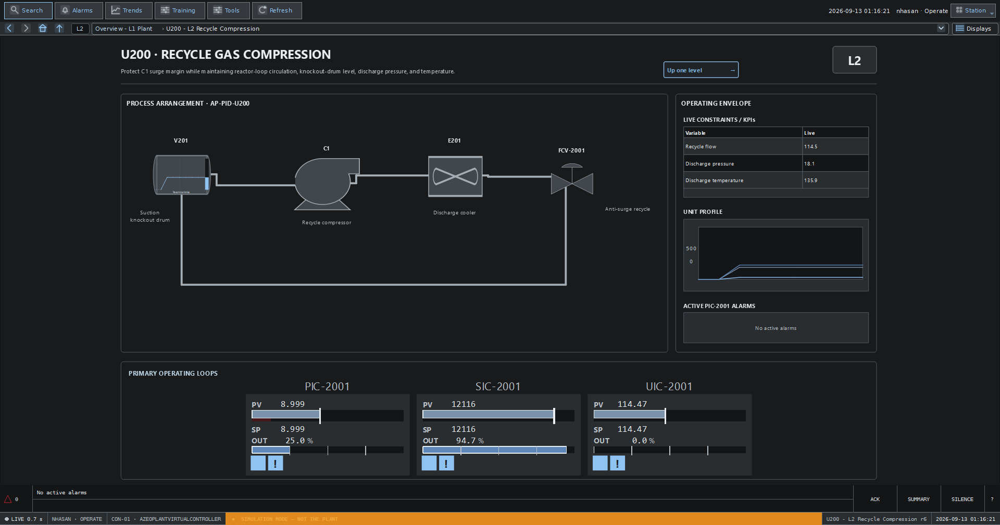
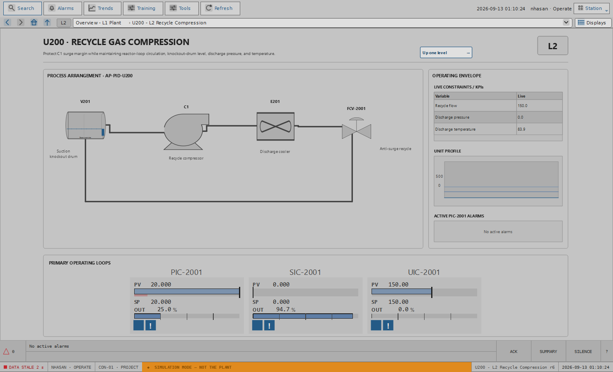
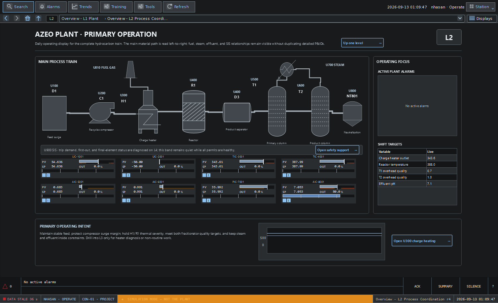
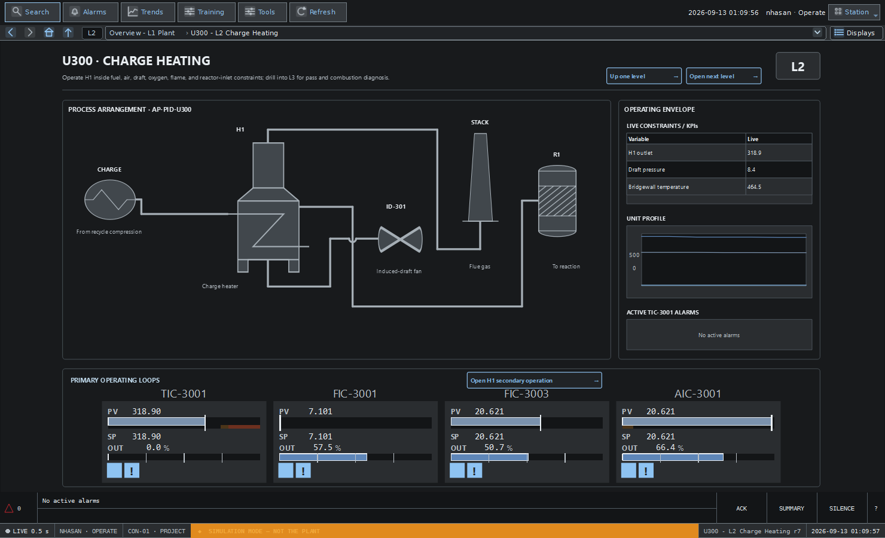
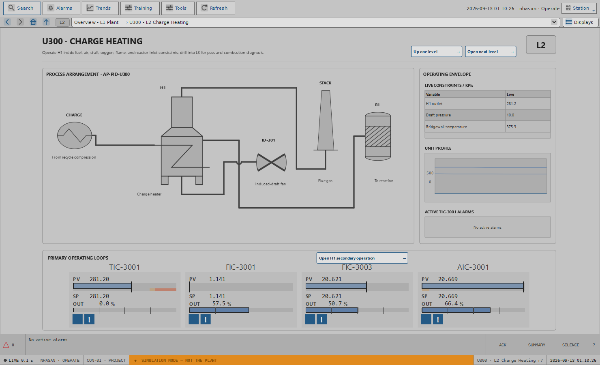
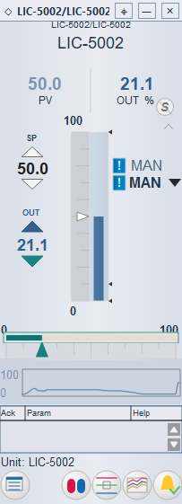
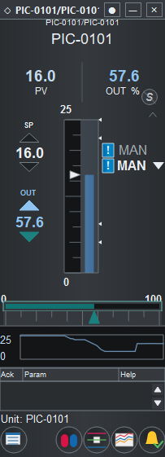
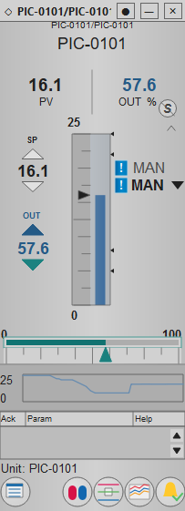

# Operator Station appearance

## Choose an HMI theme

In Operator Station, open **Tools → Themes → Choose Theme** and select:

| Choice | Appearance |
| --- | --- |
| Azeo Silver | Cool silver/lavender-gray canvas, blue-gray equipment and restrained blue actions. |
| Charcoal Dark | Near-black process background, graphite panels, light text. |
| High Performance Gray | Flat neutral-gray surfaces, dark text, restrained blue actions. |
| Azeo Classic | Compatibility appearance for existing stations. |

The check mark identifies the active choice. **Station default** identifies the
console's configured startup appearance. A console without an explicit setting
starts in Silver. **Restore station default** removes your saved override.

The selection applies immediately to the station, role-based process graphics,
equipment and PA faceplates, detail windows, trends and station-owned help.
Already-open windows follow the change. Displays retain their accepted revision,
zoom and navigation position. Pending faceplate input stays in its editor; a
theme change does not apply that input.

## Where the selection is saved

The preference belongs to the current Windows user, project location and console
ID. It is a local workstation preference, not part of a display, published
revision, controller configuration or shared tag database. Other consoles and
other Windows users can choose a different appearance.

Moving or copying a project to a different location or machine starts a separate
preference. Choose the theme there once. An unknown saved theme falls back to the
configured station default and displays a message. If local preferences cannot
be saved, the theme stays active for the current session and the station reports
that it could not save the selection.

Windows light/dark settings do not automatically select the HMI theme. Explorer,
Graphics Designer, Control Designer, PA Designer authoring and Simulation
Workbench keep their existing engineering appearance.

## Process state and operating controls

Appearance changes do not write tags, acknowledge alarms, change authority,
start or stop procedures, reset condition qualification timers, or accept newer
display revisions. PA run state, pending responses, queued tuning values and
hold evidence remain in the same runtime session.

Alarm priorities keep their established color and shape meanings. Bad or stale
quality remains distinct from a healthy value. Existing historian pen colors
remain assigned to the same tags; low-contrast traces receive a contrasting
outline. Axis labels, cursor annotations and chart furniture follow the theme.

## Custom graphics and older displays

PVMs and drawings using semantic color roles follow the selected theme. An
explicit color, image, imported artwork or authored page background retains its
authored appearance. A theme does not rewrite published documents.

If an older custom display contains an unexpected silver rectangle in Dark mode,
inspect its background/fill/text bindings in Graphics Designer. An engineer can
replace neutral literals with the appropriate surface/text roles, verify all
supported themes, then publish through the normal display revision workflow.
Do not recolor alarm states or process media simply to match a background.

## Troubleshooting

| Symptom | Check or action |
| --- | --- |
| A restart returns to the default | Look for a preference-save message; verify the Windows user, project path and console ID are the same. |
| Another machine uses Silver | Local preferences are not copied with a project. Select the desired theme on that workstation. |
| One graphic keeps its original colors | Check whether it uses explicit colors or artwork rather than semantic roles. |
| An engineering window stays silver | Engineering applications have a separate appearance; the HMI choice is scoped to Operator Station. |
| A theme could not be applied completely | The station attempts to restore the previous appearance and reports the error. Retry or report the affected window and application log. |
| Text or an alarm is unclear | Restore the station default and record the theme, display revision, Windows scaling and affected PVM for review. |

All thirteen generated plant examples now support the station themes, including
the L1 overview, every unit L2 display and the L3/L4 heater pages. Restart an
already-running station after updating the source, then press **Refresh** to
retrieve the published artwork. U200 should show **r6** and U300 **r7** in the
status bar. Older custom displays with explicit colors still need
their own reviewed migration.

In Graphics Designer, select a drawing item and use **Fill Theme Role**,
**Line Theme Role**, or **Text Theme Role** in its properties. Choosing a role
clears that item's custom color; entering a custom color restores an explicit
override. Built-in equipment SVGs use separate outline and fill roles, preserving
their internal detail. Imported artwork without theme support keeps its colors.
Leave the display background empty to follow the station background. Save,
verify, publish, then retrieve the change with Operator Station **Refresh**.

Help is available offline from **Tools → Azeo Help Center → Operator appearance**.
Include the installed version and Windows display scaling when reporting a
visual problem. Theme selection needs no network connection or downloaded theme
file.

## Appearance examples

The same Azeo PID faceplate in each primary appearance, captured from Operator
Station on Windows. Process values come from the simulator; the alarm and
measurement-bar colors retain their established meanings in every theme.

**Azeo Silver**

The editable column example is shown below.

**Charcoal Dark**

**High Performance Gray**

