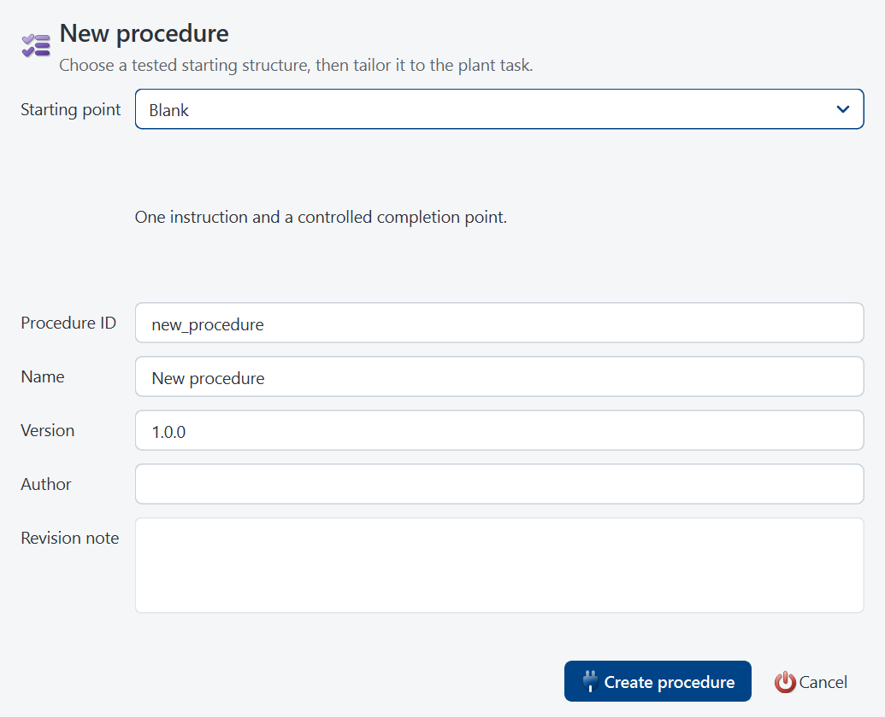
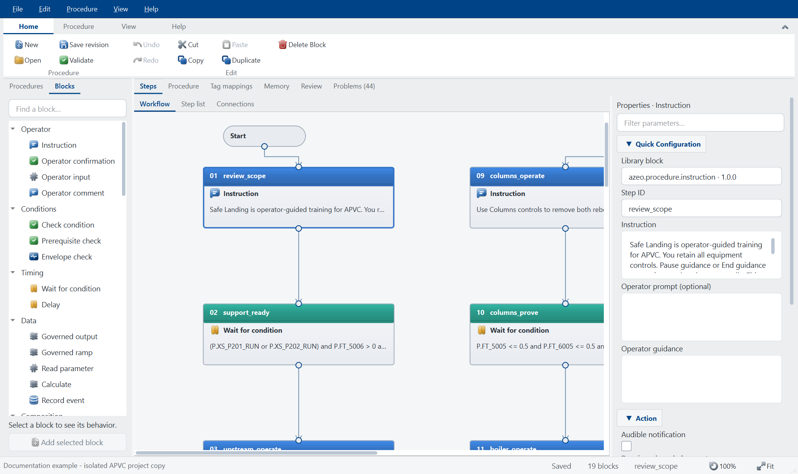
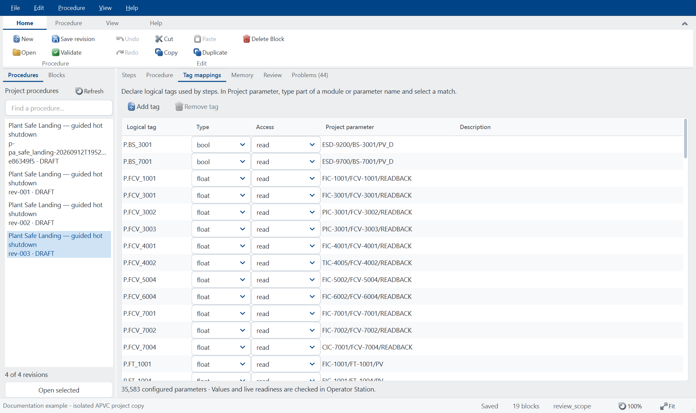

# Azeo PA Designer User Manual

Edition 1.0 - 23 September 2026
Application baseline: `0.4.0`
Document ID: AZEO-UM-PA

Procedure authoring, governed revision review and supervised operation. This guide uses the current Azeo application names and real
widget captures. Examples use the training system; values and demonstrated
conditions are not operating targets for a real plant.

Section numbers inherited from the [suite user manual](USER_MANUAL.md) are kept
intact so cross-application references remain accurate. Application-specific
commands depend on the active project, selected object and granted authority.

## Start with a task

| Goal | Where to go |
| --- | --- |
| Create and validate an advisory workflow | Relevant numbered section below |
| Map tags and review findings before saving a revision | Relevant numbered section below |
| Supervise a run and inspect its audit evidence | Relevant numbered section below |

**Before changing live state:** use an instructor-approved training copy,
check the selected project and current source quality, and keep Save, Download,
Publish, Refresh and operator commands distinct. The [installation guide](INSTALLATION_GUIDE.md)
covers setup and repair. **Help > System information** gives the actual build,
licence and support paths on the workstation.

## 2. Your first session

### 2.1 Prepare the workstation

For a source checkout, create the environment described in the repository
README, open PowerShell at the repository root, and use:

```powershell
& .\.venv\Scripts\python.exe run.py
```

The command opens Azeo Explorer on the registered default project. On a
managed training workstation, use the installed launcher instead of the
source-checkout command.

For a list of available projects and areas, run:

```powershell
& .\.venv\Scripts\python.exe run.py --list
```

**Expected result:** The project list includes the intended training project, and the startup project is marked as the default. `--list` exits without starting the graphical application.

### 2.2 Open a specific application

Run these options from the repository root using the same interpreter. Replace the project path only when selecting a different prepared project.

| Option after `run.py` | Result |
| --- | --- |
| No option | Open Explorer on the registered default project |
| `projects/AzeoPlantVirtualController` | Open the explicitly named project |
| `--classic` | Open Control Designer as the primary window |
| `--graphics` | Open Graphics Designer as the primary window |
| `--station` | Open the dedicated Operator Station; Control Designer stays hidden until requested from a faceplate |
| `--simulation` | Open Simulation Workbench as the primary window |
| `--blank` | Open an empty scratch area |
| `--online` | Request an area download at startup; use only for a prepared configuration |
| `--no-plant` | Open an engineering session without a driven process source |
| `--help` | Show the launcher's command reference |

For the first commissioning session, use Explorer so you can explicitly inspect the project, provider, and module state. Application windows can also be opened from Explorer's **Applications** menu without launching another independent controller session.

### 2.3 Start the APVC training system

**Before you begin:** Confirm the selected project and use a training copy if you intend to make changes. The default APVC workflow uses the embedded Local Virtual I/O provider. Its manual startup state is deliberate.

1. Launch Explorer and read the project identity in the window.
2. Inspect the controller and Local Virtual I/O nodes under the physical network.
3. Open **Tools > Virtual I/O > Provider Status** if available, or the corresponding Local Virtual I/O node's status command.
4. Choose **Start Simulator** from **Tools > Virtual I/O**.
5. Confirm that the provider reports Running. Refresh the status and check that exchange activity advances.
6. Open the intended module in **Applications > Control Designer**. Compile and download the selected module as described in Chapter 4, or use the reviewed **Total Download** workflow for the prepared project.
7. Confirm that the required modules are online and their scan counters advance.
8. Choose **Applications > Operator Station**.
9. Verify the intended home display, current data quality, and station status.

**Expected result:** The provider is running, required modules are scanning, and bound values appear with credible quality. A source that has just started may need an observation interval before the station can establish freshness.

**Recovery:** If values are Bad, check provider state, online module state, and the tag path before changing a control mode. An open window and a moving clock do not prove that process data is healthy.

### 2.4 Make a read-only orientation pass

1. In Operator Live, select **Displays** and open one assigned unit display.
2. Select a live instrument or loop PVM to open its faceplate.
3. Read the module/block identity, PV, quality, and actual mode.
4. Select **Pin** on the faceplate title bar.
5. Select a second loop and compare the two independent windows.
6. Open **Trends** or the faceplate's history action.
7. Open **Alarms** and inspect the list without acknowledging anything solely to clear the screen.
8. Return to the home display with **Alt+Home**.

**Expected result:** You can locate equipment, retain a comparison faceplate, and reach process history without editing a graphic or changing a process value.

### 2.5 Finish a session

1. Finish an active training session so its report and input-fault cleanup are completed.
2. Review and release exercise-specific input simulations or engineering forces.
3. Save intended engineering changes. Publish only displays that have completed the release checks.
4. Save a project backup or simulation snapshot when the lesson requires one; these serve different purposes.
5. Close tools and application windows through their normal close controls.
6. Wait for application shutdown before restoring files or modifying provider configuration.

Closing a faceplate closes that window. Closing Operator Live is not the same command as pausing the coordinated simulation. Use the explicit Workbench or training-session pause command when you need the process and controller clocks to stop together.

## Operator PVMs, faceplates and tuning

Graphics Designer's Procedure HMI blueprint now creates a paired PVM/faceplate and
Workflow, Conditions, Tuning, Trends and History detail classes.
The plant's existing PA class family includes these pages and its manual-control link.

In the Memory table, Operator tuning explicitly exposes a typed value for Next run
or Live / next run; Unit supplies its engineering units. Wait blocks also expose
Operator timer tuning in the Timing inspector and logic worksheet. Existing
revisions default to Not exposed. Next-run changes are signed, retained and used
once by the same revision. Live changes restart condition qualification at an
observation boundary; they do not restart the overall timeout. The operator HMI
records requested/applied values and opens the existing shared historian and run reports.

## Build a procedure




Open **Explorer > Applications > PA Designer**, or the **PA Designer**
toolbar button. It is a separate, modeless application window; repeated activation
returns to the same project editor. The dedicated source launch is
`run.py --procedures`; the portable package provides `AzeoPADesigner.exe`.
Dedicated authoring does not create a controller or start a process provider.

The window uses the shared cool silver engineering chrome, blue menus, vector
icons, positive point-sized fonts, library navigation and contextual inspector.
Its Home, Procedure, View and Help ribbon tabs use Control Designer's actual shared
button, group and page widgets. Ribbon pages scroll on smaller desktops;
double-click a ribbon tab to collapse it and select a tab to expand it.

1. Select **New procedure** and choose Blank, Guided operation, Startup,
   Shutdown, Equipment changeover, Loop verification or Advanced workflow;
   or open a revision from the project library.
2. Set its ID, name, version, author and revision note on **Procedure**.
3. On **Steps > Workflow**, drag from the **Blocks** library onto the canvas.
   Drop onto a connection to insert there, or use **Add selected block**.
   Select a block to edit its instruction, condition, timing or result properties.
   Drag its output port to another block's input to move that block immediately
   after it in execution order. **Step list** provides the equivalent ordered table.
   **Undo/Redo** restores document edits and completed canvas gestures.
4. On **Tag mappings**, declare each logical tag, its type and access. In
   **Project parameter**, type part of the engineering path and select a
   completion from the existing project tag catalog. Use **Procedure > Rename
   symbol / Find usages** for an AST-aware preview and one undoable rename across
   declarations, mappings, expressions and workflow references.
5. On **Variables**, declare initial values for operator inputs, reads and calculations.
6. **Validate** (F7) checks the runner contract and configured parameter paths.
   The live **Problems** tab groups errors and warnings; double-click a finding
   to open its block, flow node, connection, tag or property. **Review** shows
   the ordered procedure, mappings and warnings.
   Validation does not claim live readiness; the station checks that at start.
7. **Save revision** (Ctrl+S) creates a new directory containing the existing
   `procedure.yaml` and `mapping.yaml` formats. Earlier revisions remain intact.
8. In **Operator Station > Tools > Procedures**, choose **Refresh library**, select
   the saved revision and run it against the intended training condition. The
   station displays Draft, Review, Approved or Released as review context; its
   existing authority and live-readiness checks still control Start.

Unsaved edits are protected when opening another procedure, creating a new one,
closing the editor or closing its Explorer owner. Failed validation or saving
retains the draft. Revisions become discoverable only when the document and
mapping are both complete. New revisions are drafts; prior review evidence is
not carried onto changed content. Immutable repository release folders cannot
be edited. **Review and release** advances a saved revision through Draft,
Review, Approved and Released using separated actors and hash-chained evidence
in `governance.json`. The sidecar is bound to the complete revision digest and
never rewrites `procedure.yaml`, mappings or bundled dependencies.

The visual editor covers linear and advanced advisory workflows.
It preserves additional native document fields when opening an existing
procedure, and retains local referenced documents when saving another revision.
Adding controlled references and linked recovery procedures is not exposed in
this editor. Reusable subprocedures use pinned revisions and explicit recovery
connections.

## Engineering productivity workflows




- **Compare revisions** uses a saved immutable revision as the baseline and the
  working draft as the target. It reports semantic changes to procedure
  identity, metadata, workflow, steps, tags, memory and mappings, including the
  affected execution surface.
- **Extract reusable procedure** is available for one contiguous selection in
  a linear workflow. PA Designer derives the selected tag/memory interface,
  saves and validates the child first, then replaces the parent selection with
  a pinned reusable-procedure call. It refuses advanced branch-boundary
  extraction rather than guessing graph semantics.
- **Engineering annotations** add movable notes, phase bands, rectangles and
  swimlanes. Their text, color, size and location persist in metadata but never
  enter the executable step graph.
- **Connections** retains the complete node/edge worksheets and adds typed
  property inspectors for transitions, retry limits, joins, outcomes, default
  paths and priorities. Decision, Retry and Parallel pair commands create the
  corresponding bounded structure; connect their open ports and resolve live
  Problems before saving.
- A saved revision shows its controlled state beside its library identity.
  Review, approval and release require explicit actor/role evidence; approval
  and release also require a reason. Author, reviewer, approver and releaser
  separation is enforced where applicable. This is local engineering evidence,
  not a claim of regulated electronic-signature identity.

## Visual workflow




The Workflow view adapts the original PA Designer `FlowNodeGraphicsItem`,
`FlowEdgeGraphicsItem` and route handles, with source provenance in the product's
`CANVAS_SOURCE.json`. Action blocks use the same silver gradient, category header
palette and blue selection outline as Control Designer; selection does not erase
the block's category color. The canvas also shares Azeo's vector icons and fonts.
The block library, inspector, step list and diagram edit the same procedure.

- Drop on a wire to insert a library block at that point. Dropping on empty canvas
  inserts after the selected step and retains the chosen position.
- Drag a block to change its layout. Wires remain attached. Port-to-port dragging
  changes the actual step order while preserving one connected linear procedure.
- Drag a wire or its selected handle to route it. Double-click a wire to restore
  automatic routing. Geometry survives saving and reopening.
- Use **Arrange** for a compact sequence, **Fit** for an overview, **100%** or
  Ctrl+wheel to zoom, and middle-drag to pan. Initial sizing fits block width;
  an explicit zoom or pan remains under the engineer's control.
- Delete selected blocks with Delete; double-click a block to focus its inspector.
  Escape cancels a block move or unfinished connection without creating an undo entry.

Right-click a block for the shared Azeo **Properties**, **Rename**, **Clipboard**
and **Delete Block** menu. Right-clicking an unselected block targets that block;
clicking one within a selection retains the selection for Cut, Copy, Duplicate
and Delete. The step list uses the same commands. Ctrl+X/C/V/D, Delete, F2,
Alt+Enter and Ctrl+A work in the workflow; text fields retain their native text
shortcuts. Pasted blocks receive unique IDs and preserve their configuration,
library version, relative layout and internal wire bends. Each structural command
creates one undo entry. Cross-procedure tag and variable references still require
declaration and validation in the destination procedure.

The inspector uses the same collapsible parameter-group widget as Control Designer:
Quick Configuration, Action, Timing, Failure Handling and Documentation, as
applicable to the block. **Filter parameters** searches labels, parameter names
and types without changing values; field tooltips identify parameter names and
types, and time fields display their units. Library identity/version is read-only.
Right-click a library block for insertion and Block Help. Connection
menus expose automatic routing and insertion; background menus provide library
insertion, undo/redo, paste, selection, zoom and arrangement.

## Help and block reference

**Help** opens a separate modeless, searchable reference window. Menu and ribbon
entries cover getting started, the visual workflow, properties, tags and variables,
timing, validation and revisions, operator execution, troubleshooting and keyboard
shortcuts. F1 opens help for the focused block or authoring tab. The window remains
available beside the editor and does not change the draft or validation results.

Every library block and placed block has **Block Help** on its right-click menu.
Each of the 20 core primitive and 38 comparison-block references includes configuration instructions, runtime outcome,
a practical example, every exposed property with type/default/meaning, and common
mistakes. The inspector and reference use one `parameter_specs` catalog so fields
cannot silently drift. Search covers the complete topic text; internal links and
Back/Forward navigate between topics. All help ships in the application and works
offline, including in the portable package.

Hold and failure/timeout actions that choose hold finish the current run with
Held status. This version does not resume from a held step. Operator confirmation
provides an acknowledgement gate; the station's Pause/Resume controls an active
run separately. **Break with reason** is an audited pause; Resume requires fresh
controller observations. A step's **Operator skip** property may be set to
**Reason** only for Instruction, Operator confirmation or Operator comment.
The operator chooses Continue or Skip before that step executes. Skip requires
a reason and records the actor and step in the run history. Outputs and required
verification cannot be made skippable.

New documents and imported procedures still use the native `steps` list and
`metadata.canvas_layout`. The Azeo metadata extension `canvas_routes` stores only
cosmetic wire bends for linear procedures, which have no native `flow.edges`.
Canvas positions do not decide execution order. Advanced workflows persist native
`flow.nodes` and `flow.edges`: decisions, bounded retry loops, transitions and
parallel split/join paths. Complete leads directly to End. Disconnected actions
are validation errors. No controller or simulator is started by authoring.

Pointer motion updates only the incident connections and visible painting. It
does not serialize YAML, validate a procedure, rebuild the inspector or create
undo snapshots. A completed gesture makes one document edit. Static text and
icons are cached, and ordinary property edits retain existing scene items.
`tests/test_procedure_canvas.py` drives real port, palette and block gestures,
checks save/undo/reload, contains injected Qt callback failures and measures a
500-block drag-and-repaint budget below 16.7 ms (best of three batches).

## Block library standards

**Explorer > Library > Procedure Blocks (PA)** exposes the same categorized
catalog as PA Designer. Search by label, category, behavior or block identity.
The contents pane shows each block's version and description. Double-click a
block to reveal it in the current PA Designer palette without changing the
draft; **Insert into current procedure** adds it using the editor's normal undo
and revision workflow. **Block Help** and F1 open that block's reference directly.

The Azeo catalog in `core/procedures/library.py` profiles 20 supported native
step types. The palette uses the shared engineering stylesheet, vector icons,
searchable categories, selection-driven commands and a contextual property
inspector. These are procedure steps; they do not register a second controller
function-block library or introduce another procedure document format.

Each insertion, including the initial procedure, saves `library_block_id`
(`azeo.procedure.<type>`) and `library_block_version` (`1.0.0`). Duplicate,
undo, save, reload and the recorded run document retain these fields. The catalog
records the imported source block identity/version separately. Modified Azeo
profiles do not inherit upstream approval claims. The editor and runner reject
unknown Azeo identities, mismatched step types and unsupported profile versions.
Older steps without an identity remain editable as **Custom / legacy step**.

| Category | Blocks |
| --- | --- |
| Operator | Instruction, Operator confirmation, Operator input, Operator comment |
| Conditions | Check condition, Prerequisite check, Envelope check |
| Timing | Wait for condition, Delay |
| Data | Governed output, Governed ramp, Read parameter, Calculate, Record event |
| Run control | Procedure warning, Procedure alarm, Hold, Abort, Complete |

True grants a prerequisite. Envelope check evaluates once when reached; it is
not continuous background monitoring. Warning and alarm blocks record procedure
messages and continue; add a confirmation or hold when progression must stop.
They do not create controller alarms or SIS functions. A governed output asks
for operator authorization, uses the station's checked-write service and
requires a later actual-feedback wait.

Only timed blocks expose timing controls. Instruction and confirmation blocks
always require operator acknowledgement. Live output and ramp blocks always
require audited authorization before their first checked write; the authored
confirmation option also gates isolated trials. Branches, bounded loops,
parallel groups and reusable procedures use the supervised advisory integration.
The procedure delegates live writes to the Operator Station rather than owning
a controller transport. Isolated trials execute outputs only in memory.
Placeholder tags and result variables must be declared and mapped
before validation can pass. Run approval remains separate from library provenance.

## Run a procedure

Operator Station integrates the PA Designer execution core for guided
training procedures. Open **Tools > Procedures** while a local simulation
project is running. The execution core is first-party code under
`core/pa_designer/`; a sibling `azeo_dcs` checkout is not required.

## Verify a loop

1. Use **Training sessions** to restore the intended starting condition and
   start an exercise if the run should belong to that exercise.
2. Open **Tools > Procedures**, select **Built-in: verify a flow loop**, and
   choose a PID loop. Review the target setpoint, PV tolerance and dwell.
3. Wait for completed controller scans, then **Start procedure**.
4. Confirm the initial review. Use **Open faceplate** to select AUTO and set
   the requested setpoint through the existing operator controls.
5. The procedure verifies actual mode and actual setpoint, then requires PV
   to stay inside the selected band for the specified observed dwell.
6. Enter the run observations. The run finishes only after the required
   conditions and operator responses have completed.
7. Use **Run history** to review, export JSON/Markdown, or select two runs
   with Ctrl-click and compare their outcomes.

Operator Station supervises up to eight active main procedures. The **Active
procedures** picker switches between runs; each run has its own prompt, pause,
workflow, token and evidence. Procedures may share read-only observations.
A second run cannot start if its authored output or shared-memory targets
overlap an active run's reservations. Each saved revision's PVM and faceplate
remain bound to that revision's run, including while another procedure is
selected in the workspace. Execution continues when a workspace tab, faceplate
or detail is hidden or closed. Closing Operator Station ends every active run
and waits for their final audit records. Pause and Break affect only the chosen
run; they do not operate the simulator.

For an operator HMI, use **Graphics Designer → PVM Configuration Designer →
New faceplate ▼ → Procedure HMI: PVM, faceplate and detail**. The generated
layouts remain editable user classes. Configure the caller's `ProcedureRef`,
then validate, publish and retrieve it through the existing display workflow.
See the installed Graphics Designer Help tutorial for bindings, commands and
deployment requirements.

## Project procedures

**Save template to project** creates a new revision directory below
`<project>/procedures/` containing `procedure.yaml` and `mapping.yaml`. It
does not overwrite an existing revision. Open them in PA Designer to author
project procedures, then choose **Refresh library** in the station. Invalid documents are
reported and cannot be started.

PA Designer's native schema is retained. A minimal document is:

```yaml
procedure_id: verify_pressure
name: Verify pressure
mode: advisory
connectivity:
  mapping_path: mapping.yaml
tags:
  - tag: PRESSURE.PV
    data_type: float
    access: read
steps:
  - id: verify
    type: wait_until
    description: Verify pressure remains in the training band.
    condition: PRESSURE.PV >= 40 and PRESSURE.PV <= 60
    timeout_sec: 120
    poll_sec: 0.1
    stable_for_sec: 10
  - id: record
    type: operator_comment
    comment_prompt: Record the observed condition.
```

Its mapping uses actual engineering names from the loaded project:

```yaml
mappings:
  - logical_tag: PRESSURE.PV
    connector_tag: MODULE/BLOCK/PV
```

Replace `MODULE/BLOCK/PV` with a real controller parameter. Every declared tag
requires one explicit mapping. Mapping files must remain within the project
procedure library. Supported paths are `MODULE/BLOCK/PARAMETER` (including
fields such as `MODE.ACTUAL`) and `MODULE/BLOCK/CONFIG/PARAMETER`.

`stable_for_sec` is the Trainer extension to `wait_until`. Dwell is continuous
across **observed** values; an out-of-band observation resets it. The station
samples at 100 ms wall time. At accelerated speeds it cannot prove that no
shorter excursion occurred between observations. Use a slower simulation
speed when a procedure needs finer observation resolution.

## Clock, authority and evidence

- Procedure delays, waits, timeouts and dwell use the host's simulation time.
  Both procedure pause and simulator pause freeze progression. After simulator
  resume, execution waits for a new completed controller scan. Manual simulator
  steps while paused do not advance this first procedure integration.
  Opening a faceplate temporarily suspends procedure observation during Qt
  construction, with a bounded 30-second allowance. Execution then requires a
  new completed scan; the unobserved interval is excluded and dwell restarts.
- `LiveGraphSource` supplies values and quality on the station thread.
  `ScanFreshness` observes increasing controller scan counters; cached reads
  never receive invented fresh timestamps. Only immutable observations cross
  into the worker thread. Stale, missing, Bad, Uncertain or non-finite values
  prevent start or stop an active run, including while awaiting confirmation.
- A clock rewind, controller replacement, configuration identity change or
  training session change aborts the run. Restart it from the new condition.
- Live outputs require explicit operator authorization and go through Operator
  Station's existing checked-write service on the host thread. The procedure
  owns no transport and cannot bypass write authority. The document must include
  a later `wait_until` referencing its configured feedback tag to verify actual
  process readback.
- Run history includes the exact document and bindings, their SHA-256 digest,
  actor, project, training session/configuration identity, native audit records,
  source read timestamps, and Trainer step events with simulation and procedure
  elapsed time. These are observed controller scans, not instrument timestamps.
  Run milestones also go into the existing training/historian event stream.

The native audit database and its integrity key live in
`<project>/procedures/runtime/`. These are per-installation records, ignored by
Git and excluded from the portable package. Export reports for sharing. Keep
the database and its integrity key together when backing up local history.
On Windows the generated key uses DPAPI and belongs to the Windows account
and machine. Copying that runtime directory is not a portable history transfer;
use exported reports when sharing results with another installation.
Report comparisons currently show the native engine's wall-clock metrics;
simulation timing is available in the Trainer audit events. Compare runs with
the same document digest, targets and starting condition for meaningful results.
The native report's `tag_writes`/"Tag Writes" entries are output-journal
records. `PCS_OUTPUT_CONFIRMATION`, `PCS_OUTPUT_APPLIED` and
`PCS_OUTPUT_REJECTED` events distinguish authorization from the checked-write
result. Actual controller reads are retained in the local audit database.

## Current scope and architecture

The supported operator workflow is manually started and advisory, with linear
steps or an explicit bounded graph. Already-satisfied entry checks, decisions,
recovery outcomes, parallel groups and reusable subprocedures are supported.
Automatic triggers remain outside this integration. Bounded ramps execute in isolated trials and, after
operator authorization, through the same checked-write service in live runs.
Saved revisions have a local review/approval/release evidence workflow whose
hash-chained sidecar is bound to immutable content. It does not authenticate a
corporate directory identity or replace repository release management. Terminal HELD runs
require a new run after the condition is resolved; Pause/Resume controls an
active run only.

PA Designer **View > Run isolated trial** accepts preset logical-tag values,
runs the validated revision on a deterministic virtual clock, and shows its
internal output journal. The trial provider has no `SharedDataStore`, live
source or controller reference. **File > Export procedure document** generates
printable HTML or Markdown directly from the executable revision, including
document control, mappings, variables, steps, workflow paths and content digest.
The complete procedure comparison inventory is documented in
`docs/PROCEDURE_PARITY_STATUS.md` and generated from
`core/procedures/capabilities.py`.

The execution core was imported from `azeo_dcs` (commit `f7b88b1`) and is now
maintained here as `core/pa_designer/`, first-party code like every other
engine under `core/`. Trainer-specific
models and execution adaptors live in `core/procedures/`; GUI-thread collection
and presentation live in `azeo_operator_station/procedure_observations.py` and
`procedures.py`. No dependency on the plant, Modbus field images, or C++ plant
DLL has been introduced into the procedure adapter.

`azeo_pa_designer/` owns the independent authoring UI, and
`core/procedures/authoring.py` owns its offline revision operations. Parameter
completion uses the existing `TagDatabase`, not a separate tag namespace.

Source installs need `pydantic>=2.12,<3` and `PyYAML>=6,<7`, declared in
`pyproject.toml`. The Windows builder explicitly includes the procedure core,
definitions and dependency closure. A checkout of this repository is sufficient;
no path to the source machine is used at runtime.

The regression suite is `tests/test_procedure_integration.py`. It exercises the
reachable station action, actual Trainer bindings, prompts, completion and
export integrity, template round trips, governed-output readback, continuous dwell,
accelerated/paused time, failed evidence and hidden/closed window lifecycle.
`tests/test_procedure_authoring.py` additionally checks editing, undo/redo,
typed fields, project paths (including actual-mode fields), immutable revisions,
failed-save cleanup, approval invalidation, reference retention, and unsaved
changes. The integration suite drives an editor-authored revision through the
station's real selection, prompt, observation and completion workflow.

### Workspace and library feedback

PA Designer uses the suite's compact ribbon buttons and silver theme. The
canvas receives extra space when the window grows; the properties pane starts
at 320 pixels and both splitters remain adjustable. Collapse ribbon (Ctrl+F1)
reclaims the command area. The bottom status bar reports document save state,
block count, selection and actual zoom, with working 100% and Fit controls.

The Procedures tab lists saved revisions in the current project's `procedures/`
folder, including nested revision folders. A new unsaved draft does not create a
library entry. Returning to the window refreshes the library without replacing
the draft; the library Refresh button does the same, and F5 also refreshes tags.
The panel explains empty libraries and searches, counts unreadable files and
reports their paths in Review. Both plant Safe Landing revisions are discoverable.

### Tag selection, shared memory and block logic

Tag, condition and calculation fields offer autocomplete and a search button.
The search dialog uses the existing engineering Tag Database browser over all
configured project modules. Open module definitions overlay the saved inventory.
Selecting a terminal or configuration parameter creates a readable logical tag
mapping; repeated selections reuse it. MODE selects actual mode. Expression
insertion preserves surrounding operators and any selected replacement text.

The same picker has a **Memory tags** tab. **New memory** saves a float, int,
bool or text tag directly in the project's Tag DB, with an initial value,
description and optional numeric limits. Both the definition and last accepted
value persist in `tagdb/memory.sqlite3`. Copy the project with this database to
retain its memory tags on another machine. Opening a project with no memory tags
does not create a database. A new PA run reads current values; it does not reset
shared memory. The database requires an editable project; released configuration
packages remain immutable.

Control Designer's **Tag Database → New memory tag** uses the same editor and store.
On MEM_FLOAT, MEM_BOOL, MEM_INT or MEM_STRING, use the search button on
**memory_tag** to select `MEMORY/name/VALUE`. An empty path retains the existing
module-local behavior. A linked block reads the shared value each scan; its
existing write-enable/set/reset inputs write that same tag. A missing or
mismatched tag gives Bad quality. HMI bindings can also use the shared path.
PA process commands remain operator-authorized checked writes; only explicitly
linked memory points receive input/calculation assignments automatically.

The PA **Memory** tab shows each linked database path, with its definition
read-only in the procedure. Removing the PA link does not delete the tag.
Legacy local variables remain supported and reset on each run.
Operator input uses the destination type and the intersection of block/memory
limits. Invalid calculation or read results fail without accepting the value.

Select a condition or calculation block and choose **Edit block logic**. A block
can contain up to 32 condition rows and 32 ordered calculation rows. Each
condition has an ID, expression and, on Wait blocks, a continuous hold time.
Choose ALL/ANY or grouped logic such as `C1 and (C2 or C3)`. Every row must occur
in the group. Each row qualifies independently; the combined hold starts after
the group of qualified rows becomes true. Set combined hold to zero when only
individual row timers are required. False resets that row; unknown inputs
cannot qualify. Pause and dropped observation history reset qualification.
Overall timeout is separate from hold times; a late true result cannot override it.

Calculate executes its rows once, top to bottom. Wait executes calculation rows
for every captured observation before evaluating its conditions. Results go to
the selected local variable or shared memory tag, with row order visible and
editable. A failed row batch rolls back its assignments. Cancel discards
worksheet edits and new links; Apply commits those edits as one undoable change.
Saving a new Tag DB memory tag is immediate and independent of worksheet Cancel
or Undo. The creation dialog states this before Save.

Every received scan is evaluated, including false pulses between worker updates.
The HMI publishes Waiting/Timing/Satisfied/Uncertain, elapsed and required row
hold, and the combined timer. Existing two-column PA tables show the row timer
beside the expression; newly authored procedure blueprints also include a Hold
column. The observation table includes current PA memory values with their scope.
Completed steps stop monitoring their former conditions; use control interlocks
for continuous equipment protection.

Verification: `test_procedure_logic.py` covers independent/group timers, grouped
logic, typed memory, round trips, real operator input and between-poll pulses.
`test_procedure_symbols.py` drives the actual picker and worksheet, cancellation,
one-command undo and shared completion models.

`test_shared_memory_tags.py` verifies persistence, atomic typed writes, Control
Studio block reads/writes and PA reuse of saved operator input.

The expression cache stores parsed syntax only. Values and quality are read on
every observation. A 39-condition plant step measured 32.8 ms per observation
before caching and 13.2 ms afterward (best of three 32-observation batches,
including durable audit writes; all 7,680 signed reads verified). Audit commits
batch up to 32 observations. A captured set can span several commits; later
false observations in that set prevent an earlier true result from completing
the step. New arrivals do not continually extend the set being evaluated, and
queued scans proceed without an extra polling delay. Pause discards prior
qualification and resume waits for a fresh observation.
Queued scans validate source freshness at capture time and keep their original
timestamps in the signed history. Live reads and the host observation watchdog
retain their freshness checks; stale, missing, future-dated and invalid values
are rejected.

History initialization adds an audit-record lookup index before verification.
Coverage still checks every operational record against the signed chain, but
does not rescan the entire chain for each tag read. The regression checks the
actual coverage query plan and verifies that an unsigned inserted read is still
rejected. The full native shutdown history verified all 50,140 signed records
in 10.24 seconds with this index during the final validation run.

### Related Azeo help

- [Complete suite user manual](USER_MANUAL.md) - connected workflow and glossary.
- [Installation and administration](INSTALLATION_GUIDE.md) - setup, update and repair.
- [PA Designer authoring guide](PA_DESIGNER.md) - block and procedure details.
- [Control Module Class tutorial](CONTROL_MODULE_CLASS_TUTORIAL.md) - reusable control engineering.
- [PVM and faceplate tutorial](PVM_FACEPLATE_TUTORIAL.md) - reusable graphics engineering.

Use the application's F1 help for the installed block or selected tool. A screenshot
documents the interface, not live readiness or permission to perform a command.
