# Creating reusable PVMs and faceplates

A **PVM (Process Visualization Module)** is a reusable HMI component with
configurable graphics, live tag bindings, status indications and an optional
linked faceplate. PVM is the term used throughout Azeo Graphics Designer.

This is the complete Graphics Designer workflow for creating a reusable visual
class pair, binding it to process data, placing it from Control Data, and
releasing the affected operator displays.

The workflow deliberately separates three concerns:

| Artifact | Engineering responsibility | Release boundary |
| --- | --- | --- |
| PVM class | Compact, reusable process-display object | Save to the engineering library |
| Faceplate class | Contextual operator popup for the same control object | Save to the engineering library |
| Display instance | One linked use with plant-specific public values | Verify, Save, and Publish the display |

A class Save never changes an accepted operator display. A linked engineering
instance reflects the new class while the station continues to run its last
accepted published display revision. This separation prevents a class edit
from changing an operator's screen without display review.

## Before starting

Run the project with the repository virtual environment:

```powershell
.\.venv\Scripts\python.exe run.py AzeoPlantSimulator --online
```

Open **Graphics Designer** from Control Designer. Use **Help > Illustrated Guide**
to keep this tutorial open in the modeless Help Center while authoring.

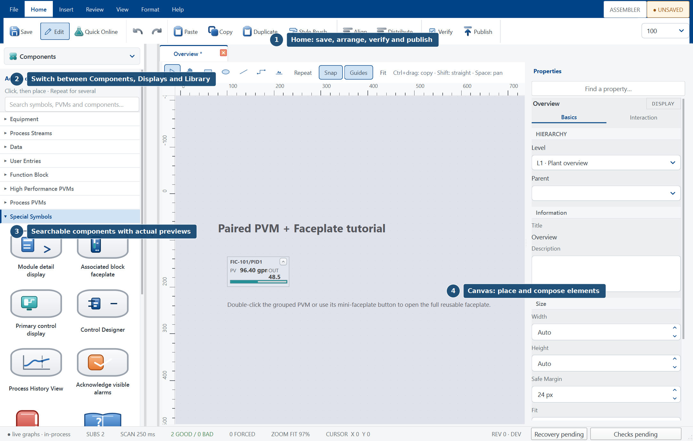

The normal reusable-class loop is:

1. Create the paired classes.
2. Draw both class masters.
3. Define the public/internal interface.
4. Declare one typed primary drop target.
5. Bind class members through `Pvm.*` properties.
6. Drag a compatible control block onto a display.
7. Complete the instance configuration.
8. Validate and Save the classes, then publish every affected display.
9. Troubleshoot the first violated contract.

---

## Draw a display quickly

Choose **Components** in the selector at the top of the left sidebar. Search
stays visible while the stencils scroll. Function-block PVMs have engineering
glyphs; process and authored PVMs show their artwork. Tab to a card and press
**Enter** or **Space**, or use the pointer to choose it.

The same selector opens **Displays**, **Library**, **Control Data**, **Objects**
or **Layers** at full height. **Split view** keeps a browser above Components.
The left chevron collapses and restores the chosen arrangement.

Use the toolbar immediately above the canvas to toggle **Repeat**, **Snap**
and **Guides**. Search the Component Palette, click a card, then click the
canvas where the object belongs. With Repeat enabled, keep clicking to place
more instances. It also keeps shape and connector tools active between strokes.
Press **Esc** or right-click to return to Select.

- Hold **Space** and drag to pan while keeping the current drawing tool.
- **Ctrl+drag** a selection to copy equipment together with its internal pipes
  and manual bends. Grouped copies get an independent group.
- **Shift+drag** constrains movement to an axis; **Alt+drag** bypasses snapping.
  Multiple selected objects keep their relative spacing while moving.
- Select a styled drawing object, choose **Home > Style Brush**, then click another
  shape or pipe to copy its appearance. Repeat keeps the brush active; bindings
  and geometry remain specific to each target.

Each placement, copy-drag or completed movement is one undo step. To reuse
equipment across displays, convert the selection to a PVM class using the
existing class workflow below. These canvas gestures use the same display,
library and publication models as the rest of this tutorial.

Select a drawing to use the **Properties** inspector. **Design** starts with
position, size, fill and stroke; color swatches open a picker. **Data** contains
bindings and equipment-port configuration. **Behavior** contains actions,
scripts and animation. Display and installed-PVM properties retain their
existing typed configuration controls.

The alert strip summarizes repeated conditions. **Details** opens the complete
live list while leaving the canvas usable.

## 1. Create a PVM and faceplate pair

Open **Library Explorer** with **Ctrl+2**. Reusable classes are separate from
ordinary display documents and from installed read-only function-block
classes.

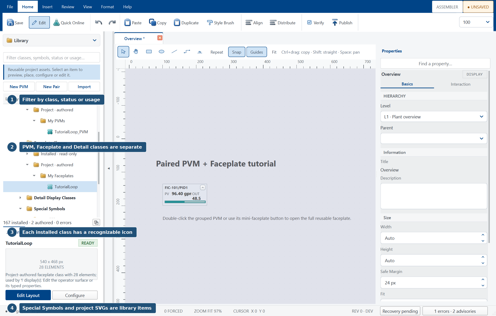

1. Expand **Library > Faceplate Classes**.
2. Right-click **Faceplate Classes**.
3. Choose **New Paired PVM + Faceplate Blueprint...**.
4. Enter a functional class name without spaces, such as `FeedFlowLoop`.

Graphics Designer creates:

- `FeedFlowLoop` — the full faceplate class;
- `FeedFlowLoop_PVM` — the compact display class;
- reciprocal pairing between the two classes;
- a measured class-master page for each class; and
- compatible starter interfaces containing `ControlTag`, `ModuleName`,
  `Title`, `Description`, `PVPath`, `SPPath`, `OUTPath`, `ModulePath`, `EU0`,
  `EU100`, and `UnitName`.

`ControlTag` is the typed primary drop target. The PID-family blueprint accepts
`PID`, `PID_AT`, `PID_DEADTIME`, and `FLC`. `SPPath` is an operator-write
Parameter Reference for the checked User Entry service; PV and OUT remain
read-only.

### Alternative: create only a PVM

Right-click **PVM Classes > New PVM Class...** when no contextual faceplate is
needed. Define its primary drop target before expecting it to appear when a
block is dragged from Control Data.

### Alternative: convert a tested composition

Select the intended display elements, right-click, and choose **Convert to PVM
class...** or **Convert to Faceplate class...**. Conversion creates a linked
class instance, but the interface still must be configured explicitly. A
literal path copied from the source display is not a reusable contract.

---

## 2. Draw on the class-master canvas

Right-click either authored class and choose **Edit Layout...**. The class
opens in the same Graphics Designer canvas used for displays, with class-specific
authoring behavior.

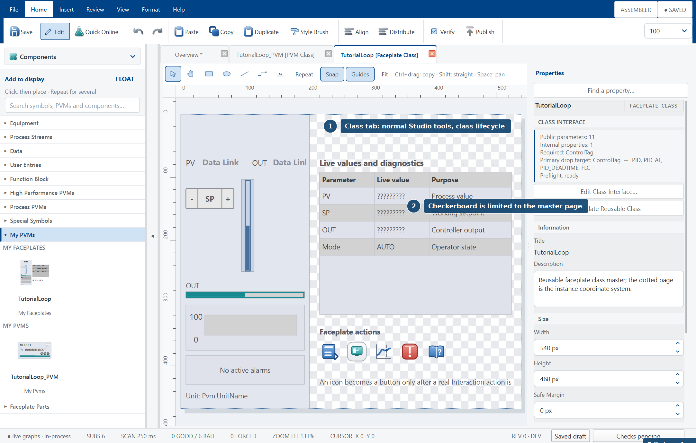

What to look for:

- The tab says **[PVM Class]** or **[Faceplate Class]**.
- Studio opens the master in **Edit** mode.
- Checkerboard transparency appears only inside the class page.
- The dotted page is the class's instance coordinate system.
- **Graphics Configuration** becomes the **Class Inspector** and reports the
  public/internal property counts, required properties, primary drop target,
  accepted block types, and preflight status.
- **Publish** is disabled because a class is saved to the library, not
  published as an operator display.

Use the normal authoring tools:

- draw rectangles, ellipses, lines, connectors, arcs, pencil paths, and text;
- place equipment, Data Links, tables, charts, Alarm Lists, User Entries, and
  Special Symbols;
- move and resize members with handles or exact Geometry fields;
- use rulers, grid, snap, smart guides, alignment, distribution, grouping,
  layers, and the Selection pane;
- name members so a later engineer can identify them; and
- add named connection points where external pipes should attach.

The class page **Width** and **Height** are authoritative. Save preserves the
master's internal whitespace and origin; it does not shrink the class to the
currently selected child. Keep intended ink and interaction targets inside
the dotted page.

### Recommended compact PVM anatomy

- module/block tag;
- one or two decision-relevant live values;
- mode, alarm, quality, or constraint state;
- compact analog bar or equipment silhouette; and
- a serviced mini-faceplate action.

### Recommended faceplate anatomy

- module identity, title, description, alarm/simulation indication;
- PV/SP/OUT values and PV scale;
- a centered dark PV bar inside the light PV channel;
- working-SP and alarm-limit markers;
- checked operator inputs;
- PV/SP/OUT trend;
- module-scoped Alarm List; and
- only those Special Symbol actions backed by runtime services.

---

## 3. Define public and internal properties

With the class master open, choose **Edit Class Interface...** in the Class
Inspector. The same editor opens from **Library Explorer > right-click class >
Configure Properties...**.

The Designer uses the same blue command icons as Graphics Designer. Find a property
with the search field, then select it with the mouse or arrow keys. **Add group**
selects the new group so the next **Add property** goes into it. Drag the pane
dividers to give the tree, editor, or preview more room.

The appearance preview supports **Fit** and **Actual size** and follows the
preview pane's size and screen resolution. **Test configuration** opens an
offline trial of the class's options, resolved properties, presence rules, and
online subscriptions. **Validate** checks the class before **Save**; Ctrl+Z and
Ctrl+Y undo and redo changes to the current class.

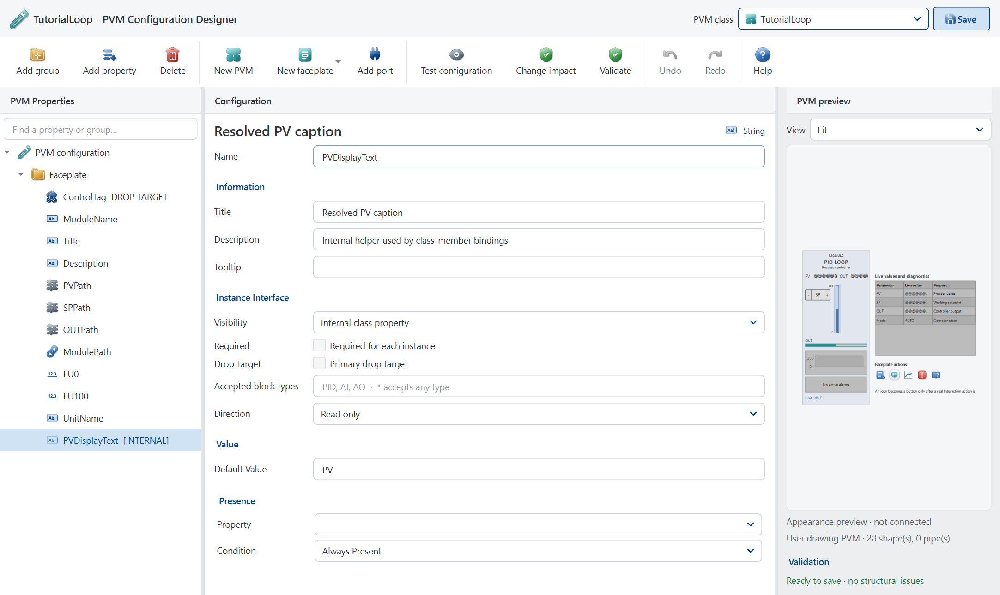

Every property has an **Instance Interface** section.

### Public instance parameters

Use **Public instance parameter** for values that legitimately vary by placed
instance:

- the control tag or function-block reference;
- PV, SP, OUT, mode, alarm, or configuration paths;
- engineering range and units;
- operator-facing title or description;
- an equipment/style Selection; or
- an optional-feature Boolean.

Public properties appear in **Configure instance...**. Mark a public property
**Required** only when no valid instance can be created without a value.
Required fields carry `*` and Verify reports missing values.

### Internal class properties

Use **Internal class property** for values used only inside the reusable
drawing:

- derived display text;
- helper percentages or normalized values;
- internal visibility decisions;
- intermediate Selection values; or
- reusable subcomponent state.

Internal properties remain available to class-member bindings but are hidden
from instance configuration. They cannot be Required, Operator write, or the
primary drop target.

### Direction

- **Read only** is the default for data presentation and class selection.
- **Operator write (checked service)** is valid only for a public property
  consumed by a User Entry whose resolved process target is writable and
  operator-owned.

Do not mark an algorithm output writable to make a control appear enabled.

---

## 4. Configure the typed primary drop target

The primary drop target is the bridge between a configured control block and
an authored visual class.

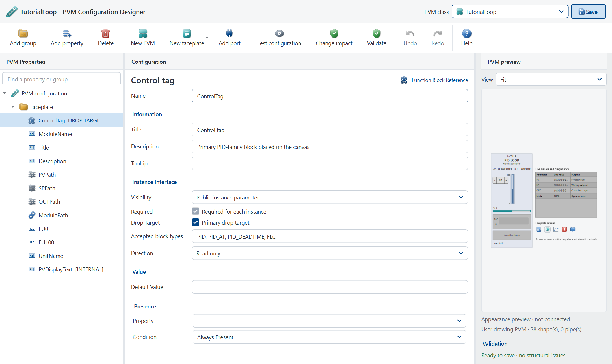

1. Select a public **Control Tag** or **Function Block Reference** property,
   normally `ControlTag`.
2. Enable **Primary target for a dragged control block or tag**.
3. Enter a comma-separated list in **Accepted block types**, for example:

   ```text
   PID, PID_AT, PID_DEADTIME, FLC
   ```

4. Select **Validate**, then **Save** the interface.

The editor enforces the contract:

- exactly one primary drop target per class;
- Public visibility;
- reference type;
- Required value;
- Read-only direction; and
- a nonempty, normalized accepted-block list (`*` accepts any type).

A class is offered in the drag chooser only when its saved interface is valid
and its target accepts the dragged block type. A property named `Tag` without
this metadata does not qualify.

---

## 5. Bind text, tables, alarms, trends, and entries

The master must not contain a commissioned instance path. It binds through
typed `Pvm.*` properties; each placed instance supplies the actual values.

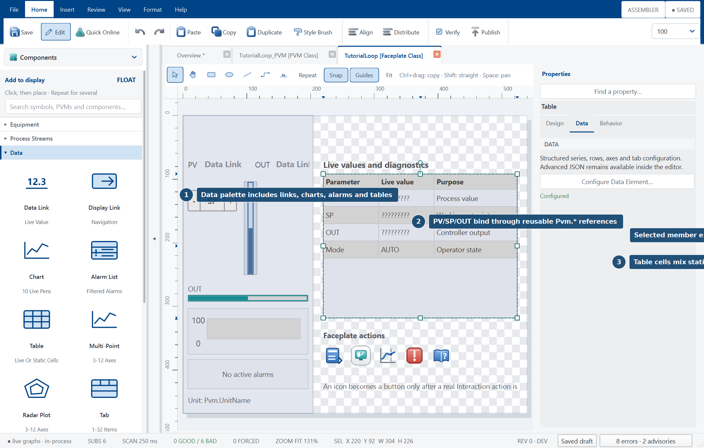

### Text and shape properties

For static captions use **Text Box**. To make text or appearance configurable:

1. Select the class member.
2. Right-click and choose **Shape binding...**.
3. Select a bindable member property such as `text`, `visible`, `fill_pct`,
   `fill`, `opacity`, or geometry.
4. Enter a typed reference such as `Pvm.Title`, `Pvm.UnitName`, or an internal
   helper property.

Use `Standard.<Name>` for project-wide appearance values. Do not paste a
plant tag into a text member.

### Data Links

Place **Data > Data Link** and use a class Parameter Reference:

| Displayed value | Class reference |
| --- | --- |
| PV | `Pvm.PVPath` |
| SP | `Pvm.SPPath` |
| OUT | `Pvm.OUTPath` |
| Module label | `Pvm.ModuleName` |
| Range labels | `Pvm.EU0`, `Pvm.EU100` |

### Tables

Place **Data > Table**. Static cells are labels; live cells are typed
descriptors. Example:

```json
{
  "columns": [
    {"key": "parameter", "title": "Parameter", "width": 2},
    {"key": "value", "title": "Live value", "width": 2},
    {"key": "purpose", "title": "Purpose", "width": 3}
  ],
  "rows": [
    {
      "parameter": "PV",
      "value": {"path": "Pvm.PVPath", "type": "numeric", "decimals": 2},
      "purpose": "Process value"
    },
    {
      "parameter": "SP",
      "value": {"path": "Pvm.SPPath", "type": "numeric", "decimals": 2},
      "purpose": "Working setpoint"
    }
  ]
}
```

### Alarm Lists

Place **Data > Alarm List** and set `path_prefix` to `Pvm.ModulePath`. The list
uses the live alarm registry. Ack, Param, and Help remain alarm semantics; do
not paint static rows that resemble alarms.

### Charts and trends

Place **Data > Chart** and define pens from the same class references used by
the faceplate values:

```json
{
  "pens": [
    {"label": "PV", "path": "Pvm.PVPath", "color": "#496F9B"},
    {"label": "SP", "path": "Pvm.SPPath", "color": "#178A91"}
  ],
  "lo": "Pvm.EU0",
  "hi": "Pvm.EU100",
  "window_seconds": 120
}
```

Do not create a second set of instance path fields only for the trend.

### User Entries

Place a button, check box, combo, radio group, slew, slider, or text entry from
**User Entries**. Example setpoint slew:

```json
{
  "kind": "slew",
  "label": "SP",
  "path": "Pvm.SPPath",
  "lo": "Pvm.EU0",
  "hi": "Pvm.EU100"
}
```

`SPPath` must be Public and **Operator write (checked service)**. Test mode is
a write sandbox. The operator runtime performs ownership, range, quality, and
permission checks before a write.

### Special Symbols

Special Symbols are scalable artwork. They become buttons only when a real
Interaction action exists. Remove unsupported or inert actions rather than
leaving a clickable promise.

---

## 6. Drag a control block onto a display

Save and validate both class interfaces before placement.

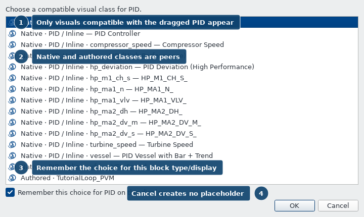

1. Open an ordinary display in **Edit**.
2. Open **Control Data** with **Ctrl+3**.
3. Expand a module and drag the function-block row—not a terminal row—to the
   desired canvas position.
4. If several native or authored classes accept that block type, choose the
   required visual. Leave **Remember this choice...** selected when this
   display should reuse it for later blocks of the same type.

Canceling the chooser creates no placeholder. When exactly one compatible
visual exists, placement is immediate.

The drop transaction fills:

- the declared primary target;
- `ModuleName` with the block path;
- `ModulePath` with its containing module;
- `PVPath` with `<block>/PV`;
- `SPPath` with `<block>/SP`; and
- `OUTPath` with `<block>/OUT`;

but only when those conventional names are declared as Public properties.
Custom required fields remain for instance configuration.

Dragging a terminal or CONFIG parameter row creates a Data Link instead of a
PVM.

---

## 7. Configure the placed instance

Right-click any member of the linked group and choose **Configure instance...**.

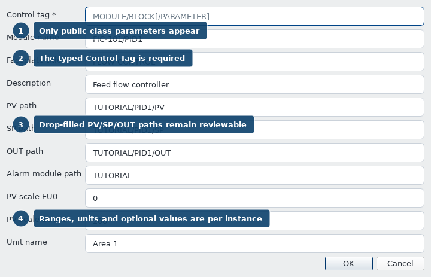

The dialog contains only Public properties. Internal helpers are deliberately
absent. Required labels carry `*`.

1. Review the auto-filled `ControlTag`, module, PV, SP, and OUT paths.
2. Complete custom Required fields.
3. Set engineering range and unit.
4. Choose appearance/feature Selections.
5. Accept the dialog, then select the instance and run **Verify**.

Instance values configure the linked class; they do not copy or expose the
class's child artwork. Keep the instance Linked so accepted master changes can
propagate to engineering displays. Unlink only when intentionally creating a
local fork.

Place a second instance during class commissioning. If it requires editing
the class to change an ordinary public value, the interface is incomplete.

---

## 8. Validate, Save, and publish affected displays

Class validation and display publication are separate operations.

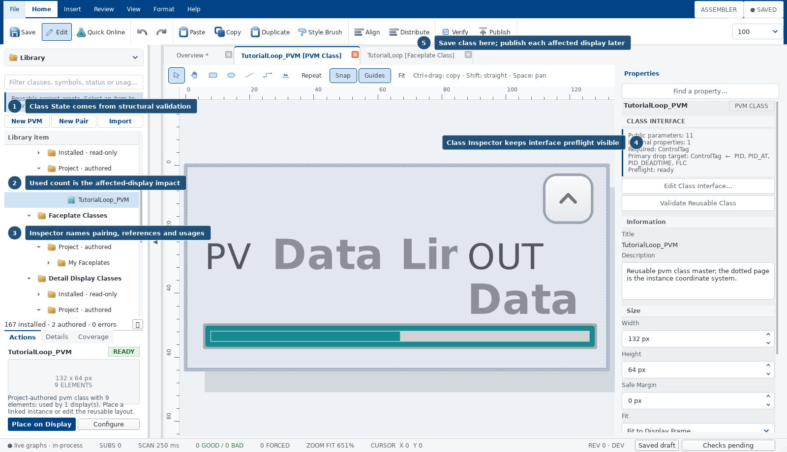

### Validate and Save each class

1. Open the faceplate class master.
2. Choose **Validate Reusable Class** or **Verify**.
3. Resolve invalid scope/direction, missing or multiple drop targets,
   incompatible types, missing required defaults, unresolved `Pvm.*`
   references, pair errors, and nested dependencies.
4. Select **Save**. This saves the class layout and interface to the
   engineering library.
5. Repeat for the compact PVM class.

**Publish remains disabled on a class master by design.**

### Identify impact

1. Open **Library Explorer**.
2. Right-click the changed class.
3. Choose **Find Usages...**.
4. Treat the returned display list as the affected-display review set.

### Release each affected display

For every listed display:

1. Open the display in Edit.
2. Inspect linked instances and complete newly Required public fields.
3. Run **Verify** and resolve every binding, action, pair, and class problem.
4. Enter **Test** or **Quick Online**. Exercise Good, Bad, Uncertain, alarm,
   acknowledged, mode mismatch, range edge, faceplate open, trend, Alarm List,
   and User Entry refusal/acceptance states.
5. **Save** the engineering draft.
6. **Publish** the accepted display revision.

The operator station discovers the published revision through its normal
deployment assignment and accepts/refreshes it at an operator-safe time.

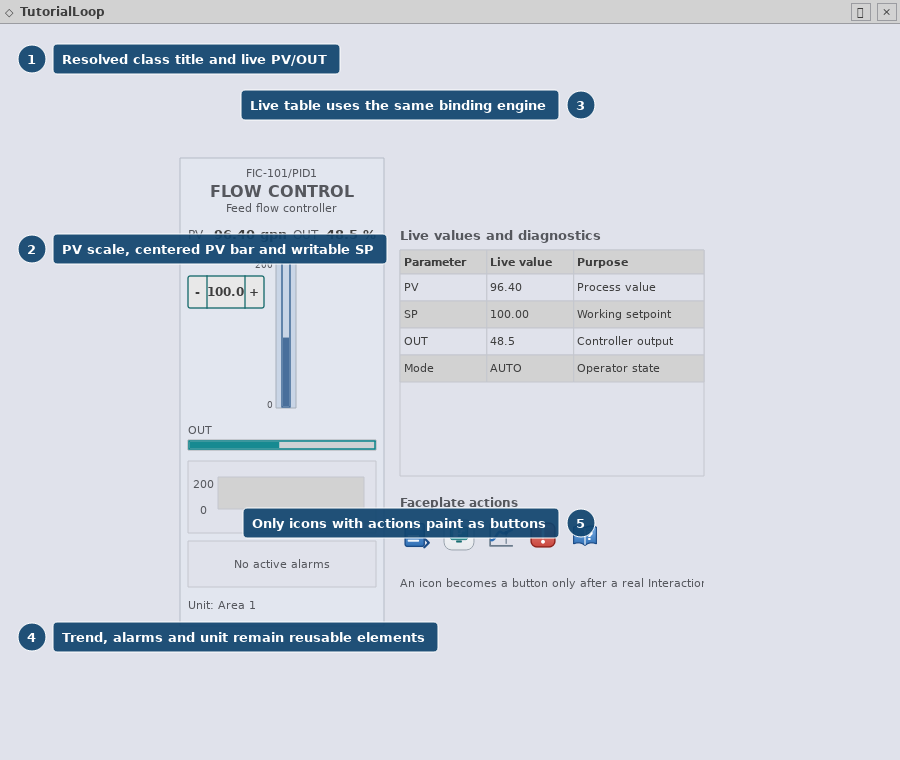

### Release acceptance checklist

- Paired class references are reciprocal.
- Both sides use compatible public property names.
- Only one typed primary drop target exists per PVM class.
- Internal helpers do not appear in Configure instance.
- Every Required property has an instance value.
- Every live path resolves with expected quality and units.
- Every User Entry routes to a checked writable target.
- Every visible action has a runtime handler.
- Alarm color appears only for an alarm state.
- Test and operator rendering use the same layout and binding sources.
- Find Usages has no unreviewed affected display.
- Displays—not merely classes—have published revisions.

---

## 9. Troubleshooting examples

Start with the first failed contract. Later visual symptoms are often only its
consequences.

| Symptom | Likely cause | Correction |
| --- | --- | --- |
| Authored class is missing from the drag chooser | Interface is unsaved/invalid, no primary target, or block type is not accepted | Configure one Public Required Read-only reference as Primary Drop Target, add the block type, Validate, Save |
| An incompatible class appears | Accepted block list is too broad or uses `*` | Replace it with the exact supported block types |
| Helper field appears in Configure instance | Property is Public | Change Visibility to Internal and Save |
| A required field remains empty after block drop | Custom property name is not one of the conventional auto-filled names | Open Configure instance and enter it, or use a conventional name where semantically correct |
| Text or Data Link is blank/Bad | `Pvm.*` reference is undeclared, instance value is empty, or resolved path does not exist | Verify the member reference, public property, instance value, terminal/CONFIG path, and source quality |
| Table cells show labels but no live values | Cell is static or descriptor path does not resolve | Use a typed live descriptor with `Pvm.<ParameterReference>` |
| Alarm List is empty despite a module alarm | Wrong or empty `Pvm.ModulePath`/`path_prefix` | Configure the module scope and verify the alarm registry sees that module |
| Trend is flat or missing a pen | Pen path differs from the displayed PV/SP path or history has not collected | Reuse the same class references and run the source long enough to collect samples |
| User Entry is disabled or refused | Property is Read only, path is not writable/owned, quality is Bad, or value is outside range | Set Operator-write direction only on a legitimate Parameter Reference and correct ownership/range/quality |
| Faceplate does not open | Pair is not reciprocal or the compact instance did not pass the same choices | Pair the classes, Validate both, and verify ControlTag/ModulePath values |
| Publish button is disabled on class tab | Correct class lifecycle behavior | Save class, Find Usages, then publish affected displays |
| Operator station still shows old artwork | Affected display was saved but not published/accepted | Publish the display and accept or refresh the assigned station revision |
| Canceling a block chooser leaves a graphic | Regression: cancellation must be atomic | Remove the object and report the defect; a correct build creates no placeholder |

Use **Review > Verify** for the active document, **Library Explorer > Validate
Class** for reusable class structure, and **Find Usages...** for release
impact. Use **Help > Troubleshoot** for broader path, quality, navigation, and
deployment checks.

---

## Help and guided learning

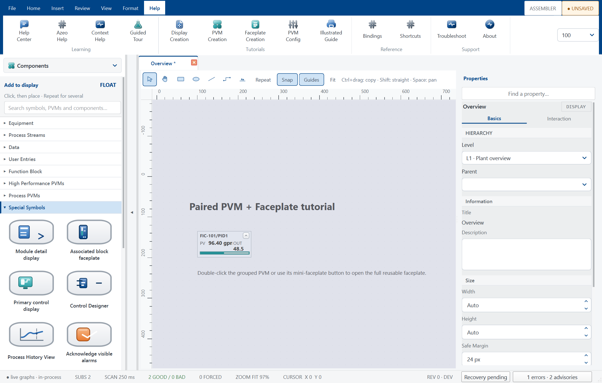

- **Help Center** opens the searchable, modeless reference.
- **F1** routes to the active Graphics Explorer, Library Explorer, Control
  Data, canvas, Selection, properties, or Test topic.
- **PVM Creation**, **Faceplate Creation**, and **PVM Config** provide focused
  procedures.
- **Illustrated Guide** renders this document and its screenshots inside Help.
- **Guided Tour** identifies the real Studio panes without changing a display.

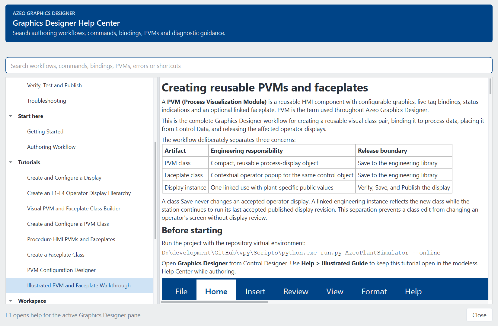

## Regenerating the screenshots

The screenshots are deterministic captures of the real Qt widgets over an
isolated in-memory PID. They do not modify a strategy or commissioned display:

```powershell
.\.venv\Scripts\python.exe tools\render_pvm_faceplate_tutorial.py
```
