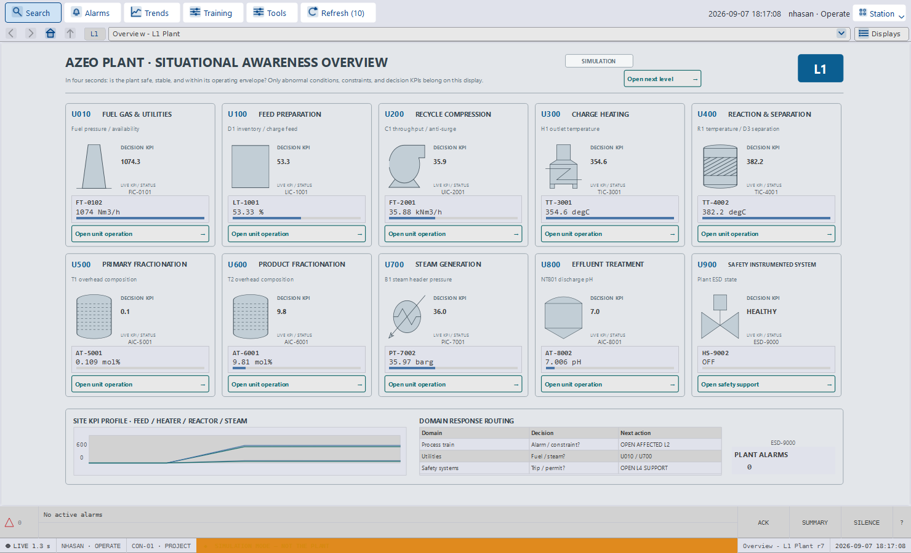
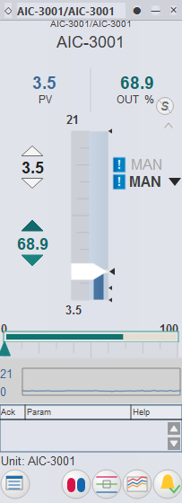
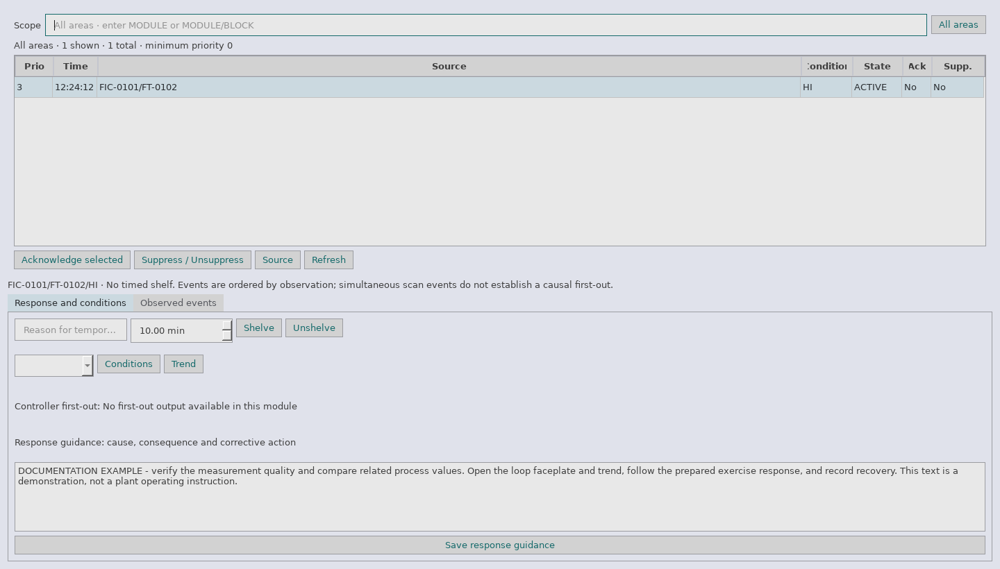
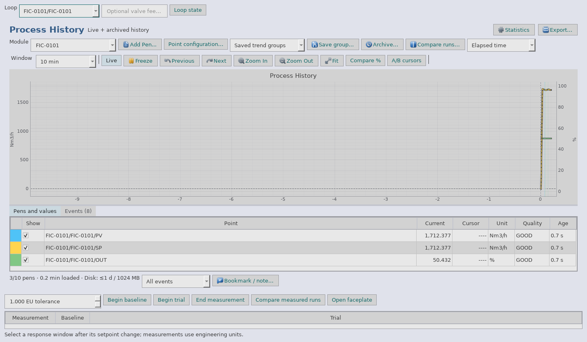
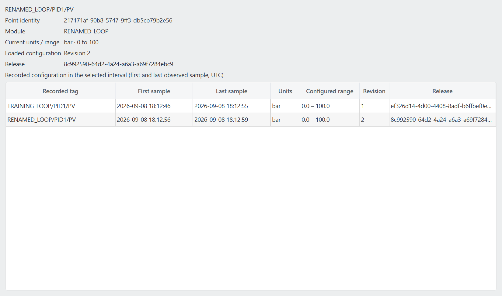
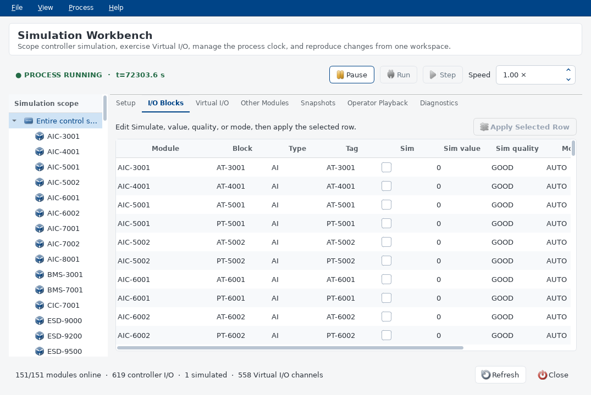
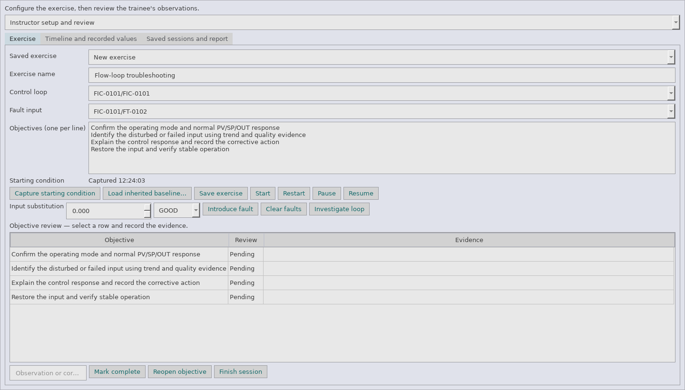
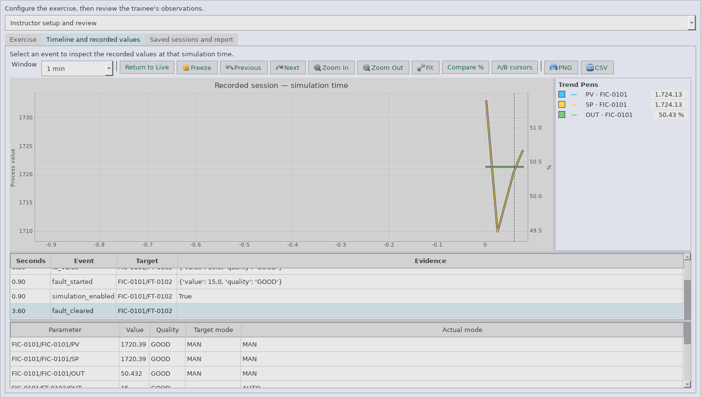
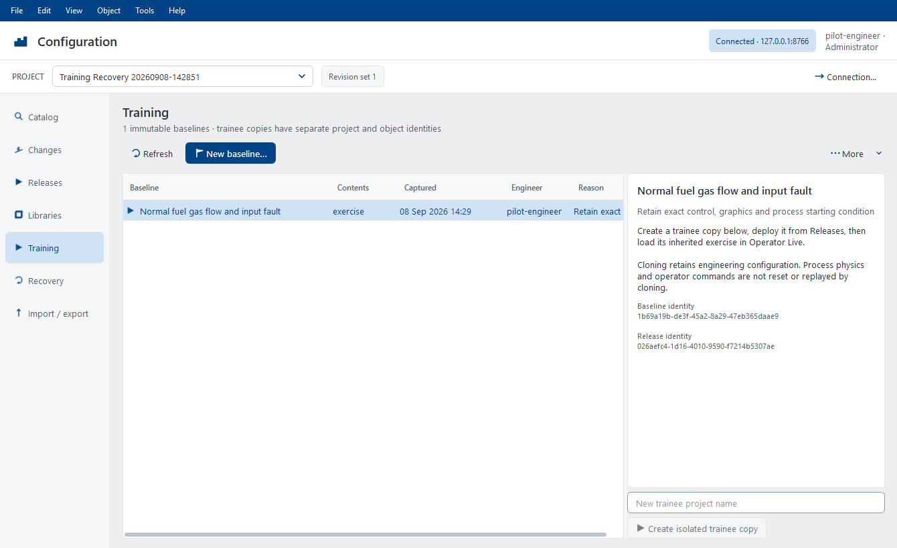

# Azeo Control Trainer

**User Manual | Engineering and Operator Training**

Edition 1.5 - 22 September 2026\
Application baseline: `0.4.0`\
Document ID: AZEO-UM-001

Earlier engineering screenshots retain their documented capture context.

This manual covers Azeo Explorer, Azeo Control Designer, Azeo Graphics Designer,
Azeo Operator Station (Operator Live), Azeo Simulation Workbench, and Azeo PA
Designer. PA Designer has a [dedicated authoring and operation guide](PA_DESIGNER.md).
Use the [Installation and Administration Guide](INSTALLATION_GUIDE.md) for
component selection, first launch, updates, repair, backup and recovery. PVM
Configuration Designer and the engineering training tools have dedicated
procedures.

This edition incorporates the Control Designer, Graphics Designer, and PA Designer
product identities; Graphics Designer productivity tools; the Process History
workspace; and shared configuration workflows through training and database
recovery. Use the task routes in Section 1.6 to find the procedures. Detailed
administration references remain in the [Configuration Database guide](CONFIGURATION_DATABASE.md).

**Contents**

1. [Using this manual](#1-using-this-manual)
2. [Your first session](#2-your-first-session)
3. [Azeo Explorer and project administration](#3-azeo-explorer-and-project-administration)
4. [Azeo Control Designer](#4-azeo-control-designer)
5. [Virtual I/O and signal checkout](#5-virtual-io-and-signal-checkout)
6. [Graphics Designer: build a process display](#6-graphics-designer-build-a-process-display)
7. [Reusable PVMs and faceplates](#7-reusable-pvms-and-faceplates)
8. [PVM Configuration Designer](#8-pvm-configuration-designer)
9. [Verify, test and publish graphics](#9-verify-test-and-publish-graphics)
10. [Operator Live: everyday operation](#10-operator-live-everyday-operation)
11. [Alarms and condition investigation](#11-alarms-and-condition-investigation)
12. [Trends and loop diagnosis](#12-trends-and-loop-diagnosis)
13. [Simulation Workbench](#13-simulation-workbench)
14. [Training sessions and instructor review](#14-training-sessions-and-instructor-review)
15. [Practical training exercises](#15-practical-training-exercises)
16. [Troubleshooting, maintenance and recovery](#16-troubleshooting-maintenance-and-recovery)
17. [Keyboard and gesture reference](#17-keyboard-and-gesture-reference)
18. [Glossary](#18-glossary)
19. [Reference and document control](#19-reference-and-document-control)

## 1. Using this manual

### 1.1 Purpose and audience

Azeo Control Trainer provides a connected environment for learning how a distributed control system is engineered, commissioned, operated, and investigated. Engineers create control modules and process graphics. Operators use published graphics, faceplates, alarms, and trends. Instructors prepare repeatable simulation exercises and review the evidence from each attempt.

Use this manual as a task guide. Each procedure identifies its starting point, the actions to take, and the result to check. Reference tables explain terms and state indications. The practice exercises combine several tools into a complete training workflow.

| Your role | Start here | Continue with |
| --- | --- | --- |
| First-time user | Chapter 2: first session | Chapter 3: project navigation |
| Control engineer | Chapters 4 and 5: modules and I/O | Chapters 12 and 13: trends and simulation |
| Graphics engineer | Chapter 6: display authoring | Chapters 7-9: PVMs, configuration and deployment |
| Operator or trainee | Chapter 10: Operator Live | Chapters 11 and 12: alarms and trends |
| Instructor | Chapter 13: Simulation Workbench | Chapters 14 and 15: sessions and practical exercises |
| Project administrator | Chapter 3: project administration | Chapter 16: maintenance and troubleshooting |

### 1.2 Product map

| Application | Main responsibility | Typical output |
| --- | --- | --- |
| Azeo Explorer | Navigate projects, controllers, modules, I/O and applications | Project organization and commissioning context |
| Azeo Control Designer | Create, compile, download and monitor function-block modules | Saved modules and running controller configuration |
| Azeo Graphics Designer | Draw process displays and reusable graphic classes | Engineering drafts, PVM classes and published display revisions |
| Azeo Operator Station | Operate published displays and inspect live process data | Checked commands, acknowledgements and operating observations |
| Azeo Simulation Workbench | Coordinate simulation time, I/O simulation, snapshots and playback | Repeatable starting conditions and controlled test changes |
| Azeo PA Designer | Author, diagnose, refactor, compare and revise Procedure Automation workflows | Versioned procedures with review/release evidence; Operator Station supervises up to eight concurrent runs with governed Skip and Break controls |

The applications share process values and control-module identity. A graphic does not contain an independent controller. Publishing a graphic does not download control logic. Starting a simulator does not by itself prove that controller modules are scanning.

### 1.3 Conventions

**Bold text** identifies a visible command, label, tab, or field. A route such as **Tools > Virtual I/O > Start Simulator** means select those items in sequence. `Monospace text` identifies a name, tag path, filename, or value to enter. Keyboard shortcuts refer to the application that currently has focus.

**Before you begin** states prerequisites. **Procedure** introduces ordered actions. **Expected result** describes what to verify. **Recovery** describes a practical response when the result differs.

> **Training environment:** Procedures that change modes, outputs, simulation inputs, tuning, or snapshots are intended for an instructor-approved training project. Use a project copy for exercises. The examples are not operating instructions for a real plant.

### 1.4 Version and example data

Use **Help > System information** or an application's **About** command for the
actual software version, build/source commit, distribution channel, licence,
runtime and support paths. The main example project is
`AzeoPlantVirtualController` (APVC). Project configuration, module contents,
published revisions, and live values may differ between workstations. A
displayed number in a screenshot is an illustration of the interface, not a
commissioning target.

Screenshots are captures of Azeo widgets. Some show controlled demonstration data; others show a disposable copy of the APVC training project. Their captions identify their purpose. Menus can depend on the selected object, available provider, configured workstation, and current editing mode. Do not assume that an unavailable service becomes available by changing the display theme or user label.

This manual describes the six Azeo applications. It does not provide a separate reference for every internal plant-model panel or every function block. Use **Control Designer > Help > Block Reference** for the installed block's parameter contract.

### 1.5 Three operations to keep separate

| Operation | What it changes | What to verify next |
| --- | --- | --- |
| Save a control module or graphic draft | Engineering files | The saved name and intended project |
| Download a control module | Configuration used by the controller runtime | Compile result, module status, scan activity and live values |
| Publish and retrieve a display | Revision available to Operator Live | Station assignment, accepted revision, bindings and actions |

A saved PVM class can affect linked engineering instances. Operators continue to use their held published display revision until the station retrieves the intended update. Treat class edits, display publication, and controller downloads as separate review points.

Repository editing adds a **Check in** step between local Save and release. A
private draft is recoverable local work; check-in creates the shared engineering
revision. **Release Manager** then validates, freezes and deploys reviewed
configuration. Use Sections 3.11-3.13 for that workflow. The ordinary file-project
procedures elsewhere in this manual continue to apply to file-owned projects.

### 1.6 New workflows in this edition

| Task | Procedure |
| --- | --- |
| Capture a project and search its shared configuration | Sections 3.9-3.10 |
| Edit privately, resolve conflicts and deploy a reviewed release | Sections 3.11-3.13 |
| Edit many graphics bindings and find commands/properties | Sections 6.12-6.13 |
| Review class impact and adopt selected class versions | Sections 8.10 and 7.9 |
| Play timed visual tests and compare display revisions | Sections 9.9-9.10 |
| Navigate, measure and export historian evidence | Sections 12.5-12.7 |
| Prepare a released baseline and independent trainee copies | Sections 14.10-14.11 |
| Back up the database and verify an isolated restore | Sections 16.10-16.11 |

Shared configuration currently supports isolated engineering and training pilots.
Existing source projects are not converted in place. External field-I/O cutover,
production rollback and broader rollout qualification are outside this edition.
An administrator must prepare the configuration service and project access before
the shared workflows are available.

This edition also documents UI consistency improvements.
Graphics Designer, PVM Designer, controller tools and historian forms share flat blue
dropdowns and numeric controls. Use Tab to move between fields and arrow keys to
select or step values. Numeric fields retain their precision, units and Auto option
where applicable. Watch refreshes immediately when reopened; missing terminals
read Unavailable. Virtual I/O and Workbench show provider reasons above the
workspace, with an Explorer route to check the provider before Refresh. Operator
faceplates remain independent windows: pin each one that should stay open.

## 2. Your first session

### 2.1 Prepare the workstation

For a source checkout, create the environment described in the repository
README, open PowerShell at the repository root, and use:

```powershell
& .\.venv\Scripts\python.exe run.py
```

The command opens Azeo Explorer on the registered default project. On a
managed training workstation, use the installed launcher instead of the
source-checkout command.

For a list of available projects and areas, run:

```powershell
& .\.venv\Scripts\python.exe run.py --list
```

**Expected result:** The project list includes the intended training project, and the startup project is marked as the default. `--list` exits without starting the graphical application.

### 2.2 Open a specific application

Run these options from the repository root using the same interpreter. Replace the project path only when selecting a different prepared project.

| Option after `run.py` | Result |
| --- | --- |
| No option | Open Explorer on the registered default project |
| `projects/AzeoPlantVirtualController` | Open the explicitly named project |
| `--classic` | Open Control Designer as the primary window |
| `--graphics` | Open Graphics Designer as the primary window |
| `--station` | Open the dedicated Operator Station; Control Designer stays hidden until requested from a faceplate |
| `--simulation` | Open Simulation Workbench as the primary window |
| `--blank` | Open an empty scratch area |
| `--online` | Request an area download at startup; use only for a prepared configuration |
| `--no-plant` | Open an engineering session without a driven process source |
| `--help` | Show the launcher's command reference |

For the first commissioning session, use Explorer so you can explicitly inspect the project, provider, and module state. Application windows can also be opened from Explorer's **Applications** menu without launching another independent controller session.

### 2.3 Start the APVC training system

**Before you begin:** Confirm the selected project and use a training copy if you intend to make changes. The default APVC workflow uses the embedded Local Virtual I/O provider. Its manual startup state is deliberate.

1. Launch Explorer and read the project identity in the window.
2. Inspect the controller and Local Virtual I/O nodes under the physical network.
3. Open **Tools > Virtual I/O > Provider Status** if available, or the corresponding Local Virtual I/O node's status command.
4. Choose **Start Simulator** from **Tools > Virtual I/O**.
5. Confirm that the provider reports Running. Refresh the status and check that exchange activity advances.
6. Open the intended module in **Applications > Control Designer**. Compile and download the selected module as described in Chapter 4, or use the reviewed **Total Download** workflow for the prepared project.
7. Confirm that the required modules are online and their scan counters advance.
8. Choose **Applications > Operator Station**.
9. Verify the intended home display, current data quality, and station status.

**Expected result:** The provider is running, required modules are scanning, and bound values appear with credible quality. A source that has just started may need an observation interval before the station can establish freshness.

**Recovery:** If values are Bad, check provider state, online module state, and the tag path before changing a control mode. An open window and a moving clock do not prove that process data is healthy.

### 2.4 Make a read-only orientation pass

1. In Operator Live, select **Displays** and open one assigned unit display.
2. Select a live instrument or loop PVM to open its faceplate.
3. Read the module/block identity, PV, quality, and actual mode.
4. Select **Pin** on the faceplate title bar.
5. Select a second loop and compare the two independent windows.
6. Open **Trends** or the faceplate's history action.
7. Open **Alarms** and inspect the list without acknowledging anything solely to clear the screen.
8. Return to the home display with **Alt+Home**.

**Expected result:** You can locate equipment, retain a comparison faceplate, and reach process history without editing a graphic or changing a process value.

### 2.5 Finish a session

1. Finish an active training session so its report and input-fault cleanup are completed.
2. Review and release exercise-specific input simulations or engineering forces.
3. Save intended engineering changes. Publish only displays that have completed the release checks.
4. Save a project backup or simulation snapshot when the lesson requires one; these serve different purposes.
5. Close tools and application windows through their normal close controls.
6. Wait for application shutdown before restoring files or modifying provider configuration.

Closing a faceplate closes that window. Closing Operator Live is not the same command as pausing the coordinated simulation. Use the explicit Workbench or training-session pause command when you need the process and controller clocks to stop together.

## 3. Azeo Explorer and project administration

### 3.1 Find your way around Explorer

Explorer provides the project tree, object details, and entry points to the other applications. Expand a tree node to narrow the scope; select the object before using its context menu. A command on a controller applies to a different scope from a command on one module.


Use **View > Refresh** or **F5** to refresh the Explorer view. Use the application toolbar or **Applications** menu to open Control Designer, Graphics Designer, Operator Station, Tag Database, and available simulation tools. **F1** opens Explorer help.

| Object or tool | What to inspect |
| --- | --- |
| Project/system node | Current project identity and project administration |
| Area and module nodes | Module organization, names and available opening/download actions |
| Controller node | Controller identity, assigned modules and diagnostic state |
| Local Virtual I/O node | Provider state, source/holder identity and input simulation entry point |
| Tag Database | Canonical tag paths, types, units and consumers |
| Graphics/display nodes | Engineering graphics and publication context |

### 3.2 Open and verify a module

1. Expand the appropriate area or controller assignment.
2. Select the required control module.
3. Double-click it or choose **Open in Control Designer** where that action is offered.
4. Check the Control Designer tab name before editing.
5. Use **Module > Compile** to check the module and review any reported errors.

**Expected result:** Control Designer focuses the selected module. Opening a module does not, by itself, replace a running controller configuration.

### 3.3 Inspect a tag

1. Open **Tag Database** from Explorer.
2. Search for a known tag, such as `FT-0102` in the APVC example.
3. Select the appropriate field or parameter row. Similar text can appear in several rows with different meanings.
4. Read its canonical path, I/O kind, direction, data type, engineering units, description, and consumers.
5. Compare that path with the binding or block configuration you are investigating.

A physical field tag, a function-block path, a terminal, and a CONFIG parameter are different addresses. For example, `FIC-0101/FT-0102` identifies a block path in the example project; adding a terminal name selects one value on that block.

### 3.4 Create a training copy

**Before you begin:** Know which project is the source. A project copy is appropriate for experiments that should not alter the commissioned teaching baseline.

1. Choose **File > Project Administrator**.
2. Select the source project.
3. Choose **Copy** and enter a unique name, such as `Training_Student01`.
4. Complete the copy operation and select the new row.
5. Choose **Verify Selected**.
6. Inspect the copied provider paths, controller assignments, and workstation configuration before starting it.
7. Choose **Set Active** if this copy should be opened by the next application session.
8. Close the current suite normally and launch again.

**Expected result:** The copy has its own project identity and contains the source modules, graphics, library, and configuration. **Set Active** changes the next startup selection; it does not switch open editors to a different project.

### 3.5 Create an empty project

Choose **New** in Project Administrator. Enter a canonical project name and description. For an empty engineering database, leave network preservation off. To reuse an established topology, enable network preservation and select the source project.

The topology-preserving option copies controller/network and provider declarations, not the control modules and process displays. Inspect external or relative provider paths before using the new project. A copied network declaration is not evidence that a provider is running.

### 3.6 Back up and restore a project

**Backup procedure**

1. Save the intended module and graphic drafts.
2. Open Project Administrator and select the project.
3. Choose **Backup**.
4. Choose a descriptive `.azeoproject` filename and destination.
5. Confirm successful completion and retain the file with the lesson or project release record.

The archive includes project configuration, control/sequence modules, HMI drafts and revisions, PVM classes, deployment configuration, Virtual I/O files, and project-local documents. File checksums allow restore to reject damaged or incomplete archives.

**Restore procedure**

1. Choose **Restore** and select the archive.
2. Supply a new project name if that name already exists.
3. Complete validation and restoration.
4. Run **Verify Selected** on the restored project.
5. Review assignments and provider configuration before selecting it as Active.
6. Restart into the restored project, compile the required modules, and perform a staged checkout.

**Expected result:** Restoration creates a separate verified project. It does not overwrite an existing project. A backup protects engineering files; use a Workbench snapshot when you need process and controller operating state.

### 3.7 Register, rename, migrate or deregister

| Command | Behavior | Important condition |
| --- | --- | --- |
| Register | Copies an existing project into the managed projects directory | Source directory must contain `_project.json` |
| Rename | Changes the canonical name and project directory | The currently open project cannot be renamed |
| Verify Selected | Checks project structure and referenced module files | It does not compile or download modules |
| Migrate | Previews supported metadata/schema changes | Review the preview before applying |
| Deregister | Moves the project to a recoverable deregistered directory | Active and currently open projects are protected |

Recover a deregistered project with **Register** using its archived directory. Project Administrator has no permanent-delete operation.

### 3.8 Use Total Download deliberately

1. Select the intended project/controller scope in Explorer.
2. Choose **Total Download**.
3. Read the planned scope and validation results.
4. Resolve missing modules, invalid assignments, or compile failures before proceeding.
5. Review the download plan and any initialization implications.
6. Execute the intended stage and inspect its result.
7. Confirm the resulting online module inventory and live tag quality.

A total download is a controller operation. It does not substitute for publishing display revisions. For an individual loop under development, prefer the selected-module workflow in Chapter 4.

### 3.9 Capture a project in the Configuration Database

**Before you begin:** Have an administrator prepare the local service using the
[Configuration Database setup guide](CONFIGURATION_DATABASE.md#local-pilot-setup).
Select the intended source project in Project Administrator.

1. Choose **Configuration Database** to open **Configuration > Import / export**.
   Confirm the service and identity in the header; the local pilot connects
   automatically. Use **Connection** to change this workspace's service or token.
2. Enter a name beside **Capture as** and choose **Preview local project**.
3. Review additions, changes, removals, exclusions and unresolved references.
   Pause engineering changes while capturing a baseline that must be coherent.
4. Choose **Import reviewed snapshot**. If the source or shared generation changed,
   repeat the preview before importing.
5. Inspect **Objects**, **Tags** and **Audit** for the captured revision and author.
6. Use **Export snapshot** to reconstruct the captured files in a new directory
   and verify their hashes.

**Expected result:** The repository contains a traceable capture. Original files
remain the engineering source for this project; capturing does not redirect Save,
download a controller or publish a display. Exported project files are distinct
from the database backup in Section 16.10.

### 3.10 Search shared configuration and inspect a loop

Open **Tag Database > Shared configuration** in Explorer or Control Designer, or
**View > Tag Catalog** in Graphics Designer. Select the repository project explicitly
if the local project's association is ambiguous.

The **Configuration** workspace uses the same blue controls as Control Designer.
Its header shows the service, signed-in identity, selected project and revision
set. The left navigation opens **Catalog**, **Changes**, **Releases**,
**Libraries**, **Training**, **Recovery** and **Import / export**. Project pages
retain their filters and selections while you move between them. Review dialogs
stay separate so you can inspect the proposed action before committing it.
Finish an active request or review before changing the project or connection.

The **File**, **Edit**, **View**, **Object**, **Tools** and **Help** menus follow
the engineering apps' shared menu style. **Object** exposes commands for the
current page. Right-click a row (or press **Shift+F10**) for actions on that
object: inspect references, include release/library items in a review, open a
draft, create a named trainee copy, or rehearse/export a selected backup.
Commands use the same selection and review requirements as their page buttons.

Use **F5** to refresh the current page, **Ctrl+F** to focus its search, **Ctrl+C**
to copy selected text or table rows, and **Ctrl+Shift+C** to copy the catalog
object path. **Ctrl+Alt+1** through **Ctrl+Alt+7** switch pages; **Ctrl+B** toggles
the navigation pane. These shortcuts apply while the Configuration workspace
is active. **F1** opens Configuration help, and **Help > User guide** opens this guide.

1. Search by module, point path or several words; choose a category filter.
2. Select a result and choose **Inspect loop**. Follow **References** to its I/O,
   controller publications, graphics, classes and faceplate connections.
3. Use **Where used only** to focus on consumers. Double-click a source or target
   to follow it; **Back** returns to the previous object.
4. Inspect **Properties**, **History** and **Revisions** for identity, author,
   reason and captured configuration. Double-click a revision to inspect it.
5. Review **Coverage** findings before renaming or changing a shared object.
   Dynamic/script references can require manual review.

Binding and I/O pickers offer **Shared configuration** to select the exact point
or store tag. Confirm parameter case, units and expected type after insertion.
The catalog shows captured configuration, not live PVs. **Live / open modules**
retains the local live-data view; a graphic preview cannot issue operator writes.

### 3.11 Work in a private draft and check in changes

**Before you begin:** Select a repository editing project in the Engineering
catalog. An administrator can use **Create isolated editing pilot** on a captured
project to create one without changing the source project.

1. Open **Changes** and choose **Start new editing session**. Use
   **Resume selected draft** to continue saved work after closing the session.
2. In the session's **Changes** page, select a module or display and choose
   **Open in Studio**. It reserves the document and opens it in the
   corresponding Studio. Confirm the project and session before editing.
3. Use normal **Save**, or **Save drafts** in Changes. This saves private
   work and does not update the shared revision.
4. Choose **Review and check in**, inspect **Changed fields** and reference
   findings, and enter a change description.
5. Choose **Check in change set** and verify the resulting shared revision.

**Conflict recovery:** Use **Compare / resolve** to compare the draft base, your
draft and the current shared revision. Review before reloading the shared version
or retaining your draft against it. Both choices preserve a dated recovery copy;
retaining a draft still requires check-in. After a lost response, choose **Retry
interrupted check-in** from **More** to recover the original receipt.

Reservations renew while connected. **Release reservations** frees them promptly;
expiry after a crash does not permit an old draft to overwrite newer work. Reopen
drafts through **Configuration > Changes**. Draft modules cannot run on scan, and draft
displays cannot publish directly.

For a module rename, first check in or resolve local changes, then use **More >
Rename module**. Review known consumers and unclassified references, supply a reason and
choose **Check in reviewed rename**. The module retains its repository identity;
its block names and controller-store publications are separate identifiers.

### 3.12 Validate and deploy a repository release

1. Open **Configuration > Releases**, or **More > Release Manager** in engineering
   changes after checking in the intended work.
2. In **Build release**, select the modules and graphics, then choose **Validate
   and review**. The footer shows how many objects are selected.
3. Review included dependencies, validation findings and display links. Resolve
   errors; enter a reason and choose **Create immutable release**.
4. Choose **Create isolated runtime**, or **Start / resume selected runtime** for
   an existing target.
5. In **Deploy / recover**, select the release, runtime and intended control and/or
   graphics operation, then choose **Deploy selected release**.
6. Open **Operator Live** from the runtime. For an already opened graphic, use
   operator **Refresh** to accept the new display and matching classes/assets.
7. Inspect **Configured vs running** and **Audit** before declaring completion.

| Reported comparison | What to check |
| --- | --- |
| Current | Source matches and control has scanned, or the station accepted the graphic |
| Online changes | The loaded version matches, but observed engineering tuning differs |
| Different | Target is using another source revision |
| Available / inactive | Graphic is unaccepted or the loaded module is inactive |
| Not loaded | Connected target has not reported the object |
| Unknown | Fresh target evidence is unavailable; investigate connectivity and runtime state |

**Delivered** confirms target processing. It does not prove a controller scan or
operator acceptance. Clear **Reported objects only** to include objects never
loaded. The isolated target has its own tag store; external field-I/O deployment
is not enabled. Section 14.11 describes explicitly attaching its training process.

After a lost response, use **More > Retry pending command**. Correct a transient
failure before **Deploy / recover > More > Retry selected failed deployment**.
If replacing a failed release, use **Cancel selected failed deployment** in that
same menu, then deploy the corrected release.
Cancellation preserves evidence of partial target changes; inspect that evidence
before deciding the next action.


### 3.13 Preserve selected online tuning

1. In Release Manager, select the runtime and choose **Compare selected runtime's
   online tuning**.
2. Check the observation time, configured values and online values. Select only
   parameters that should become engineering configuration and enter a reason.
3. Choose **Check in selected tuning** and verify the new engineering revision.
4. Validate, release and deploy through Section 3.12 when ready.

A tuning upload does not automatically download its result. Changed selected
values, stale target evidence, conflicting ownership or a newer engineering
revision require another review. Normal SP/mode movement is not an engineering
tuning change.

## 4. Azeo Control Designer

### 4.1 Understand the workspace

Control Designer presents one tab per open module, a function-block canvas, commands on the ribbon and menus, configuration panels, and monitoring/debugging tools. The canvas shows the control strategy; live monitoring can overlay wire values and execution information.


| Control Designer object | Purpose |
| --- | --- |
| Module | Named control configuration containing blocks and connections |
| Function block | An algorithm or I/O/device function with typed terminals and configuration |
| Terminal/pin | Connection point for an input, output, mode or status signal |
| Wire | Connection carrying a value and associated quality/status |
| CONFIG parameter | A configured setting rather than an ordinary terminal |
| Compiled module | Verified execution representation of the module |
| Downloaded module | Configuration installed in the controller runtime |

The Project Explorer separates logical process ownership from physical runtime
placement. Control modules appear under **Project > Area > Units > Unit >
Control Modules**. Create or import from a unit's context menu to assign the
module there, or right-click a module and choose **Move to Unit**. Modules with
no valid process-unit assignment remain accessible under **Unassigned**. The
separate **Control Network** branch continues to show which controller node
runs each module; moving a module between units does not change that node.

### 4.2 Create and save a module

**Before you begin:** Work in a training project and decide the module's purpose, tag names, signal units, and I/O source.

1. Choose **File > New Strategy** or press **Ctrl+N**.
2. Give the module a unique, meaningful name when prompted.
3. Insert blocks using **Insert > Function Block**, or drag them from the block palette.
4. Select a block and configure its name and parameters using the available block editor.
5. Connect compatible output and input terminals on the canvas.
6. Add comments that explain control intent, assumptions, and required interlocks.
7. Open **Module > Module Properties** and review the module settings, including its execution interval where configured.
8. Choose **File > Save** or press **Ctrl+S**.

**Expected result:** The named module is saved in the intended project/area. Unsaved changes and changes not downloaded remain separate concerns.

### 4.3 Build a basic measured loop

Use the installed block reference to select the exact terminals for each block. A typical analog loop includes an AI, a PID, optional scaling, and an AO/final-element demand. It also includes the required downstream status and back-calculation path.

1. Configure the AI's field reference and engineering range.
2. Configure the PID's PV range, action, initial mode, output limits, and tuning for the exercise.
3. Connect the measured value to the PID's PV input using compatible units.
4. Connect the PID output through any necessary scaler to the final-element command input.
5. Complete the downstream acceptance/tracking and BKCAL connections required by the block contracts.
6. Verify that both sides of every scaler use the same numerical interpretation.
7. Keep commissioning modes under deliberate control and compile the module.

> **Range check:** A PID output of 0-100 connected to a scaler expecting 0-1 is a configuration error even if the wire type is numeric. Confirm ranges and units at each boundary. Do not correct a saturated final element by hiding or clamping the displayed value.

### 4.4 Compile and resolve errors

1. Select the module tab.
2. Choose **Module > Compile** or press **F7**.
3. Read the complete result. Identify the referenced block, pin, connection, or expression.
4. Correct the first underlying error and compile again.
5. Review warnings before download; a successful compile does not prove that the I/O mapping or control intent is correct.
6. Use **View > Show Execution Order** to inspect the compiler-derived execution order when investigating dependencies.

**Expected result:** The module compiles with understood diagnostics. Confirm that every critical input is intentionally driven and every output has the correct owner.

### 4.5 Save, download, go online and go offline

| Command | Use it when | Result to inspect |
| --- | --- | --- |
| Save | Preserve engineering edits | Saved project file and module identity |
| Compile, F7 | Check module structure and execution | Diagnostics and execution order |
| Download, F5 | Choose the set of open modules that should be online | Entire checkbox selection, download result and controller state |
| Go On Line | Attach the editor's live view to the running configuration | Live values and online indication |
| Go Off Line, Shift+F5 | Take all online modules open in this Control Designer offline | Resulting module inventory and scan state |
| Upload (Controller -> Project) | Bring supported running values/configuration back into the project | Reviewed differences before saving |
| Compare Parameters, Ctrl+K | Inspect parameter differences | Intended versus actual values |

**Download procedure**

1. Save and compile the module.
2. Verify the target controller/module identity and required I/O readiness.
3. Choose **Module > Download** to open the module-selection dialog.
4. Review the complete checkbox selection. Keep every already-running module selected if it must stay online; deselecting an online module takes it offline. Select the additional modules required by the exercise and confirm the reviewed selection.
5. Open **Module > Controller Status** and confirm the module is active/online as intended.
6. Observe more than one scan and verify PV quality and output acceptance.
7. If an online module has changed since download, use its **Re-Download** action in **Controller Status** before expecting the runtime to use the edit. Selecting an already-online module in the ordinary download selection does not replace its running configuration.

**Expected result:** The intended module is scanning. A source edit, an open tab, or an attached live view is not proof that the new configuration was downloaded.

> **Offline scope:** The menu/ribbon **Go Off Line** command affects all online modules open in that Control Designer. For one-module work, use that module's row in **Controller Status**: **Go Offline**, **Go Online**, or **Re-Download** as appropriate. The row's Go Online action compiles and brings that inactive module online; it is different from the menu's view-attachment command.

### 4.6 Monitor a running module

1. Open the module and attach its online view.
2. Enable **View > Show Wire Values** if needed.
3. Select the relevant block and inspect its values, modes, quality, and status.
4. Open **View > Watch Window** or press **Ctrl+Shift+W** for a focused set of observations.
5. Open **Module > Controller Diagnostics** for scan and module health.
6. Use **Module > Cross Reference** to inspect related references when a signal appears to have an unexpected consumer or source.
7. Use the **Monitoring Tab** with **Ctrl+M** for the available monitoring view.

Record a symptom together with the actual mode, target mode, PV/SP/OUT, quality, and downstream status. A single numeric value rarely explains a loop that will not transfer or a demand that will not move an output.

### 4.7 Use controller debugging tools

Breakpoints, stepping, forcing, and watch facilities are engineering tools for an isolated exercise. A breakpoint can suspend progress expected by other modules or displays. A forced value can conceal the real signal path. Record the scope and remove temporary interventions before returning to normal operation.

1. Reproduce the problem in a copied project or a prepared offline controller simulation.
2. Add only the observations needed to isolate the block/connection.
3. Use the available breakpoint/step controls to examine execution at the intended boundary.
4. Record the input, output, quality, and internal state that establish the problem.
5. Remove breakpoints and forces, restore the agreed state, and repeat under normal scanning.

Use **Module > Controller Simulator** for the separate offline module-testing surface. Use the suite's **Simulation Workbench** for coordinated process/controller time and complete process snapshots. The two tools serve different scopes.

### 4.8 Review and document a module

Use **File > Module Report** for the available module report and **Print Preview** before printing. **Tools > Compare Strategies** and **Version History** support engineering review. Record the control purpose, input/output mapping, units, normal/setup modes, limits, and expected abnormal behavior with the module.

Before a lesson release, confirm that the saved project, running module, graphic bindings, and instructor's starting snapshot describe the same intended configuration.

### 4.9 Reuse a master Control Module Class

Use a Control Module Class when complete modules should share governed block
structure, wiring, configuration, drawing layout, and documentation while a
small typed set of instance values may differ.

1. Open, compile, save, and take the finished source module offline.
2. Choose **Tools > Control Module Classes...** and
   **Create Class from Active**.
3. Expose only approved instance properties such as field tags or selected
   tuning values. The source becomes the first linked revision-1 instance.
4. Choose **Create Linked Instance**. In the guided window, enter a unique
   module name, select the owning project area and process unit, and apply only
   the typed property overrides that should not inherit the class default.
5. Publish later master changes with **Publish Active as New Revision**. Other
   instances remain unchanged and report **STALE**.
6. Open each stale instance and use **Review / Adopt Update** to compare class
   changes, direct deviations, and exact three-way merge conflicts.
7. Compile and perform deployment-impact review on every effective instance
   before download.


See [Creating a master Control Module Class](CONTROL_MODULE_CLASS_TUTORIAL.md)
for the complete illustrated workflow, status reference, and release checklist.

The installed `AzeoPlantVirtualController` project provides a concrete
cooling-water example. Four revision-1 classes create nine linked instances:
four AI/PID/AO loops, two cooling-tower fan cells, two circulation-pump and
discharge-valve assemblies, and one tower-performance module. The fan cells
stage from supply temperature with availability, VFD, fault, run-feedback and
basin-low-low protection. Each pump opens and proves its discharge MOV before
start; the standby instance adds a delayed low-header-pressure demand. All 16
CT1 outputs download in Manual and require the normal commissioning transfer.
The simulator remains open-loop and owns only process physics and its
independent SIS.

## 5. Virtual I/O and signal checkout

### 5.1 Understand the signal boundary

The APVC provider exchanges plant measurements and controller demands through Local Virtual I/O. AI and DI are acquired inputs. AO and DO are controller-owned outputs. The provider's output-holder rules prevent competing sources from writing the same outputs.

| Signal kind | Meaning | Plant-side input simulation |
| --- | --- | --- |
| AI | Analog measurement from the process | Static or patterned value with acquisition quality |
| DI | Discrete measurement/status from the process | Supported discrete/static or patterned input |
| AO | Analog command from the controller | Read-only in the plant-side input simulator |
| DO | Discrete command from the controller | Read-only in the plant-side input simulator |

Controller block simulation and Virtual I/O input simulation are separate layers. The first substitutes a block's configured simulation input. The second substitutes a provider input before it reaches the controller. Graphics TEST is a third layer used only to review display behavior.

### 5.2 Inspect provider health

1. In Explorer, select the Local Virtual I/O node.
2. Open **Provider Status**.
3. Confirm Running state, the intended source identity, and the output holder.
4. Record current exchange counters.
5. Close/reopen or refresh the status after a short interval and confirm progress.
6. Inspect a routed field point in Tag Database and then its consuming control block.

**Expected result:** Provider activity advances and valid acquired data reaches the intended block. A total Tag Database count can exceed the field-route count because it includes module parameters.

### 5.3 Apply an input profile

**Before you begin:** Select an AI or DI in a copied training project. Identify the live source to which the input should return after the exercise.

1. Open **Applications > Virtual I/O Simulator**, or the Local Virtual I/O node's **Open Signal Simulator** action.
2. Find the tag by unit and signal kind.
3. Select the input row and choose **Configure Input**.
4. Select the required Static, Sawtooth, Square, or Sine profile offered for that input.
5. Enter the static value or the pattern's low, high, and period settings.
6. Choose Good, Uncertain, or Bad acquisition quality for the test.
7. Apply and inspect the input's simulation indication.
8. Verify the resulting value and quality in Control Designer and Operator Live.

**Expected result:** The selected input changes through the intended provider path. AO/DO rows remain protected from this input-simulation operation.

### 5.4 Release, save and load input simulations

Choose **Release** on the simulated input to expose current process physics again. The process can continue evolving while its measurement is substituted, so the restored live value may differ from the pre-test value.

Use **Save Scenario** to preserve the active input-profile set. **Load Scenario** validates the complete saved set before replacing active profiles. Pattern phase restarts when loaded. Keep these input scenarios separate from complete Workbench snapshots and from recorded training sessions.

### 5.5 Commission a loop's direction and authority

1. Confirm Good input quality and the intended manual/setup modes.
2. Compare the displayed output with the actual final-element readback.
3. Make only the small output movement specified in the instructor's exercise.
4. Observe the process response and confirm its direction and plausible rate.
5. Return to the agreed operating condition and verify tracking/BKCAL acceptance.
6. Transfer the downstream device and controller through their engineered modes in the prescribed order.
7. Verify actual mode and response after every transfer.

Do not assume a generated project's initial modes or special-case output values remain unchanged after project editing or snapshot restoration. Read the actual configuration and use the lesson's approved values.

### 5.6 Change a provider configuration

Changes to provider factory, paths, source/holder identity, routes, catalog, snapshots, exchange timing, or startup settings require a reviewed configuration update and an application restart. Explorer **F5** refreshes its view; it does not reconstruct the provider.

The APVC Local Virtual I/O configuration is an embedded-provider workflow. Connecting to a separately running process requires a commissioned network transport/profile; a changed endpoint string alone does not convert Local Virtual I/O into an external OPC UA client.

## 6. Graphics Designer: build a process display

### 6.1 Understand the authoring workspace

Open **Explorer > Applications > Graphics Designer**, or **Control Designer > View > Graphics Designer**. Check the project and display name before entering Edit mode.


| Workspace area | Use |
| --- | --- |
| Ribbon | Create, edit, arrange, verify, test and publish |
| Display tabs | Switch between display drafts and open class masters |
| Sidebar selector | Switch among Components, Displays, Library, Control Data, Objects and Layers |
| Component Palette | Search and place equipment, function-block PVMs, data elements and User Entries |
| Canvas toolbar | Select, pan, repeat placement, snap, guides and fit |
| Drawing page | The display's authored coordinate area |
| Property inspector | Edit the selected object, display or class interface |
| Alert/status strips | Inspect current conditions, mode, selection and view state |

**Split view** keeps a browser above Components. The sidebar chevron collapses and restores the arrangement. Resize panes to suit the current task. Ribbon content can scroll horizontally on a narrow desktop.

### 6.2 Choose the display's purpose and level

Plan what an operator must decide on this display before drawing equipment. Use L1-L4 hierarchy metadata and consistent parent/child navigation.

| Level | Intended information | Typical content |
| --- | --- | --- |
| L1 | Overall plant or process-area awareness | Unit health, major constraints and routes to unit displays |
| L2 | Unit control and process relationships | Main equipment, flows and primary operating loops |
| L3 | Focused equipment or task operation | Supporting measurements and detailed process context |
| L4 | Detailed diagnosis/reference | Conditions, limits, maintenance or specialist detail |

The level field describes the display hierarchy; it does not enforce an operator's permission level. New displays start at L1. Older displays that predate explicit level metadata can be treated as L2 for compatibility, so review the metadata when adapting an older drawing.

### 6.3 Create a display and establish its page

1. In the Displays/Graphics browser, choose **New Display**, or use the ribbon's **New** command.
2. Enter a meaningful, unique display name.
3. Enter **Edit** mode.
4. Select the display/page rather than an individual object and review page dimensions, display level, title, and navigation metadata in the available configuration controls.
5. Choose a suitable built-in template when appropriate, or begin with a clear empty page.
6. Establish a consistent margin and reserve space for headings and critical operating information.
7. Save the initial draft.

**Expected result:** The correct display tab is open in Edit mode, with a page appropriate to the target workstation. Page geometry and viewport zoom are different settings; use Fit to inspect the whole page without changing its authored size.

### 6.4 Place equipment and data rapidly

1. Select **Components** in the sidebar.
2. Enter a functional search term, such as a pump, vessel, valve, data link, or block family.
3. Select the component card and click the desired canvas position.
4. Enable **Repeat** to place several instances without reselecting the card.
5. Press **Esc** or right-click to return to Select after placement.
6. Select each instance and complete its process reference and properties.
7. Use **Control Data** when a graphic should be created from an existing module/block rather than configured from a blank visual.

A process symbol communicates equipment geometry. A function-block PVM also has a data and action contract. An attractive symbol is not automatically connected to a process value or faceplate. Verify the binding and interaction, not just the artwork.

### 6.5 Move, resize, align and duplicate

| Gesture or command | Result |
| --- | --- |
| Select and drag | Move the selected object or selection |
| Drag a resize handle | Resize according to the object's supported geometry |
| Shift+drag | Constrain movement to an axis |
| Alt+drag | Temporarily bypass snapping |
| Ctrl+drag | Copy the selection, including selected equipment and internal pipe relationships |
| Ctrl+Alt-click | Cycle through overlapping visible, unlocked objects |
| Hold Space and drag | Pan temporarily while keeping the current drawing tool |
| Snap | Align placement/movement to the configured snapping aids |
| Guides | Show/use alignment assistance |
| Fit | Fit the drawing into the available viewport |
| Undo/Redo | Reverse or repeat an authoring transaction |

Use exact position and size fields for repeatable geometry. Use alignment/distribution commands for rows of values and equipment. Multiple selected objects retain their relative arrangement during a move. A completed placement, move, or copy-drag is an undoable action.

### 6.6 Connect equipment with pipes

**Before you begin:** Place the equipment and choose the intended inlet/outlet geometry. Keep equipment identity separate from the pipe's visual route.

1. Select the connection tool.
2. Start on the intended visible perimeter or a named port of the source equipment.
3. Route toward the destination and finish on its intended perimeter or port.
4. Inspect both endpoints after committing the connection.
5. Move one connected object and confirm that the connection remains attached.
6. Adjust route bends where the automatic path does not communicate the intended process route clearly.
7. Use endpoint coordinates and persistent ruler guides to align manual bends.
8. Test rotated or mirrored symbols to confirm the chosen ports remain correct.

Named cardinal ports are convenient magnetic targets; connection geometry is not limited to the bounding box's four side centers. The chosen endpoint and its orientation remain part of the authored connection. Avoid routes that obscure tags, values, operator targets, or other equipment boundaries.

While dragging, the route is provisional. Release the pointer to evaluate the
final obstacle route. For a decorative background panel, clear **Graphics
Configuration > Visibility > Block automatic pipe routes** so connections can
cross its background. Keep equipment and labels clear of the chosen port exits.

### 6.7 Group an equipment arrangement

1. Select the relevant PVMs, static drawing objects, and connecting pipes.
2. Use the grouping command.
3. Click a member and confirm the arrangement selects as a group.
4. Move the group and verify internal connections.
5. Save, reopen, and confirm grouping is retained.
6. Ungroup only when you need to edit the independent membership.

Use a **PVM class** for a linked reusable visual with a formal public interface. Use an **assembly** for a reusable arrangement that is inserted/copied through the existing template and clipboard workflow. A group alone does not create a reusable class contract.

### 6.8 Set appearance and behavior

Select a drawing object to open its inspector. **Design** contains geometry, fill, stroke and text styling. **Data** contains bindings and equipment-port configuration. **Behavior** contains the supported actions, scripts and animation controls. Display and installed-PVM properties use their corresponding typed controls.

Use color swatches to choose colors consistently. **Home > Style Brush** copies the appearance from a styled drawing object to another shape or pipe. With Repeat enabled, apply the style to several targets. Each target keeps its own geometry and bindings.

Use the shared blue for application/authoring actions. Keep process quality, alarm priority, mode, and state colors semantic. Do not turn every process indication blue merely to match the ribbon.

### 6.9 Add live values, navigation and actions

1. Place a **Data Link** for a live value or drag a terminal/CONFIG parameter from Control Data.
2. Review its exact path, displayed precision, units and quality behavior.
3. Place a **Display Link** or configure a supported navigation action for a real destination.
4. Add a chart or Alarm List only where the operating task needs it.
5. Use supported User Entries for operator input. Bind them to valid, writable targets.
6. For a decorative icon, omit an interaction unless a real action is configured.
7. Test every target using the actual runtime-style interaction.

**Expected result:** Values come from the intended source, display links reach an assigned destination, and input actions either receive an accepted result or a meaningful refusal. No unlabeled inert control should be part of the released operating workflow.

### 6.10 Reuse an assembly and map its tags

1. Choose **Insert > Assemblies**.
2. Select an available starter or saved arrangement.
3. Map every source block to an existing destination block.
4. Choose **Preview mapped bindings**.
5. Resolve missing blocks, incompatible families, terminals, and CONFIG paths.
6. Choose **Apply to canvas** after the preview succeeds.
7. Position the inserted arrangement and verify its internal pipes and PVM bindings.

To reuse your own arrangement, select its members and pipes, provide an assembly name, and choose **Save selection as assembly**. To remap a complete drawing, select the current-display source in the mapping tool. The full insertion/replacement is one undoable operation. Use **Reload source** if the source display has changed while the mapping dialog is open.


### 6.11 Review before leaving Edit

Check the display at its intended operating size, not only while zoomed in. Tags and units should be legible; important values should align; action targets should remain clear; abnormal states should attract attention without making the normal display visually noisy.

Run **Verify**, inspect unresolved references, and save the draft. Continue with the class workflow in Chapter 7 if you are creating reusable graphics, or the commissioning and publication workflow in Chapter 9 if this is an ordinary display.

### 6.12 Edit many objects with the engineering worksheet

1. Open **Insert > Worksheet** and choose **Selected objects** or **Whole display**.
2. Edit the supported tags, PVM labels, registered variants, text or display-link
   destinations. Each PVM parameter has its own row; locked objects are excluded.
3. Choose **Preview changes**. Resolve missing targets and binding incompatibilities.
4. Choose **Apply all**, then inspect the affected objects and their bindings.
5. Save the display after review. Use Undo to reverse the complete application.

**Expected result:** One reviewed batch becomes one undo step. Reload the worksheet
if the canvas changed since it opened. Controller ranges, units, tuning and alarm
limits remain controller configuration and are not edited by this worksheet.


### 6.13 Find commands and frequently used properties

Press **Ctrl+K**, or open **View > Commands**, and type a command name. Press Enter
or double-click to run the selected result. Recent components armed from the
palette also appear here for quick placement.

Select an object and choose **View > Properties** or **Find a property** in its
inspector. Search, choose **Go to property**, and edit the existing field. Use
**Favorite / Unfavorite** to keep frequent fields at the top on this workstation.

For a PVM, **Inherited** identifies a class default and **Instance** identifies an
individual choice. **Reset** restores the applicable class default in one undo
step. For retained repository class versions, inspect the effective contract in
Library Manager before adopting another version (Section 7.9).

## 7. Reusable PVMs and faceplates

### 7.1 Choose the correct reusable artifact

| Artifact | Intended use | Editing/release behavior |
| --- | --- | --- |
| Installed function-block PVM | Standard visual for an installed block family | Use its supported properties and runtime contract |
| Authored PVM class | Compact reusable graphic with a typed public interface | Save the class, review its linked uses, then publish affected displays |
| Authored faceplate class | Reusable contextual operating surface | Pair with a compatible compact PVM and verify actions |
| Assembly | Repeated arrangement of objects and pipes | Map and insert through the assembly/template workflow |
| Display | Operator's process page | Save draft, verify, publish and retrieve at the station |

A linked class instance is a use of the master with instance-specific public values. An unlinked copy is a local fork and no longer serves the same linked-maintenance purpose.

### 7.2 Create a paired PVM and faceplate

**Before you begin:** Decide the supported block family and identify which values vary by instance. Use a training library, not an installed read-only class, for the first exercise.

1. Open **Library Explorer** using the sidebar or **Ctrl+2**.
2. Expand **Faceplate Classes**.
3. Right-click and choose **New Paired PVM + Faceplate Blueprint**.
4. Enter a functional name without spaces, such as `FeedFlowLoop`.
5. Inspect the created faceplate class and compact `FeedFlowLoop_PVM` class.
6. Open each class with **Edit Layout**.
7. Review the reciprocal pairing and initial interface before changing either master.

The PID-family blueprint supplies conventional fields such as `ControlTag`, `ModuleName`, `Title`, `Description`, `PVPath`, `SPPath`, `OUTPath`, `ModulePath`, `EU0`, `EU100`, and `UnitName`. Its typed target supports the declared PID-family block types. Check the saved interface instead of assuming an arbitrary class name gives it the same behavior.

For a graphic with no contextual operating surface, use **PVM Classes > New PVM Class**. To start from tested objects on a display, select them and choose **Convert to PVM class** or **Convert to Faceplate class**. Conversion still requires an explicit reusable interface.

### 7.3 Edit the class master


1. Choose **Edit Layout** on the authored class.
2. Confirm the tab identifies a **PVM Class** or **Faceplate Class**.
3. Review the master page's Width and Height.
4. Draw and arrange members using the normal Graphics Designer tools.
5. Name members according to their purpose, such as a title, PV value, mode indicator or trend.
6. Keep visible content and interaction targets within the intended class page.
7. Save the class master.

The class page preserves its origin and internal whitespace. Saving does not resize it to a selected child. **Publish** is disabled on a class master because library Save and display Publish are different operations.

### 7.4 Define a compact PVM

Use a compact PVM to answer a small number of operational questions: what equipment is this, what is its important value/state, is that value trustworthy, and how does the operator reach its controls?

A useful starting arrangement includes the tag, one or two live values, mode/status/quality, an equipment silhouette or analog bar, and a working faceplate action. Avoid reproducing the complete faceplate inside every unit display.

For a reusable class, bind members through public or internal `Pvm.*` properties. A hard-coded plant path in the master makes the second instance difficult to commission and easy to bind to the wrong loop.

### 7.5 Define the faceplate

Organize a faceplate around the equipment's operating contract. A measured-loop faceplate commonly includes identity, PV/SP/OUT, scale, actual/target mode, checked inputs, trend, module alarms, units, and supported detail/history/engineering actions. Device and condition faceplates present different data where appropriate.

Keep labels readable at the authored size. Test a small logical desktop or a high-DPI display: the body may need to scroll while the title, pin, and close controls remain reachable. Operator Live opens faceplates as independent windows; do not design the class on the assumption that it becomes a full-height sidebar.

### 7.6 Bind members through the interface

| Member purpose | Typical class reference | Check |
| --- | --- | --- |
| Title text | `Pvm.Title` | Resolves to the intended instance title |
| PV data link | `Pvm.PVPath` | Read-only measurement and quality |
| SP data link/input | `Pvm.SPPath` | Read display and permitted checked-write target |
| OUT data link | `Pvm.OUTPath` | Correct algorithm/output value and units |
| Alarm List scope | `Pvm.ModulePath` | Shows the intended module's alarms |
| Range limits | `Pvm.EU0`, `Pvm.EU100` | Correct low/high scale values |
| Unit label | `Pvm.UnitName` | Operator-facing engineering units |

For a shape or text member, use **Shape binding** and select the bindable property, such as text, visibility, fill percentage, fill, opacity, or supported geometry. Use `Pvm.*` for class data and `Standard.*` for the supported project appearance references.

Charts should use the same PV/SP/OUT references as the numeric values. A table's live cell should resolve a typed value; a static label should remain a static label. An Alarm List should read the runtime alarm registry, not a row of painted text that merely resembles an alarm.

### 7.7 Place from Control Data

1. Validate and save the class interface.
2. Open an ordinary display in Edit mode.
3. Open **Control Data** with **Ctrl+3**.
4. Expand a module and drag the function-block row to the canvas.
5. If a chooser appears, select the intended compatible native or authored visual.
6. Review **Remember this choice** before accepting it for later blocks of the same type on this display.
7. Right-click the placed instance and choose **Configure instance**.
8. Review auto-filled conventional references and complete all remaining required values.
9. Verify the instance and test its paired faceplate.

Dragging a terminal or CONFIG parameter creates a Data Link instead of a PVM. If a class is missing from the chooser, inspect its typed primary drop target and accepted block types. A property merely named `Tag` is insufficient.

### 7.8 Prove that the class is reusable

Place two instances for two compatible blocks. Change each instance's public title, paths, range and units without editing the class master. Confirm that each faceplate and chart follows its own block.

Then edit a harmless master-level appearance feature and save the class. Review both linked engineering instances. Use **Find Usages** to identify affected displays and follow Chapter 9 to release them. Do not expect an operator's held revision to change as a side effect of class Save.

### 7.9 Adopt a shared class version for selected instances

**Before you begin:** Use a repository editing project and open **Configuration >
Libraries**. This workflow also lists paired faceplates, installed
PVM configuration and control composites.

1. Before changing an existing shared graphics class, select its unpinned instances
   and choose **Review initial pins**. Review, enter a reason and check in to retain
   their current class contracts.
2. Edit the class in a private Studio draft and check in. Affected unpinned
   instances must be resolved before the shared class change can be checked in.
3. Refresh Library Manager and find **Update available**. Select only instances
   intended to adopt the change, then choose **Review selected adoption**.
4. Inspect **Selected instances** and **Class changes**, including defaults and
   explicit overrides. Resolve incompatible choices or removed pipe attachments.
5. Enter a reason and check in the review. Validate and deploy the affected
   displays through Release Manager; verify operator acceptance.

Unselected instances keep their retained versions. A paired faceplate uses its
source PVM's retained contract, including when several versions are open. Class
Save in a repository draft does not update every linked instance automatically.
**Source revision set** permits review of an earlier class contract; adopting it
creates a new engineering revision and preserves historical evidence.

## 8. PVM Configuration Designer

### 8.1 Open the Designer

Open it from the class master's **Edit Class Interface** command, from **Library Explorer > right-click class > Configure Properties**, or from Explorer's **Tools > PVM Configuration Designer** entry point. Choose the intended authored class before editing.


The property tree organizes groups and fields. The editor defines the selected item's contract. The preview shows the resulting appearance or configuration behavior. Search finds a property/group; pane dividers let you allocate room to the tree, form and preview. **Fit** and **Actual size** change the preview view, not the class contract.

### 8.2 Plan the public interface

Create public properties only for information that legitimately varies between instances. Keep derived helper values internal. This makes instance configuration faster and prevents ordinary graphics engineers from having to understand the master's implementation.

| Public property example | Reason it is public |
| --- | --- |
| Control tag/block reference | Determines which equipment this instance represents |
| PV/SP/OUT parameter references | Resolves the required operating values |
| Title and description | Identifies this equipment to the operator |
| Range and units | Establishes a truthful scale and annotation |
| Equipment/style Selection | Chooses among commissioned class variants |
| Optional-feature Boolean | Enables an intended instance option |

Internal properties are suitable for derived text, normalized helper values, internal visibility decisions, and intermediate selection results. Internal properties remain available to class-member bindings but are absent from **Configure instance**.

### 8.3 Add a group and property

1. Choose **Add group** and give the group a meaningful name.
2. Keep the new group selected.
3. Choose **Add property** and select the appropriate supported type.
4. Enter a stable property name and operator/engineer-facing description.
5. Set the default value or supported reference.
6. In **Instance Interface**, select Public or Internal scope.
7. Set direction and Required only where they are valid.
8. Inspect the preview and choose **Validate**.
9. Save the class after resolving errors.

Use the Designer's typed controls rather than encoding numbers, references and choices into one free-text field. Match the property's meaning to its selected type, particularly for Control Tag, Function Block Reference, and Parameter Reference properties.

### 8.4 Scope, required values and direction

| Setting | Meaning | Practical rule |
| --- | --- | --- |
| Public instance parameter | Shown in instance configuration | Use for plant-specific values and supported options |
| Internal class property | Used by the master only | Do not require it from the instance engineer |
| Required | Instance must provide an acceptable value | Mark only values that the class cannot operate without |
| Read only | Presentation/configuration input | Default choice for measurements and class selection |
| Operator write (checked service) | Permitted input through a supported User Entry | Use only for a public property resolving to a valid writable target |

Internal properties cannot be Required, Operator write, or the primary drop target. Declaring a property writable does not grant authority to a read-only algorithm output or bypass runtime ownership and quality checks.

### 8.5 Set the typed primary drop target

1. Select a public Control Tag or Function Block Reference property, usually `ControlTag`.
2. Enable **Primary target for a dragged control block or tag**.
3. Enter the accepted block types as a comma-separated list appropriate to the class, for example `PID, PID_AT, PID_DEADTIME, FLC` for the supplied PID-family blueprint.
4. Confirm the property is Required and Read only.
5. Validate and Save.

**Expected result:** The saved class has exactly one valid primary target and appears for compatible block drops. Use a wildcard only when the class has been designed and tested for that broad contract.

**Recovery:** Check for multiple targets, an Internal target, an unsuitable value type, an empty accepted-type list, or unsaved validation errors. Fix the interface before trying placement again.

### 8.6 Configure a Selection

A Selection defines named options and their subproperty values. Use it for a finite set of supported visual/equipment variants rather than free-form naming conventions.

1. Add or select a Selection property.
2. Define the option names and the default selection.
3. Add the required subproperty columns.
4. Fill every option's values with the correct types.
5. If using capture mode, review the values copied from the default before treating them as a completed alternative.
6. Test each option in the configuration preview.
7. Verify the resolved values and affected member appearance.

Changing a choice should select a commissioned variant, not silently introduce an unreviewed plant reference. Check every option, including the default and any optional components it enables.

### 8.7 Configure Presence and Present Online

**Presence** controls whether a property participates under the selected Boolean condition. **Present Online** applies to a property group and controls whether that group is included online. These settings affect resolved properties and subscriptions; they are not simply a way to hide a label.

1. Define the Boolean option that should control the optional feature.
2. Apply the corresponding Presence condition to the relevant properties.
3. Set the group's Present Online rule only when the whole group should be omitted online.
4. Choose **Test configuration**.
5. Toggle the controlling option.
6. Inspect resolved properties, omitted properties, and the online subscription list.
7. Verify that required displayed values do not depend on a property that has been gated out.

**Expected result:** An absent feature is consistently absent from appearance, resolution and subscriptions. It should not leave an apparently healthy constant value where no live source is being read.

### 8.8 Test, validate and save

1. Choose **Test configuration** to try the options as an instance engineer would.
2. Exercise all required values, Selections, and Boolean feature combinations.
3. Inspect the resolved references and subscription list.
4. Return to the Designer and choose **Validate**.
5. Correct invalid types, names, scope/direction rules, drop targets and references.
6. Save the engineering class.
7. Reopen an affected display, configure its instance, and perform runtime-style testing.

**Ctrl+Z** and **Ctrl+Y** undo/redo edits to the current class. A successful interface validation does not prove that every operator action has been tested. Finish with a two-instance test and affected-display publication.

### 8.9 Diagnose class configuration problems

| Symptom | Likely check | Corrective action |
| --- | --- | --- |
| Class absent from drop chooser | Primary target, accepted types, saved validity | Repair and save the typed interface |
| Required instance field is empty | No valid default or block-drop mapping | Complete the Public value in Configure instance |
| Helper field appears to users | Property is Public | Make it Internal if it is an implementation detail |
| Value disappears with an option | Presence/Present Online dependency | Test the option and correct its dependency chain |
| Entry remains read-only | Direction, target ownership, quality or authority | Inspect the actual refusal; do not bypass it |
| Second instance shows first loop | Literal plant path in master | Replace it with the appropriate `Pvm.*` reference |
| Published display still shows old master | Station holds an older revision | Review usages, publish affected displays and retrieve |

### 8.10 Review class changes before saving

Choose **Change impact** in PVM Configuration Designer. Select an affected
instance to compare its saved and proposed appearance and resolved properties.
Open displays use their current unsaved document in this review.

1. Check the affected display and instance inventory.
2. Inspect incompatible values, removed properties/options and type changes.
3. Repair invalid choices before saving the class. Nested-consumer rows identify
   when their preview represents class defaults rather than all nested choices.
4. Save, verify affected displays and test two differently configured instances.
5. For file projects, publish the reviewed displays. For repository projects,
   follow selected class adoption and Release Manager in Sections 7.9 and 3.12.

The impact preview supports engineering review; it does not replace runtime
testing of bindings, operator actions or station acceptance.

## 9. Verify, test and publish graphics

### 9.1 Know the engineering states

| State/action | Purpose | Process/release effect |
| --- | --- | --- |
| Edit | Change geometry, bindings and behavior | Engineering draft changes |
| TEST | Exercise rendering and configured preview states | Process writes are sandboxed |
| Quick Online | Inspect graphics against available online data through its sandbox workflow | Does not publish a station revision |
| Verify | Check bindings, actions, classes and configured commissioning evidence | Reports errors/warnings; does not make the display live |
| Save | Preserve the draft or class | No automatic operator revision replacement |
| Publish | Create an accepted release candidate/revision through the deployment workflow | Makes a published display available according to assignment |
| Operator Refresh | Retrieve applicable published updates | Replaces the held revision through the station workflow |

### 9.2 Run a display verification

1. Open the intended display in Graphics Designer.
2. Choose **Verify**.
3. Inspect unresolved tag/CONFIG paths, invalid actions, write-target problems, missing class requirements, pairing issues, and commissioning findings.
4. Open each affected object and correct the underlying configuration.
5. Verify again and retain any intentional warning with its review rationale.

Use the exact parameter path and actual source resolution. A similar-looking name is not evidence that a binding is valid. An undriven environment can produce Bad values; distinguish unavailable live input from an invalid reference.

### 9.3 Create a commissioning checklist

1. Choose **Review > Checklist**.
2. Select the parameter to test.
3. Choose **Add six state cases** as a starting set.
4. Review each normal, alarm, bad-quality, manual-mode, interlocked and communication-loss case.
5. Replace example assumptions with the real parameter and expected field/value. Assign an actual interlock parameter where needed.
6. Remove inapplicable cases and add cases required by this display's purpose.
7. Choose **Check all** to evaluate the configured state checks.

The starter cases are a worksheet, not an automatic proof of commissioning. A missing interlock reference should fail rather than be treated as a healthy permit.


### 9.4 Record a visual review

1. Select a case and choose **Preview case**.
2. Inspect the actual Studio canvas in TEST.
3. Compare value, quality, mode, alarm, visibility, navigation and action behavior with the expected appearance.
4. Enter a specific observation, such as which indication changed and whether the operator could identify the affected loop.
5. Choose **Record visual review**.
6. Use **Restore preview** to return to the prior mode and TEST overrides.
7. Save the checklist and the display draft.

Checks and reviews carry the fingerprint of the display they examined. Editing the display makes prior results stale. Repeat the affected checks after editing; do not present an old review as evidence for a new drawing.

### 9.5 Publish a display

**Before you begin:** Confirm the intended display, current draft, class dependencies, workstation assignment and review result.

1. Save the draft.
2. Run Verify and resolve release-blocking errors.
3. Test the real operator interactions: open a faceplate, navigate, inspect an alarm, open a trend, and exercise an accepted/refused input where the training setup allows it.
4. Choose **Publish**.
5. Review the publication information and complete the intended revision release.
6. In Operator Live, retrieve the applicable update with **Refresh** at an appropriate training/operating boundary.
7. Open the display and verify the expected revision/content.
8. Repeat the key interactions against the published station version.

**Expected result:** Operator Live shows the intended published revision with working bindings and actions. A successful Studio preview is not the final station acceptance check.

### 9.6 Publish a class change correctly

1. Validate and Save the changed PVM and/or faceplate class.
2. In Library Explorer, right-click the class and choose **Find Usages**.
3. Open every affected display.
4. Review linked instances and complete new Required public values.
5. Repeat verification and commissioning checks invalidated by the change.
6. Save and Publish each affected display.
7. Retrieve and verify those revisions at the assigned operator station.

**Publish** remains unavailable on the class master itself. This is expected. A class has library history and usage impact; the operator consumes published display revisions.

### 9.7 Display sets and workstation layout

A display set defines a reachable group of displays. A workstation assignment connects a console to its layout and allowed sets. A layout can provide frames and screens with defined display targets and coordination.

Use the corresponding Graphics Designer display-set/layout/workstation configuration tools to review those relationships. Check the home/root display, parent links, destination names, frame target and available set before publication. In Operator Live, **Tools > Display Sets**, **Reset Layout**, and **Layout Scale** are meaningful only when supported by its assignment.

For a single-frame station, the main navigation bar is sufficient. Multi-frame/multi-screen layouts can retain frame-specific navigation. Test the actual assigned station, including its screen scaling and target frame behavior.

### 9.8 Handle an editing lock

If Graphics Designer reports that a display is locked, read the owner/session information. A display is single-writer: another active editing session may own it.

1. Confirm whether you already have the display open in another window or application process.
2. Close the owning editor normally when that session should end.
3. Reopen the display in the intended session.
4. If the previous process ended unexpectedly, use the application's lock-recovery workflow when offered and verify that no other writer is active.
5. Preserve unsaved work and investigate the application log if ownership is unclear.

Do not delete lock files merely to force two active editors onto the same draft. Repeated lock errors after a crash should be investigated with the session and process information in Chapter 16.

### 9.9 Play a timed visual TEST sequence

1. Open **Review > Sequences**. Enter a complete parameter path or choose **Use
   selection**. Confirm that each source resolves before starting.
2. Choose **Add alarm lifecycle** for a starting scenario, or add your own rows.
   Set each step's time, value, quality, state and interpolation.
3. Use **Play**, **Pause** and **Next step** to inspect the display in isolated TEST.
   Multiple tags may change together; duplicate tag/time rows are refused.
4. Choose **Capture visual evidence** and describe the observed result. Evidence
   records the canvas and the display/sequence fingerprints.
5. Choose **Save sequence**, then save the display to persist its steps and
   evidence references.
6. Choose **Stop / restore** when finished. Closing the sequence window or leaving
   TEST also restores the previous overrides and TEST state.

**Ramp** interpolates numeric values from the tag's preceding step; state and
quality change at the step time. Boolean/text values change in steps. Completion
holds the final state for inspection until Stop. Sequence playback sends no
controller or field writes. A screenshot is evidence for review, not an automatic
commissioning pass or a process training session.

### 9.10 Compare display revisions visually

1. Open **Review > Compare**, **History > Compare revisions**, or **Visual
   comparison** during Publish.
2. Choose the current draft or a retained revision on each side.
3. Select a table row to center its object in both views. Review property, binding,
   action and display-metadata differences; blue outlines identify changed objects.
4. Use **Locate on canvas** to select a current object and **Fit both** to restore
   the overview. Removed objects may have no current canvas counterpart.
5. Use **Continue to publish** to enter the normal publication review. A comparison
   opened from History or Publish returns to that dialog.

This comparison uses the current process values and class definitions. It is a
display-configuration comparison, not a historical process replay or proof of an
archived class implementation. Use the repository Library Manager and captured
catalog revisions for retained class contracts. Private repository drafts must
be checked in and released through Release Manager.

## 10. Operator Live: everyday operation

### 10.1 Read the operating workspace

Operator Live is the operating name used here for Azeo Operator Station. It displays published graphics, not an unsaved Graphics Designer canvas. The station's assignment determines its available displays and layout.



| Area | What it tells you or opens |
| --- | --- |
| Search | Find an operating object or display through the supported station search |
| Alarms | Open the alarm summary/investigation context |
| Trends | Open Process History View |
| Training | Open the training workspace when its service is available |
| Tools | Layout, theme, density, diagnosis and training tools |
| Refresh | Retrieve applicable published configuration updates |
| Station menu | Display errors, filtering, utilities, display tags, window mode and supported user/authority controls |
| Navigation row | Back, forward, home, parent, breadcrumb and display chooser |
| Process area | The current published display |
| Operating workspace | Context tools such as trends, diagnosis, alarms and training |
| Alarm banner and status | Alarm attention and observed source state |

Use the process display to understand the plant. Use the source status to judge whether its values are current. The UI clock is not a substitute for either.

### 10.2 Navigate quickly

1. Use **Displays** or **Ctrl+L** to open a known assigned display.
2. Use the breadcrumb and parent/home controls for the display hierarchy.
3. Use **Alt+Left** and **Alt+Right** for navigation history.
4. Use **Alt+Home** for home and **Alt+Up** for the parent display.
5. Use **Search** or **Ctrl+K** when starting from a known tag or object name.
6. Use authored display links for the next operating task.

Returning to a retained display restores its view state, including manual zoom/pan. This helps an operator move between related pages without repeatedly rebuilding the workspace. Hidden retained views do not need to remain visibly open to be recalled.

If a destination is absent, inspect the assigned display set, published availability and hierarchy. Repeated clicking or restarting is not a substitute for correcting a missing assignment.

### 10.3 Zoom and arrange the workspace

| Action | Use |
| --- | --- |
| Ctrl+mouse wheel | Zoom the process graphic |
| Middle-button drag | Pan the process graphic |
| Ctrl+0 | Restore the display's fit behavior |
| Ctrl+= / Ctrl+- | Zoom in/out |
| F11 | Toggle full screen/window mode |
| Tools > Comfortable toolbar | Choose larger labeled commands or compact density |
| Tools > Dock operating tools | Choose the presentation of contextual tools |
| Workspace > Pop out | Open the selected tool in its own tool window |
| Workspace > Hide | Reclaim process viewing space while retaining tool context |

Narrow windows may show command icons with tooltips instead of full text labels. This does not change the command's action. Faceplates and historian charts always use separate windows, independent of the tools-docking preference.

### 10.4 Open, pin and compare faceplates

1. Click the live PVM for the intended loop or equipment.
2. Confirm the identity on the faceplate before using any control.
3. Drag the title bar to place the detached window where it does not obscure important process information.
4. Select **Pin** to retain that faceplate.
5. Click another PVM to open its faceplate in a separate window.
6. Pin additional faceplates only when needed for comparison.
7. Close a faceplate using its own close control when the comparison is complete.

Opening another faceplate replaces the unpinned one. Pinned windows stay open. Selecting an already open object brings its existing faceplate forward instead of creating an unnecessary duplicate. Faceplates preserve their intended size; on a small logical desktop, the body can scroll while the title controls remain accessible.



**Recovery:** If a click does not open a faceplate, confirm that the object is an actual bound PVM or has a configured faceplate action. A decorative equipment shape is not necessarily interactive. Check **Station > Display errors** and the display's published revision.

### 10.5 Interpret a measured-loop faceplate

| Indication | Interpretation |
| --- | --- |
| PV | Measured/processed process value with its quality and units |
| SP | Setpoint value appropriate to the faceplate's binding |
| OUT | Controller output or commanded value for that contract |
| Actual mode | Mode currently achieved by the block |
| Target/requested mode | Mode requested by the operator/configuration |
| Mode disagreement | Actual and target are different; inspect tracking, limits and downstream acceptance |
| Scale/bar | Value's position within the configured engineering range |
| Alarm list/marks | Alarm state for the associated object/module |
| Simulation/forced status | Value or behavior has a simulation/engineering intervention |
| Unavailable-value marker | The value is configured but cannot currently be shown as a trustworthy reading |

A requested mode is not proof of an achieved mode. A displayed output is not proof that a valve moved. Confirm downstream mode, acceptance and actual feedback where available.

### 10.6 Change a setpoint or output

**Before you begin:** Confirm the equipment identity, current quality, actual/target mode, operating authority, permitted range, and the instructor's allowed change. The selected field must be writable through the installed faceplate or authored User Entry.

1. Select the intended value/input control.
2. Read the current value and engineering units.
3. Enter the requested value using the supported editor.
4. Review the requested value and any confirmation presented by the application.
5. Submit once.
6. Read **Accepted** or **Rejected** feedback and its reason.
7. Verify the resulting working value, actual mode, output and process response.

Accepted means the existing write service accepted the request. It does not assert actuator movement or completed mode transfer. Rejected feedback remains useful evidence; inspect its reason instead of repeatedly submitting the same command. The UI does not retry rejected writes for you.

### 10.7 Transfer a mode

Mode availability depends on the block family and engineered strategy. Typical labels include MAN for manual operation, AUTO for local automatic control, and CAS for an accepted cascade demand; other modes can be present.

1. Read actual and target mode on the correct faceplate.
2. Check PV quality, SP/OUT agreement, permissives, interlocks, tracking and downstream acceptance.
3. Select the permitted target mode from the supported mode control.
4. Read command feedback.
5. Confirm the actual mode reaches the intended state.
6. Observe the trend for an unexpected output or process discontinuity.

If actual and requested mode remain different, investigate the reason. Do not treat the disagreement as a graphics defect until the runtime conditions have been checked.

### 10.8 Open details, history or engineering

Use the faceplate's contextual actions to open its installed detail view, related controls, history or engineering module. Labels and tooltips identify the action. The engineering action opens **Control Designer** focused on the associated module; it does not open Graphics Designer to edit the display.

Use Graphics Designer through its own application entry point when the task is to edit a display or PVM. That edit still follows Save, Verify, Publish and station Refresh.

### 10.9 Interpret station freshness

| State | Meaning | First check |
| --- | --- | --- |
| LIVE | The station has observed appropriate completed controller scan progress | Confirm the individual value also has suitable quality |
| NO DATA | Freshness cannot yet be established from available scan evidence | Provider/module startup and observable counters |
| PAUSED | Execution is deliberately stopped through the simulation/runtime state | Whether the lesson intentionally paused |
| DISCONNECTED | Required online module/source availability is absent | Module/provider connection and online state |
| STALE | Expected scan progress has not arrived for the relevant timing | Controller scan health and stalled modules |
| PARTLY PAUSED | Some online modules are paused while others progress | Module-specific debugger/pause state |
| SIMULATION indication | The operating environment is simulated | Identify any additional input substitutions/forces |

Freshness follows observed controller counters and module periods. A healthy slow module cannot prove a stalled fast module is current. Individual Bad/Uncertain values still need investigation even when the station has observed scanning elsewhere.

### 10.10 Retrieve published updates

1. Complete the immediate operating/training action.
2. Read the **Refresh** indication and planned configuration context.
3. Choose **Refresh** or press **F5** in Operator Live.
4. Confirm the intended display revision/content.
5. Test any changed navigation or faceplate action.

Refresh does not save a Studio draft or download a controller module. An update count relates to applicable station updates; it is not a tally of all engineering files in the project.

## 11. Alarms and condition investigation

### 11.1 Distinguish state from acknowledgement

An alarm describes an abnormal condition and its acknowledgement state. Returning to normal does not necessarily mean that the operator has acknowledged the event. Acknowledging an active alarm does not remove its cause.

| Condition/response | Meaning |
| --- | --- |
| Active, unacknowledged | Abnormal condition requiring attention and acknowledgement according to the exercise |
| Active, acknowledged | Condition remains abnormal; operator response is recorded |
| Returned, unacknowledged | Condition has cleared, but acknowledgement remains outstanding |
| Shelved | Temporarily removed from normal annunciation under a recorded reason/duration |
| Suppressed | Separate configured/runtime suppression state; do not confuse with timed shelving |
| Horn silenced | Audible attention has been silenced; alarm acknowledgement is a separate action |

Read the text, symbols and priority, not color alone. Displayed alarm-limit regions can be neutral scale information; a colored graphic is not by itself evidence of a live alarm record.

### 11.2 Investigate before acknowledging

1. Open **Alarms** or press **Ctrl+Shift+A**.
2. Check the current filter and scope.
3. Select the intended alarm and read its object, condition, priority and state.
4. Open its faceplate/detail or **Tools > Alarm investigation**.
5. Inspect related values, conditions and trend context.
6. Follow the exercise's response guidance.
7. Acknowledge the selected alarm using the provided action.
8. Verify the acknowledgement state and whether the condition is still active.

The alarm list preserves a selected alarm by its identity as updates arrive. If that alarm disappears, selection is cleared; select the intended target again rather than assuming that the next visible row is the same alarm.

### 11.3 Filter the alarm view

Use **Station > Alarm filter** for the supported priority/state/scope controls. Review the active filter whenever a banner and list seem to disagree. A filtered-out alarm can still be present elsewhere in the station's alarm context.

Filtering changes what you are viewing; it does not clear an alarm, acknowledge it, or remove its process cause. Restore the intended operating filter before handing over the workstation.

### 11.4 Use Alarm investigation

1. Choose **Tools > Alarm investigation**.
2. Select the alarm of interest.
3. Read the response guidance and related module context.
4. Inspect **Observed events** for transitions seen by the station.
5. Open **Conditions** or the condition faceplate to inspect reported permissives/interlocks and available controller first-out outputs.
6. Open **Trend** to compare the condition with process behavior.

Events arriving within one station poll are observations, not a proven causal order. A controller-reported first-out value is different evidence from sorting timestamps sampled by the user interface.

For a permit-style signal, True means granted. A false permit is not granted; an absent binding is unverified. Check the installed block's polarity and the actual binding before interpreting a condition. Do not paint a permanent healthy indication for a missing source.



### 11.5 Shelve and unshelve

**Before you begin:** Confirm that temporary shelving is part of the instructor's intended workflow and that the alarm identity is correct.

1. Select the alarm in Alarm investigation.
2. Enter a specific reason.
3. Choose a duration within the UI's supported range of one minute to 24 hours.
4. Choose **Shelve**.
5. Verify the shelf state and record why monitoring attention is being handled differently.
6. Choose **Unshelve** to end the shelf early, or verify behavior when it expires.

When a shelf expires, an active condition becomes unacknowledged again. Shelving is not indefinite suppression and is not a repair. Include active shelves in the session handover and cleanup review.

### 11.6 Maintain response guidance

Where the tool provides editing, enter guidance for the selected alarm key and choose **Save response guidance**. Guidance should explain the condition, useful confirming observations, the instructor-approved response, and the result that establishes recovery.

Guidance is stored with the project's display configuration. It is authored information and requires project review. It is not generated proof that a response is correct for every operating state.

## 12. Trends and loop diagnosis

### 12.1 Open the relevant history

1. Select the loop/equipment context or open its faceplate.
2. Choose its history action, **Trends**, or **Ctrl+Shift+H**.
3. Confirm the selected module and the available pens.
4. Review the time window, axis units, pen labels and quality gaps.
5. Move or resize the separate historian window while navigating to related process displays.

To start from a displayed value, right-click its tag and choose **Add to Historian**. To chart several tags together, hold **Ctrl** and click each PVM or numeric Data Link, then right-click a selected tag and choose **Add to Historian (N tags)**. Blue outlines mark the selection. A PVM contributes its PV or primary value; **Other values** offers additional displayed parameters such as SP and OUT. Ctrl-click again to deselect a tag; **Esc** clears the selection. Normal PVM clicks still open faceplates.

New tags join the open chart without duplicates. Each chart supports ten pens; if the selection would exceed that limit, it opens in another historian window. See [Process History workspace](HISTORIAN_WORKSPACE.md) for archive browsing, measurements, saved groups and exports.

The Process History View uses the shared history service. The amount of history available depends on what has been collected and retained. An empty period before recording began is not evidence that the process was constant.

### 12.2 Read a trend correctly

| Check | Why it matters |
| --- | --- |
| Tag/pen identity | Similar names can refer to PV, field value, SP or output |
| Units and range | A percentage output and engineering-unit PV may use different scales |
| Time range | A short response and a slow drift require different windows |
| Quality | Bad/missing observations should not be interpreted as valid continuous data |
| Mode | Manual, automatic, cascade and tracking responses have different causes |
| Intervention timing | A setpoint change, fault, tuning edit or restore changes the interpretation |

Use the cursor and available trend controls to inspect an event at a particular time. Add only the pens needed to answer the current question; too many similarly colored traces make diagnosis harder.

### 12.3 Open Loop diagnosis

1. Choose **Tools > Loop diagnosis**, or **Investigate loop** in Training.
2. Select the intended loop.
3. Inspect PV/SP/OUT, actual/target/normal modes, configured output limits, tracking and back-calculation where reported.
4. Add an optional valve-feedback parameter path when a suitable value exists.
5. Open the faceplate for supported operating/tuning controls.
6. Compare the numerical state with the shared trend.

The diagnosis tool records measurements made during an active training session in its timeline. Its metrics support engineering judgement; they do not automatically grade a trainee or choose safe tuning values.



### 12.4 Measure a baseline and trial

**Before you begin:** Prepare an instructor-approved response test with a known step and positive settling tolerance in engineering units. Use the same starting snapshot, allowed input, mode, tolerance and observation window for baseline and trial. Record any limit, tracking, simulation or additional disturbance that makes the responses different.

1. Select the loop and tolerance.
2. Establish the agreed starting condition and carry out the allowed change.
3. Choose **Begin baseline** to record the baseline response window according to the exercise timing.
4. Wait long enough to observe the response, then choose **End measurement**.
5. Record the actual mode, limits and conditions during the baseline.
6. Apply only the planned trial change and restore a comparable starting condition.
7. Choose **Begin trial**, observe the response, and choose **End measurement**.
8. Compare the metrics together with the plotted signals and quality.

| Metric | Meaning | Interpretation limit |
| --- | --- | --- |
| Accumulated absolute error | Integral of absolute SP-PV error, in EU seconds | Does not bridge Bad/missing observations |
| Overshoot | Excursion beyond the selected step target, in engineering units | Single-step interpretation requires a stable target |
| Settling time | Time to remain inside the chosen tolerance | Requires five continuous seconds inside tolerance at the end of the window |

Changing setpoints or Bad/missing observations can invalidate single-step response metrics. A response that has not settled by the end of the window should not receive a fabricated settling time. Record invalid results and the reason instead of treating them as zero error.

### 12.5 Navigate history and use the trend context menu

Right-click inside the chart, or focus it and press **Shift+F10**, for historian
commands. Clicking near a trace selects its pen context; time-based commands use
the clicked time.

| Task | Command or control |
| --- | --- |
| Follow current data | Live / Return to Live |
| Inspect an earlier period | Freeze, drag the chart, or choose Archive dates |
| Move through time | Previous, Next, Center, Zoom or Fit |
| Measure a response | Place A/B cursors; inspect A, B, change and rate |
| Arrange traces | Pens and values checkboxes; pen menu for order, style, color or removal |
| Compare different scales | Engineering values or Compare % of configured span |
| Save a useful chart | Save group; reopen the named group later |

Freezing the view does not stop collection. **Current** shows the latest station
sample even while an older interval is displayed. **Age** measures time since
collection, not the field device's acquisition age. Cursor values include the
actual nearby sample time and quality; a distant sample is not presented as an
exact measurement at the cursor.

Bad values break traces. A/B differences require Good values at both markers,
and statistics use finite Good samples. Long intervals may display an envelope
that preserves extrema; zoom in for cursor or response measurements. Statistics
and exports use raw samples. Chart scales do not change controller ranges.

### 12.6 Review events, compare runs and export evidence

1. Choose the required interval and pens. Open **Events**, filter the category,
   and select an event to focus on its response.
2. Use **Bookmark / note** to record an observation at the cursor or latest time.
3. Open **Compare runs** to select baseline and trial intervals, or saved training
   attempts from the same loop. Choose the alignment and engineering-unit tolerance.
4. Review PV/SP/OUT overlays, quality coverage, duration, error, overshoot and
   settling results. Missing alignment events or unsuitable data remain explicit.
5. Use **Export** for the visible interval, A/B interval or all retained history.
   Choose an HTML report, raw CSV bundle or chart PNG; comparisons have their own
   report and aligned data export.

Match loop identity, units and test conditions before comparing responses.
Recorded events are station observations and do not establish controller-scan
ordering. Measurements support instructor judgement without assigning a grade.

The normal station records locally while it runs; closing a trend window leaves
collection active, but closing the station stops it. **Archive** exposes retention
settings. The default is one day and 1024 MB; retain exports before reducing limits
or allowing evidence to expire. The status identifies an archive failure or a
memory-only view. This is a local station historian, not a redundant archive service.

### 12.7 Inspect point identity and recorded configuration

Select a pen and open **Point configuration**, also available from the pen-table
context menu. Review its identity, current configuration and recorded paths,
units/ranges, revisions and releases in the selected interval.

For released repository modules, the same object retains history through a rename;
a different object reusing its old name does not inherit that history. Open charts
and saved groups follow the point identity. Older address-based records remain
separately available without invented repository or release information.

If a historical interval contains different engineering units, combined
measurements and that mixed-unit trace are suppressed. Select a single
configuration interval; the historian does not infer unit conversion. A live
**Current** cell with different units displays its own unit. Exports retain each
sample's recorded path, units, identity and release context.



## 13. Simulation Workbench

### 13.1 Open and select the scope

Open **Explorer > Applications > Simulation Workbench** or **Tools > Virtual I/O > Open Simulation Workbench**. Start the configured provider first when the exercise needs process-clock, Virtual I/O, or process-snapshot functions.

The scope tree contains **Entire control system** and individual loaded modules. Select one module for an isolated checkout. Use the system scope only when a deliberate bulk action is required.



| Tab | Purpose |
| --- | --- |
| Setup | Scoped simulation, setup/normal modes and dynamic initialization |
| I/O Blocks | Inspect and apply controller-block simulation settings |
| Virtual I/O | Inspect the provider and open its signal simulator |
| Other Modules | Inspect other module context outside the selected I/O focus |
| Snapshots | Save/restore selected operating, tuning and process state |
| Operator Playback | Record changes, add markers and apply recorded actions |
| Diagnostics | Inspect controller, provider, process clock and recording health |

### 13.2 Apply controller-block simulation

1. Select the intended module scope.
2. Open **I/O Blocks**.
3. Select the AI, AO, DI or DO row that supports the intended controller-block configuration.
4. Set **Sim**, enter a value of the correct type, and select supported quality for an analog input.
5. Enter a requested block mode only where that block supports modes.
6. Choose **Apply Selected Row**.
7. Inspect the resulting simulation status, value, mode and quality in the block and operator surface.

This is controller-block simulation. For plant-side acquisition profiles, use **Virtual I/O > Open Signal Simulator** and follow Chapter 5. The presence of an AO/DO in a controller I/O table does not make it writable through the plant-side input-profile editor.

### 13.3 Use Setup and Normal Mode

| Command | Behavior |
| --- | --- |
| Enable/Disable Simulate | Changes I/O-block simulation in the selected scope |
| Setup Mode | Requests configured setup mode, with Manual as the fallback |
| Normal Mode | Requests normal mode, then configured initial mode, then Auto as the fallback |
| Initialize Dynamic Blocks | Resets supported stateful algorithm state without recompiling |

Before a bulk mode or initialization action, verify the scope and the per-block configuration. Afterward, read actual modes and values. A request to restore Normal Mode does not prove that all downstream devices accepted a transfer.

### 13.4 Pause, run, step and change speed

1. Read the process state and simulation time in the header.
2. Choose **Pause** to stop the coordinated process/controller execution.
3. Confirm Paused before using **Step**.
4. Choose **Step** for the supported single-step sequence.
5. Inspect the resulting process values, controller outputs and simulation time.
6. Choose **Run** to resume.
7. Adjust **Speed** only within the tool's supported range and verify the resulting pacing.

A step advances the process, exchanges Virtual I/O, scans online controller modules at their nominal module interval, and exchanges the resulting outputs. Speed changes simulation pacing; it does not redefine the model's fixed integration step. Unsupported provider capabilities are reported as unavailable.

### 13.5 Save a complete starting condition

1. Establish the intended operating state, modes, tuning and active input profiles.
2. Open **Snapshots**.
3. Choose **Save Snapshot** and enter a descriptive name.
4. Wait for successful capture.
5. Record the project/module revision and why the snapshot is a valid lesson baseline.

Capture uses a coordinated pause boundary and returns the clocks to their entry state. A supported complete snapshot includes controller operating values and block simulations, tuning/limits, active Virtual I/O input profiles, and the provider process state. It is stored in the project's simulation snapshot area.

### 13.6 Restore selected snapshot content

1. Select the intended saved snapshot.
2. Choose the required restore categories: **Operating**, **Tuning**, and/or **Process**.
3. Review what the selection will replace.
4. Choose **Restore Selected**.
5. Wait for validation and restore to complete.
6. Verify process state, simulation time, actual modes, input profiles and key values.

The file is validated before mutation. Selected state is restored through the coordinated service, with rollback on a failed selected restore. A previously paused process is not silently started by loading a snapshot; a running process returns to its intended running state after the coordinated operation.

A snapshot is not a project backup. It does not establish bit-identical reproduction across changed control programs, different process models, or external nondeterministic transports.

### 13.7 Record and apply operator playback

1. Open **Operator Playback**.
2. Choose **Start Recording**.
3. Perform the supported workbench or journal-connected operator actions required by the exercise.
4. Use **Add Marker** for meaningful boundaries.
5. Stop recording when the demonstration is complete.
6. Restore the agreed starting condition before replaying an exercise that requires comparable state.
7. Choose **Restart Playback** and then **Apply Next Event** to apply supported actionable records one at a time.
8. Observe the resulting value and state after each event.

Markers and snapshot audit records describe boundaries and are skipped as commands. **Apply Next Event can change the current simulation.** It is different from reviewing the read-only saved training timeline in Chapter 14.

### 13.8 Diagnose and clean up

Use **Diagnostics** to inspect loaded/online modules, simulation counts, provider health, process time/heartbeat/speed, and recording/event counts. At the end of an exercise, remove its temporary simulations, restore the agreed state, and verify actual modes before returning the system to the next trainee.

## 14. Training sessions and instructor review

### 14.1 Understand the two presentation views

Open **Training** or **Tools > Training sessions** in Operator Live. The tool offers **Trainee workspace** and **Instructor setup and review**.

The trainee view emphasizes the exercise and objective progress. The instructor view exposes preparation, fault introduction, evidence review and saved sessions. This selector changes presentation on a shared training seat; it does not create authenticated instructor/trainee identities or alter operating authority.

### 14.2 Prepare an exercise

**Before you begin:** The station must have the training service, required online modules, and a provider capable of process snapshots. Use a prepared training project with a known suitable loop and AI/DI fault input.

1. Select **Instructor setup and review**.
2. Open the **Exercise** tab.
3. Enter an exercise name that describes the objective.
4. Select the **Control loop**.
5. Select the **Fault input**, an AI or DI relevant to that loop.
6. Enter one observable objective per line.
7. Establish the intended starting condition.
8. Choose **Capture starting condition**.
9. Confirm that the baseline is identified and choose **Save exercise**.

Good objectives describe evidence: identify Bad PV quality, locate the affected input, explain actual/target mode disagreement, or demonstrate recovery without leaving a simulation active. Avoid objectives that cannot be observed from the available signals.



### 14.3 Start or restart an attempt

1. Select the saved exercise and review its starting condition.
2. Choose **Start**.
3. Wait for the baseline restore and session start to complete.
4. Confirm the active session indication and elapsed simulation time.
5. Switch to **Trainee workspace** if appropriate.
6. Use **Restart** only when you intend to save the current attempt and begin another from the same starting snapshot.

**Expected result:** The attempt starts from the saved baseline and records the selected evidence. A restarted attempt is not an overwrite of the previous attempt's review history.

### 14.4 Introduce and clear an input fault

1. Confirm the selected exercise and fault input.
2. Enter the instructor-approved finite substitute value and supported Good/Bad quality, or the appropriate discrete input value.
3. Choose **Introduce fault**.
4. Ask the trainee to use process context, quality, faceplates, alarms and trends to identify the problem.
5. Record the observed response rather than supplying an automatic success judgement.
6. Choose **Clear faults** when the exercise reaches recovery.
7. Verify that the input's prior simulation settings have been restored.

These faults substitute controller inputs. They do not claim to model mechanical valve stiction, equipment damage, or a particular physical failure mechanism. Describe the exercise according to what is actually being changed.

### 14.5 Pause, resume and finish

Use **Pause** and **Resume** for coordinated process/controller time. The session strip helps show that a training attempt is active and whether it is paused.

At completion, choose **Finish session**. This clears faults introduced by the session and saves its report. Verify the resulting simulation/input state and record any other engineering intervention made outside the session's own fault mechanism.

### 14.6 Record objective evidence

1. Select an objective row in the instructor review area.
2. Enter a specific evidence note.
3. Apply the appropriate completion/review action offered by the tool.
4. Repeat for the remaining objectives.
5. Save/finish the session and inspect its report.

Useful evidence includes the exact object identified, the observed quality/mode, the time of a relevant action, the reason a command was refused, and the verification of recovery. Objective completion is an explicit instructor review, not an automatically calculated proficiency grade.

### 14.7 Review the timeline and recorded values

1. Open **Timeline and recorded values**.
2. Inspect the recorded PV/SP/OUT plot.
3. Select an event to position the trend cursor.
4. Review the preceding recorded values and associated mode/tuning/input observations.
5. Compare alarm observations, available controller first-out outputs, and journaled operator actions.
6. Add the interpretation to the objective evidence or lesson review.



Selected values are sampled when simulation time advances by the recording interval. Station polling limits event observation. This is a teaching timeline, not a high-resolution controller sequence-of-events recorder. Do not infer sub-poll causal order from rows that were observed together.

### 14.8 Reopen and export a saved session

1. Open **Saved sessions and report**.
2. Select the intended attempt using its exercise identity and timing.
3. Review its objectives, evidence, event timeline and recorded values.
4. Choose **Export report and data**.
5. Select a destination for the HTML report and complete recorded JSON.
6. Open the exported report and confirm that it belongs to the intended attempt before sharing it.

Saved sessions are persistent application data, separate from the course's engineering display files. Reviewing or exporting a session does not replay process writes. Back up these runtime records separately when they are part of a training record-retention requirement.

### 14.9 Instructor preparation checklist

- The project copy and starting snapshot are identified.
- Required provider, controller modules and training services are available.
- The loop and fault input are correct and have understood quality behavior.
- Each objective has an observable completion criterion.
- Allowed operating/tuning changes are stated before the attempt.
- The trainee understands how to pause, request help and finish.
- Cleanup checks include introduced faults, external simulations, forces and shelves.
- The exported record contains the intended attempt and reviewed evidence.

### 14.10 Capture a released training baseline

**Before you begin:** Use a repository editing project with a validated release
containing every control module and display. To capture an operating condition,
first prepare and save an exercise in **Training > Instructor setup and review**.

1. Open **Configuration > Training > New baseline**.
2. Select the complete release, name the baseline and record its teaching purpose.
3. For a process exercise, choose **Attach saved exercise and its snapshot** and
   select the prepared exercise. Omit it for a configuration-only baseline.
4. Review the release and exercise, then choose **Create immutable baseline**.
5. Confirm the baseline receipt and its selected release before creating copies.

The service checks the captured module and block identities against the release.
A baseline retains exact configuration and any attached starting condition.
Create another baseline to change it. Selecting a baseline does not reset a process.



<!-- manual-page-break -->

### 14.11 Create independent trainee copies and run the lesson

1. As a service administrator, select the baseline, enter a trainee project name,
   and choose **Create isolated trainee copy**. Repeat for each trainee and grant
   each user access to the intended project.
2. Select that trainee project in the catalog. In **Release Manager**, validate a
   complete release and deploy it to a new isolated runtime.
3. Close an already open station for that runtime, choose **Start isolated training
   process**, then **Open Operator Live**.
4. Open **Training > Instructor setup and review > Load inherited baseline**.
   Select the inherited exercise and review its starting condition.
5. Choose **Start** explicitly to restore the captured condition and begin the
   attempt. Use the normal fault, objective, diagnosis and Finish procedures.
6. Review and export each trainee's saved session with its baseline and release
   context. Use **Restart** for another attempt from the same verified baseline.

The training process initially starts at its default state. Loading an inherited
exercise installs its definition; **Start** performs the restore after compatibility
checks. Changed configuration, provider or snapshot identity must be reconciled
or captured in a new baseline before proceeding.

Copies may share readable tag names while retaining independent project, object,
point and session identities. Changes in one copy do not alter its source baseline
or another trainee. Database access comes from the service identity; the station's
Instructor/Trainee presentation selector does not grant it.

## 15. Practical training exercises

### 15.1 Exercise A: orient, locate and compare

**Purpose:** Demonstrate fluent navigation without changing the process.

**Starting condition:** A prepared project is running, required displays are published/assigned, and the trainee has the names of two loops in different unit displays.

1. Read the station identity and source freshness.
2. Navigate from home to the first unit using the display hierarchy.
3. Locate the first loop with the graphic or Search.
4. Open its faceplate and state its tag, PV, quality and actual mode.
5. Pin the faceplate and move it away from critical process information.
6. Navigate to the second unit and open its loop faceplate.
7. Pin it and compare the two loops' modes and values.
8. Open a trend for one loop and confirm the pen identity.
9. Return home using a keyboard route.
10. Close comparison windows and restore the intended workspace arrangement.

**Completion evidence:** The trainee reached the intended objects, read their identities and quality correctly, used independent pinned windows, and returned to the starting display without an unintended write.

**Instructor review:** Ask which evidence established data freshness and which established the individual value's quality. They are related but different checks.

### 15.2 Exercise B: diagnose a bad measurement

**Purpose:** Distinguish a process deviation from an untrustworthy measurement.

**Starting condition:** An exercise is saved with a suitable loop and AI input. Its starting snapshot is confirmed. The instructor defines permitted changes and expected observations.

1. Start the exercise and record the normal PV, mode and quality.
2. Introduce a Bad-quality input substitution through Training.
3. Have the trainee identify the affected measurement from the process display.
4. Open its faceplate and inspect the displayed quality/mode response.
5. Check alarms and related values; do not assume the substitute number is a valid process measurement.
6. Open Loop diagnosis or the trend to explain the timing and response.
7. State which operating commands should be deferred or why a command was refused in the configured exercise.
8. Clear the introduced fault.
9. Verify restored input settings, measurement quality and resulting control state.
10. Record objective evidence and finish the session.

**Completion evidence:** The trainee explains the quality problem, identifies the correct source/input, distinguishes actual from requested mode, and demonstrates recovery. The instructor verifies that session-introduced faults were cleared.

### 15.3 Exercise C: compare a loop response

**Purpose:** Interpret PV/SP/OUT together and compare a controlled baseline/trial.

**Starting condition:** A qualified starting snapshot, approved step size, applicable mode, positive tolerance, and observation window are defined. Any tuning change is explicitly specified by the instructor.

1. Restore the starting condition and verify actual mode/quality.
2. Open Loop diagnosis and confirm the loop and pens.
3. Carry out the approved baseline step and measure its response window.
4. Record the baseline metric validity, error, overshoot and settling result.
5. Restore the same baseline and apply the specified trial change.
6. Repeat the same step and observation window.
7. Compare metrics and plotted behavior together.
8. Explain any limiting, tracking, poor quality or unsettled result.
9. Restore the agreed tuning and operating condition.
10. Add the findings to the session evidence and export the record.

**Completion evidence:** The comparison uses comparable conditions and does not present invalid measurements as successful tuning. The final configuration and state are identified.

### 15.4 Exercise D: build and release a reusable loop graphic

**Purpose:** Complete the engineering-to-operator workflow for a reusable PVM/faceplate pair.

**Starting condition:** A training project contains two compatible configured loop blocks. Graphics Designer has an editable library and display. The station can retrieve published displays from the training project.

1. Create a paired `TrainingFlowLoop` PVM and faceplate blueprint.
2. Edit both class masters and keep their page geometry deliberate.
3. Open PVM Configuration Designer and review Public versus Internal properties.
4. Validate the typed primary drop target and accepted block types.
5. Bind the master's values and controls through `Pvm.*` references.
6. Drag the two compatible blocks from Control Data onto the display.
7. Configure different titles/ranges/units where appropriate without editing the master.
8. Verify that both instances and faceplates follow their own block.
9. Add applicable commissioning cases and record visual reviews.
10. Save/validate the classes, review usages, save the display and Publish.
11. Refresh the operator station and open the released display.
12. Click each live instance, pin its faceplate, inspect the correct trend, and verify a permitted/refused input in the exercise sandbox or controlled training setup.

**Completion evidence:** The two instances are independent in their public values and linked to the same intended class. The published station, not only Studio TEST, passes the release checks.

<!-- manual-page-break -->

### 15.5 Suggested instructor evaluation sheet

Use the following as an instructor-maintained rubric. It is not an automatic software score.

**Trainee:** ____________________  **Instructor:** ____________________

**Exercise/attempt:** ____________________  **Date:** ____________________

**Project and starting condition:** ____________________________________

| Area | Evidence to record |
| --- | --- |
| Identification | Correct project, station, module/block and parameter |
| Data judgement | Correct freshness, quality and units interpretation |
| Navigation | Efficient route, retained context and purposeful faceplate pinning |
| Operating judgement | Checked value/mode request and confirmation of actual response |
| Diagnosis | Uses related values, alarms, conditions and trends to support the explanation |
| Engineering discipline | Distinguishes draft, downloaded configuration and published revision |
| Recovery | Restores the agreed state and clears temporary interventions |
| Documentation | Records observed evidence, limitations and final configuration |

**Observed strengths and supporting evidence**

____________________________________________________________________

____________________________________________________________________

**Required follow-up and next exercise**

____________________________________________________________________

____________________________________________________________________

**Cleanup verified / final state:** ____________________________________

## 16. Troubleshooting, maintenance and recovery

### 16.1 Follow the signal and release path

When something looks wrong, first identify which layer owns it. Follow the path in order: project selection, provider/field input, online controller module, parameter path, graphic binding, published revision, station assignment and operating action.

Do not fix an uncertain measurement by recoloring it Good. Do not fix a missing faceplate by changing a controller mode. A disciplined layer-by-layer check reduces unnecessary edits and makes a reproducible issue report possible.

### 16.2 Startup and live-data problems

| Symptom | Check | Action |
| --- | --- | --- |
| Wrong project opens | Registered Active project and explicit launch path | Select the intended project and restart normally |
| Python import/startup error | Interpreter path and installed environment | Use the configured venv/launcher; collect the full error |
| Provider is stopped | Explorer's Virtual I/O lifecycle state | Start the configured provider when the exercise requires it |
| Provider cannot load | Factory/search paths and matching project assets | Correct the project configuration and restart the provider/application as required |
| All inputs are Bad | Provider, routing and module online state | Diagnose the first missing source; preserve honest Bad quality |
| One value is Bad | Exact block/terminal/CONFIG path and source quality | Correct the path or diagnose that specific input |
| LIVE status but one bad measurement | Individual value quality and binding | Investigate that signal independently of overall scan progress |
| NO DATA after opening | Whether completed scans have been observed | Allow an observation interval, then check counters and online inventory |
| STALE or PARTLY PAUSED | Module scan counters and debugger/pause state | Identify the stalled/paused module and restore intended execution |
| Controller output not accepted | Holder identity, mode, range and actual readback | Correct ownership/acceptance; verify a permitted small MAN change |

### 16.3 Operator display and faceplate problems

| Symptom | Check | Action |
| --- | --- | --- |
| Display absent from chooser | Publication and workstation/display-set assignment | Publish/assign the intended display and retrieve configuration |
| Station shows old artwork | Held revision and whether the draft was published | Publish the reviewed display, then Refresh in Operator Live |
| Faceplate does not open | Bound PVM/action, published revision and display errors | Verify the interaction in Studio and again at the station |
| First faceplate disappears on next click | Pin state | Pin it before opening another comparison |
| Faceplate is behind another window | Existing open instance | Select the same object to bring its faceplate forward |
| Faceplate body is clipped on high DPI | Logical desktop size and body scrolling | Scroll the body; keep the title controls reachable |
| Drag starts on a button | Pointer target within the title | Drag the title/caption area, not Pin or Close |
| Process view is zoomed or panned | Retained manual viewport state | Press Ctrl+0 to restore Fit |
| Alarm seems missing | Filter, shelf/suppression and scope | Inspect the intended list and condition state |
| Trend is blank | Collection start, pen path, time range and quality | Confirm valid observations exist in the chosen window |
| Repeated command refusal | Feedback reason, authority, ownership, quality and limits | Correct the actual cause before submitting again |

### 16.4 Graphics and class-authoring problems

| Symptom | Check | Action |
| --- | --- | --- |
| Cannot move an object | Edit mode, selection/layer/group context | Enter Edit and select the intended editable object |
| Placement feels constrained | Snap/Guides and intended gesture | Adjust aids or temporarily use Alt+drag |
| Tool keeps placing objects | Repeat is enabled | Press Esc/right-click or turn Repeat off |
| Pipe endpoint is wrong | Authored port/perimeter choice and symbol transform | Reconnect to the intended endpoint and verify after movement |
| Reusable instance uses the wrong loop | Public paths and literal master references | Correct Configure instance or replace literal paths with `Pvm.*` |
| Class cannot be published | Class-master tab | Save the class; publish affected display revisions |
| Commissioning review becomes stale | Display changed after the recorded review | Repeat the affected checks and visual review |
| Display locked | Another editing session or interrupted owner | Resolve ownership using the lock procedure in section 9.8 |
| Narrow ribbon/browser hides commands | Available width, scroll and sidebar arrangement | Scroll or resize the pane; use the corresponding menu/shortcut |

### 16.5 Training and simulation problems

| Symptom | Check | Action |
| --- | --- | --- |
| Training command unavailable | Station's attached training/simulation service | Open the prepared project through its supported application workflow |
| Cannot capture a starting condition | Provider running state and snapshot capability | Start a supported provider and confirm capability |
| Snapshot restore rejected | Compatibility and validation error | Use the correct snapshot/project pair; do not partially hand-edit state to bypass validation |
| Fault has no visible effect | Selected AI/DI, simulation layer and graphic binding | Follow the input through provider/block/binding to the display |
| Input does not return to the old number | Process evolved during substitution | Verify the current live value and prior simulation settings |
| Baseline/trial metric invalid | Quality gaps, setpoint changes, tolerance and window | Repeat a valid controlled measurement or record why it is invalid |
| Saved-session review changes nothing | Reviewing is read-only | Use Workbench playback only when deliberately applying supported recorded actions |
| Restart creates another attempt | Training restart semantics | Review the saved earlier attempt separately |

### 16.6 When a window disappears or stops responding

1. Record the exact time, application, project/display/module, and last action.
2. Distinguish a deliberately closed window from an unexpected disappearance.
3. Check whether other suite windows remain open and responsive.
4. Preserve unsaved engineering work where the application remains usable.
5. Collect the application and error/crash logs before repeated restart attempts obscure the sequence.
6. Restart through the supported launcher and attempt a minimal reproduction in a training copy.
7. Include the reproduction and logs in the issue report.

A warning such as `QFont::setPointSize` is a diagnostic clue, not proof of the cause of a native crash. The time, process ID, traceback/native exit information, and surrounding records are needed to establish what happened.

For a Graphics Designer exit without a traceback, a source-workstation maintainer can use:

```powershell
& .\.venv\Scripts\python.exe tools/diagnose_graphics_startup.py
```

The diagnostic launcher records supervisor information under `logs/diagnostics`. Open Graphics Designer normally during that controlled reproduction and retain the resulting diagnostic record.

### 16.7 Locate logs and support evidence

Source builds normally write under `<repository>/logs`. Frozen Windows builds use the configured per-user Azeo log directory, normally `%LOCALAPPDATA%\Azeo\ControlTrainer\Logs`. `AZEO_LOG_DIR` can redirect the location in a managed setup.

| Log area | Useful evidence |
| --- | --- |
| `applications/explorer.log` | Project navigation and Explorer actions |
| `applications/control_designer.log` | Engineering/module activity |
| `applications/graphics_designer.log` | Display/class authoring |
| `applications/pvm_configurator.log` | PVM Configuration Designer |
| `applications/operator_station.log` | Operator Station activity |
| `applications/simulation_workbench.log` | Coordinated simulation actions |
| `system/system.log` | Combined application/subsystem timeline |
| `system/errors.log` | Error/critical records and tracebacks |
| `system/audit.log` | Structured engineering/operator actions |
| `system/crash.log` | Native fault and all-thread traceback output |

Include application baseline, local timestamp/timezone, process ID where available, project and object identity, exact steps, expected result, actual result, and relevant logs. For a documentation issue, include the manual edition and section number. Remove credentials from any configuration excerpts before sharing them.

### 16.8 Choose the correct preservation artifact

| Need | Preserve | Restore/review path |
| --- | --- | --- |
| Engineering project recovery | `.azeoproject` backup | Project Administrator > Restore |
| Repeatable operating/process state | Workbench snapshot | Workbench > Snapshots |
| Reusable input profiles | Virtual I/O scenario | Signal Simulator > Load Scenario |
| Training assessment evidence | Saved session and exported HTML/JSON | Training > Saved sessions and report |
| Operator action playback | Operator change journal | Workbench > Operator Playback |
| Application failure investigation | Application, system, audit and crash logs | Maintainer review with reproduction details |
| Shared repository revisions, audits and selected seat evidence | Configuration database backup and portable ZIP | Database recovery > Rehearse selected restore |
| A released lesson with independent trainee projects | Immutable training baseline and attached exercise | Configuration > Training > Create isolated trainee copy |

These artifacts are complementary. A project archive does not automatically contain all per-user runtime journals and training records. Retain those separately when the course requires them.

### 16.9 Known boundaries in this edition

| Capability | Boundary |
| --- | --- |
| Instructor/trainee selector | Presentation choice, not a new authenticated role system |
| Objective completion | Instructor evidence review, not automatic competency grading |
| Training input faults | Input substitutions, not a mechanical-failure simulator |
| Recorded event timeline | Station-observed events, not high-resolution controller SOE |
| Snapshot repeatability | Depends on compatible modules, model and provider capabilities |
| Operator printing | No attached print service in the current station implementation |
| Optional tools/layout commands | Depend on workstation assignment and available services |
| Class Save | Engineering-library update; affected displays still need publication |
| Repository class changes | Selected instance adoption, release and station acceptance are separate steps |
| Configuration database | Isolated engineering/training pilots; original-project cutover remains deferred |
| Database recovery | Verified isolated restore rehearsal; no automatic service cutover or process reset |
| Historian identity | Repository module points carry release context; legacy/field-address history remains separate |
| Local Virtual I/O | Embedded provider; external processes need a commissioned transport/profile |
| Advanced/installed PVM indication | Some modeled or displayed features depend on a runtime producer; check the capability reference |

Consult the repository's HMI capability status when planning lessons around less common features. A visible symbol, property model, or validation rule is not by itself evidence of a complete operating workflow.

### 16.10 Back up shared configuration and rehearse recovery

**Before you begin:** Use a service administrator identity and a service host with
the configured PostgreSQL backup utilities. Decide which seats' history, training
and operator journals are part of the record to preserve.

1. Open **Project Administrator > Database recovery**, or choose **Recovery**
   in the Configuration workspace. Backup import/export and interrupted-command
   recovery are available in **More**.
2. Name the backup. Use **Add local archive** to select each required **History**,
   **Training** or **Journal** archive and its correct type.
3. Choose **Create consistent backup** and inspect the completed record. The
   service verifies that releases and baselines referenced by evidence are present.
4. Select the backup and choose **Rehearse selected restore**. Wait for a verified
   receipt naming a new isolated rehearsal database.
5. Choose **Export selected backup** to preserve the portable ZIP. On the recovery
   service, use **Import exported backup**, then rehearse that imported backup.
6. Retain the verified receipt with the backup and the service's recovery instructions.

After a lost response, use **Retry pending command** and refresh the receipts.
An interrupted rehearsal resumes its original isolated destination. A failed
verification requires investigation; a downloaded ZIP alone is not proof of recovery.

Selected seat archives are frozen before the configuration database snapshot.
They form evidence linked to immutable releases, not a simultaneous snapshot of
every workstation. The backup contains all configuration projects and access
records; keep it in administrator-controlled storage. Service credentials/settings,
PostgreSQL server roles and installed application/provider binaries require
separate preservation. The pilot accepts up to 20 evidence archives and bounds
archive uploads/imported contents at 2 GB.

**Expected result:** A new database is restored and verified while the original
service remains in place. Rehearsal does not start a controller, replay a journal,
restore process physics or switch the service to the restored database. Use a
Workbench snapshot or an explicitly started baseline exercise for process state.


### 16.11 Shared configuration troubleshooting

| Symptom | Check | Recovery |
| --- | --- | --- |
| Catalog is unavailable | Service address, connection status and project access | Reconnect with the assigned profile; ask the administrator to resolve access |
| Saved work is absent in another Studio | Private Save versus shared check-in | Review and check in, then refresh the other catalog |
| Draft cannot launch, scan or publish | Repository draft ownership | Resume through Configuration > Changes; deploy through Releases |
| Check-in or rename conflicts | Base revision, ownership and intervening changes | Compare/resolve and repeat the review; preserve the local draft |
| Request timed out | Pending command/receipt | Retry the original pending command before creating new work |
| Delivered graphic still looks old | Operator-held revision and matching class version | Inspect target evidence and use operator Refresh |
| Runtime reports Unknown | Runtime process and freshness of target observations | Restore communication and wait for new evidence |
| Class change refuses check-in | Affected instances without initial pins | Review initial pins before checking in the class change |
| Baseline refuses Start | Release, exercise, snapshot and provider compatibility | Reconcile the intended configuration or create a new reviewed baseline |
| Backup or rehearsal fails | Utility setup, archive type and receipt findings | Correct the reported cause; retry/rehearse and require verified completion |

## 17. Keyboard and gesture reference

### 17.1 Shortcuts depend on the active application

**F5 has four different meanings:** refresh Explorer, download a module in Control Designer, enter TEST in Graphics Designer, and retrieve configuration in Operator Live. Confirm window focus before using it. A text editor or modal dialog can also consume a shortcut.

### 17.2 Explorer and Control Designer

| Application | Shortcut | Action |
| --- | --- | --- |
| Explorer | F5 | Refresh the project view |
| Explorer | Ctrl+F | Search the system |
| Explorer | F1 | Explorer Help |
| Control Designer | Ctrl+N / Ctrl+O | New/open strategy |
| Control Designer | Ctrl+S / Ctrl+Shift+S | Save/Save As |
| Control Designer | Ctrl+F4 | Close module |
| Control Designer | Ctrl+Z / Ctrl+Y | Undo/Redo |
| Control Designer | Ctrl+F | Find block |
| Control Designer | F7 | Compile |
| Control Designer | F5 | Download |
| Control Designer | Shift+F5 | Take all online modules open in Control Designer offline |
| Control Designer | Ctrl+K | Compare Parameters |
| Control Designer | Ctrl+0 | Zoom to Fit |
| Control Designer | Ctrl+Shift+G | Graphics Designer |
| Control Designer | Ctrl+Shift+O | Operator Station |
| Control Designer | Ctrl+T | Tag Database |
| Control Designer | Ctrl+M | Monitoring Tab |
| Control Designer | Ctrl+Shift+W | Watch Window |
| Control Designer | Ctrl+Shift+M | Controller Simulator |
| Control Designer | F1 | Control Designer Help |

### 17.3 Graphics Designer and PVM Configuration Designer

| Shortcut/gesture | Action |
| --- | --- |
| Ctrl+N | New display |
| Ctrl+K | Search Graphics Designer commands and recent components |
| Ctrl+S | Save display/class |
| Ctrl+Shift+P | Publish an eligible display |
| Ctrl+E | Toggle/request Edit mode |
| F5 | TEST mode |
| F8 | Verify |
| F11 | Focus-view toggle |
| Ctrl+2 | Library Explorer |
| Ctrl+3 | Control Data |
| Ctrl+Tab | Next open tab |
| V / H | Select / Pan |
| R / E / L | Rectangle / Ellipse / Line |
| C / P / A | Connector / Pencil / Arc |
| S / X / T | Polygon/shape tool / Eraser / Text |
| Esc | Cancel the active gesture/tool |
| Space+drag | Temporary pan |
| Ctrl+drag | Copy the selection |
| Shift+drag | Axis-constrained movement |
| Alt+drag | Bypass snapping |
| Arrow keys | Nudge selection in Edit mode |
| Shift+Right / Shift+Left | Grow/shrink width about the center |
| Shift+Up / Shift+Down | Grow/shrink height about the center |
| Shift+F | Zoom to selection |
| F1 | Contextual Help Center |
| Designer: Ctrl+Z / Ctrl+Y | Undo/Redo the current class configuration |

Single-letter drawing shortcuts are intended for the authoring canvas. When editing a text/property field, use the field's normal text-entry behavior and then return focus to the canvas.

### 17.4 Operator Live

| Shortcut/gesture | Action |
| --- | --- |
| Alt+Left / Alt+Right | Previous/next navigation history |
| Alt+Home / Alt+Up | Home / parent display |
| Ctrl+L | Display chooser |
| Ctrl+K | Search |
| Ctrl+Shift+A | Alarm list |
| Ctrl+Shift+H | Process History View |
| F5 | Retrieve published configuration updates |
| F11 | Full screen/window |
| Ctrl+0 | Fit process display |
| Ctrl+= / Ctrl+- | Zoom in/out |
| Ctrl+mouse wheel | Zoom the process graphic |
| Middle-button drag | Pan the process graphic |
| Faceplate title drag | Move the detached faceplate |
| Faceplate Pin | Retain that window when another object is opened |
| Ctrl+click PVM/numeric Data Link | Select tags together for Add to Historian |
| Shift+F10 in historian chart | Open the historian context menu |

## 18. Glossary

| Term | Meaning in this manual |
| --- | --- |
| AI / AO | Analog input / analog output |
| DI / DO | Discrete input / discrete output |
| APVC | AzeoPlantVirtualController, the main example project |
| Actual mode | Mode currently achieved by the block |
| Alarm acknowledgement | Recorded operator acknowledgement; it does not remove the cause |
| Assembly | Reusable arrangement of graphics objects and pipes |
| Baseline | Saved or measured reference condition for a controlled comparison |
| Released training baseline | Immutable complete release with an optional saved exercise and process starting condition |
| Binding | Connection from a visual property to data or a supported expression/reference |
| BKCAL | Back-calculation/status feedback used for downstream acceptance and tracking |
| CAS | Cascade mode, where a block accepts the engineered upstream demand |
| Class master | Authoritative reusable PVM/faceplate layout |
| Class revision pin | Retained class contract used by a selected instance and its paired faceplate |
| Check-in | Reviewed private changes committed as shared engineering revisions |
| Commissioning | Structured verification that the engineered configuration behaves as intended |
| CONFIG parameter | Configured block setting addressed under a CONFIG path |
| Controller | Runtime executing downloaded control modules |
| Data Link | Graphic element displaying a bound value |
| Display set | Assigned collection of reachable operator displays |
| Draft | Engineering work not yet released; a repository working draft is private until check-in |
| EU | Engineering units |
| Faceplate | Contextual operating/diagnostic window for a loop or device |
| Fault input | AI/DI selected for a training input substitution |
| Force | Deliberate engineering override; distinct from normal process acquisition |
| PVM | Process Visualization Module: reusable HMI graphics with tag bindings, status indications and an optional faceplate |
| Held revision | Published revision currently retained by a station |
| HMI | Human-machine interface |
| Interlock | Engineered condition that prevents or changes an equipment action |
| L1-L4 | Display hierarchy levels from overview to focused detail |
| Local Virtual I/O | Provider connection between the embedded process and controller tag store |
| MAN / AUTO | Manual / automatic mode, according to the block's contract |
| Module | Named collection of configured blocks and connections |
| OUT | Output value for the selected block/faceplate contract |
| Permissive | Condition that grants permission for an action when satisfied |
| Pin | Keep a detached faceplate open for comparison |
| Point identity | Historian identity that distinguishes an object from another object reusing its address |
| Presence | Conditional inclusion of a PVM configuration property |
| Present Online | Group-level inclusion in online configuration/subscriptions |
| Primary drop target | Typed class property populated by a compatible block/tag drop |
| Public property | Instance-configurable class interface value |
| Publish | Release a reviewed display revision for deployment |
| PV / SP | Process value / setpoint |
| Quality | Trust/validity state associated with a value |
| Quick Online | Engineering preview against available online data in its sandbox workflow |
| Runtime | Executing controller or live display behavior, as specified by context |
| Repository release | Immutable validated configuration package selected for deployment |
| Restore rehearsal | Verified restore into a separate database without switching service ownership |
| Selection | Named options with typed subproperty values in PVM configuration |
| Shelving | Temporary alarm annunciation treatment with reason and expiry |
| Snapshot | Captured supported operating, tuning and process state |
| SOE | Sequence of events; station polling is not a controller-resolution SOE recorder |
| Target mode | Requested mode, which can differ from the actual mode |
| TEST | Graphics review mode with isolated preview overrides and blocked process writes |
| Trainee copy | Independent repository project created from a released training baseline |
| Workstation assignment | Console's layout and display-set configuration |

## 19. Reference and document control

### 19.1 Product help

Use **F1** in Explorer and Control Designer for their help. In Graphics Designer, use **Help > Illustrated Guide**, context help, and the guided tutorials. Use **Help > Block Reference** in Control Designer for the exact installed block type.

For uncommon PVM capabilities, consult the maintained capability inventory. It distinguishes implemented behavior from model-only, display-only and deliberate departures; do not infer complete functionality from the existence of a class or icon.

### 19.2 Related repository guides

| Guide | Purpose |
| --- | --- |
| [Configuration Database](CONFIGURATION_DATABASE.md) | Shared catalog, editing, releases, libraries, training and recovery administration |
| [Process History workspace](HISTORIAN_WORKSPACE.md) | Historian navigation, measurements, retention and evidence exports |
| [PVM and faceplate tutorial](PVM_FACEPLATE_TUTORIAL.md) | Illustrated reusable-class workflow and detailed examples |
| [Simulation Workbench guide](SIMULATION_WORKBENCH_GUIDE.md) | Coordinated simulation, snapshots and playback |
| [Project administration](tutorials/project_administration/README.md) | Project copy, backup, restore and registration |
| [Virtual I/O configuration](tutorials/virtual_io_configuration/README.md) | APVC provider configuration and field checkout |

The running UI and current implementation govern a specific installed build. Older implementation notes can describe retired behavior; this manual's commands were cross-checked against its stated baseline. Use a matching manual edition after updating the application.

### 19.3 Edition record

| Field | Value |
| --- | --- |
| Document | AZEO-UM-001 |
| Title | Azeo Control Trainer User Manual |
| Edition | 1.5 |
| Issued | 22 September 2026 |
| Application baseline | 0.4.0 |
| Audience | Project administrators, control/graphics engineers, operators and instructors |
| Scope | Six Azeo applications, PVM Configuration Designer, historian, shared configuration and training workflows |
| Source format | Maintained Markdown with local screenshot assets |
| Distribution format | Searchable PDF with contents and bookmarks |

| Edition | Changes |
| --- | --- |
| 1.0 - 7 September 2026 | Initial illustrated engineering and operator manual |
| 1.1 - 8 September 2026 | Integrated graphics productivity, historian investigation, shared configuration, retained classes, trainee baselines and database recovery procedures |
| 1.2 - 8 September 2026 | Shared authoring fields, visible provider guidance, retained Watch refresh and detached faceplate lifecycle fixes |
| 1.3 - 12 September 2026 | Selectable Windows installation, offline Help and administration procedures |
| 1.4 - 12 September 2026 | PVM terminology, compatible property references and refreshed graphics authoring captures |
| 1.5 - 22 September 2026 | Control Designer, Graphics Designer and PA Designer identities; release 0.4.0 packaging and refreshed application guidance |
